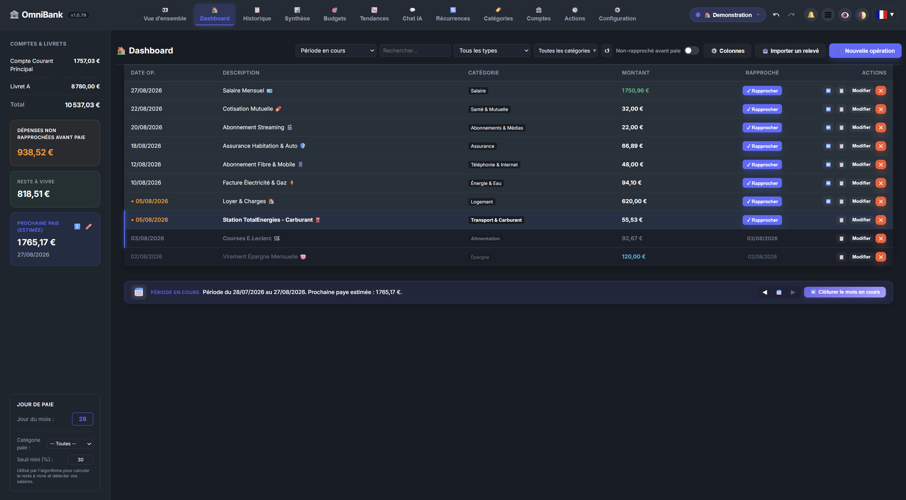
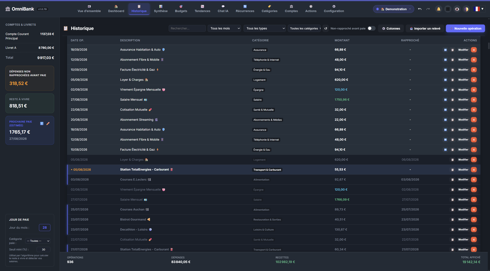
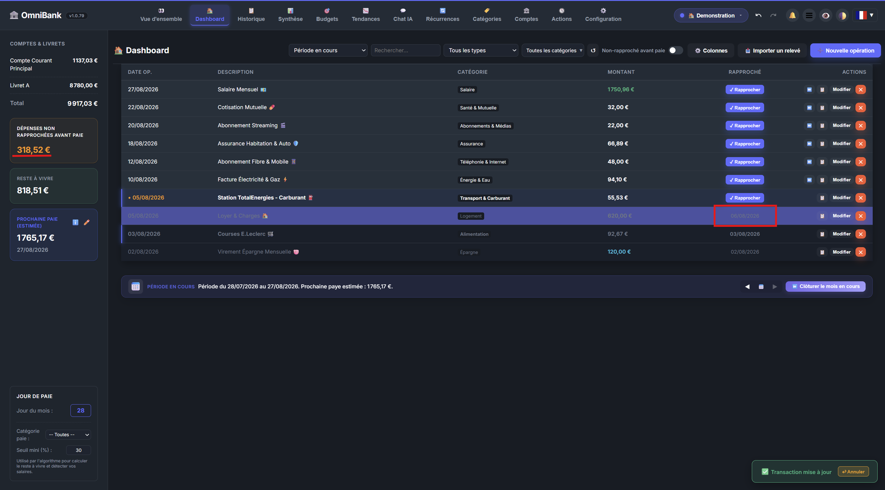
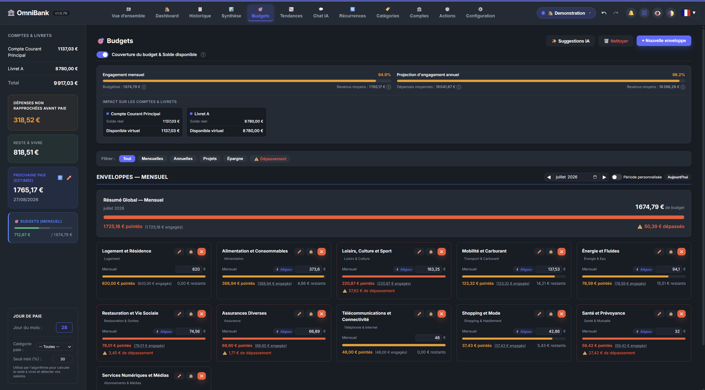
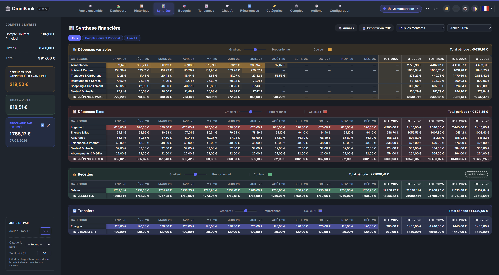
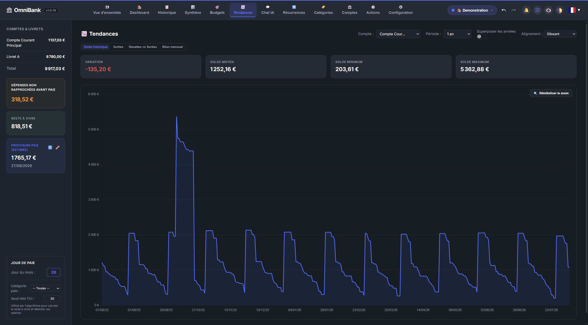
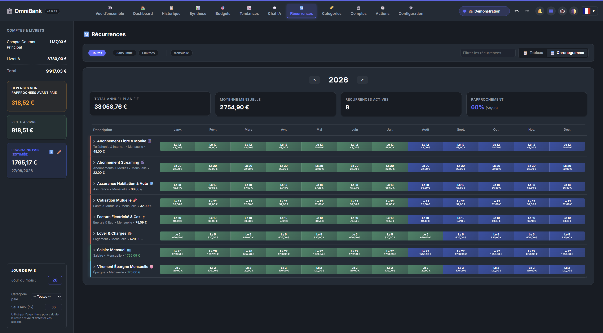

# OmniBank Local 🏦

<p align="center">
  <a href="#-français">Français</a> • 
  <a href="#-english">English</a>
</p>

---

# 🇫🇷[](https://github.com/Aschefr/OmniBank-Local/releases)
[](https://amify-studio.fr)
[](#)

**OmniBank Local** est une solution de gestion de finances personnelles et associatives ultra-privée, conçue pour ceux qui exigent un contrôle total sur vos données. Alliant la puissance d'un tableur à l'intelligence d'une IA locale, elle transforme votre gestion financière en une expérience fluide et sécurisée.



> [!CAUTION]
> **Avertissement** : La sécurité du code n'a pas fait l'objet d'un audit indépendant. Utilisez cette application à vos propres risques et uniquement dans un environnement local sécurisé.

---

## 🌟 Pourquoi OmniBank ?

*   **🔒 Confidentialité Absolue (Zéro Cloud)** : Vos données financières ne quittent jamais votre machine. Tout est stocké localement dans une base SQLite.
*   **🤖 Assistant IA Local (Ollama)** : Interagissez avec vos finances en langage naturel. Catégorisation intelligente, analyses de tendances et conseils personnalisés sans compromettre votre vie privée.
*   **⚡ Performance Extrême** : Grâce au rendu virtualisé, gérez des milliers de transactions sans aucun ralentissement.
*   **🎯 Gestion par Enveloppes** : Un système budgétaire visuel et intuitif pour suivre vos projets et vos dépenses courantes.

---

## ✨ Fonctionnalités Clés

### 🏗️ Configuration Simplifiée (Setup Wizard)
Dès le premier lancement, un **Assistant d'Initialisation** vous guide pour configurer vos comptes, vos préférences et connecter votre instance Ollama.


### 📈 Analytique & Gestion Quotidienne
*   **Tableau de Bord Dynamique** : Une vue d'ensemble de vos soldes, de vos budgets et de vos prochaines échéances.
*   **Historique Virtualisé** : Gérez des milliers de transactions avec une fluidité parfaite grâce au rendu ultra-rapide.
*   **Rapprochement Intelligent** : Un système visuel pour pointer vos opérations. Comparez d'un coup d'œil vos relevés bancaires (avant) et votre comptabilité propre (après).

| Saisie d'opération | Historique | Rapprochement |
| :---: | :---: | :---: |
|  |  |  |

### 🎯 Budget & Enveloppes
Suivez vos dépenses par catégories ou par projets avec un système d'enveloppes visuel. L'IA peut même vous suggérer des budgets basés sur vos habitudes.

| Vue Budget | Détail Budget | Suggestions IA |
| :---: | :---: | :---: |
|  |  |  |

### 🤖 Intelligence Artificielle Locale
Interagissez avec votre assistant financier personnel via Ollama. Grâce au RAG (Retrieval-Augmented Generation), l'IA accède à vos données pour répondre précisément. Elle peut même vous soumettre des **propositions d'actions interactives** directement dans le chat.


### 📊 Synthèse & Tendances
Visualisez l'évolution de votre patrimoine et générez des **rapports PDF haute fidélité**, parfaits pour un suivi comptable rigoureux ou un partage sécurisé.

| Synthèse | Tendances | Export PDF |
| :---: | :---: | :---: |
|  |  |  |

### 🛠️ Administration & Personnalisation
Prenez le contrôle total de votre structure financière avec des outils de gestion flexibles.

| Comptes | Catégories | Récurrences | Configuration |
| :---: | :---: | :---: | :---: |
|  |  |  |  |


---

## 🏢 Mode Organisation (Associations / CSE)

OmniBank propose un **mode organisation** conçu pour les associations, comités d'entreprise (CSE) et petites structures ayant besoin d'un suivi multi-utilisateur.

*   **👥 Multi-utilisateur sans mot de passe** : Chaque membre (trésorier, adjoint, secrétaire…) sélectionne son profil au lancement.
*   **📋 Audit intégré** : Chaque opération enregistre automatiquement qui l'a créée et qui l'a modifiée en dernier.
*   **🔑 Licence requise** : L'activation du mode organisation nécessite une clé de licence.

> Pour obtenir une licence, ouvrez une **[Issue sur GitHub](https://github.com/Aschefr/OmniBank-Local/issues)**.

---

## 🚀 Installation

### 🖥️ Windows (Recommandé)
Téléchargez le dernier installateur `.msi` depuis la page des [Releases](https://github.com/Aschefr/OmniBank-Local/releases).

### 🐳 Docker
```bash
docker-compose up -d --build
```
Accédez à l'interface sur `http://localhost:8434`.

---

## 🛠 Stack Technique

*   **Backend** : Python (FastAPI), SQLAlchemy, Pandas.
*   **Frontend** : HTML5/CSS3 (Vanilla), JavaScript, Chart.js.
*   **Desktop** : Tauri (Wrapper Rust).
*   **IA** : Ollama (Support Texte & Vision).

## 🆕 Dernières Mises à Jour (v1.0.77)

*   **🤖 Bilans & Prévisions IA Intelligents** : Détection automatique des achats exceptionnels (véhicule, électroménager) pour éviter les fausses alertes de découvert. Prise en compte réelle des dépenses planifiées et des réserves d'épargne (tirelires) dans les projections à 30 jours et le Reste à Vivre.
*   **↔️ Transferts Inter-Profils & Validation** : Transferts d'argent directs entre comptes de profils différents (partenaires, activités partagées) avec file d'attente d'approbation (Accepter/Refuser) et conversion de devises automatique.

## 🆕 Dernières Mises à Jour (v1.0.76)

*   **📱 Compatibilité Mobile 100% & Ergonomie Modale** : En-tête compact 52px mono-ligne sur mobile (≤768px), barres de filtres opaques sur l'Historique/Timeline, footer de totaux ancré en grille 2×2, et cartes de récurrences 100% responsive. Correction du débordement du footer de la modale d'édition avec raccourcissement du bouton en **« Enregistrer »** et conteneur auto-adaptatif `flex-wrap`.

## 🆕 Dernières Mises à Jour (v1.0.74)

*   **💼 Budgets & Enveloppes** : Thread-safety du service IA Ollama via `threading.Lock` et appels asynchrones non-bloquants, contraintes d'unicité et de vérification en base de données, nettoyage automatique des identifiants de comptes orphelins lors de la suppression d'un compte, et externalisation de 120+ styles inline vers des classes CSS sémantiques (`.bv-*`).

## 🆕 Dernières Mises à Jour (v1.0.73)

*   **📋 Formulaire d'Opération & UX** : Ajout du badge "Vider les champs" (persistant dans `localStorage`), maintien de la modale ouverte en mode édition, et remplacement du bouton de suppression par un bouton "🗑️ Supprimer l'opération" avec confirmation inline 2 clics.
*   **🔍 Recherche sans Accent** : Normalisation NFD pour ignorer les accents dans l'ensemble de l'application (saisie d'opérations, gestionnaire de catégories, composant multi-select).
*   **🎨 Alignement Global** : Centrage vertical/horizontal parfait des boutons `.btn` et ajustement du footer de saisie pour éviter tout tronquage du bouton d'enregistrement.

## 🆕 Dernières Mises à Jour (v1.0.72)

*   **📊 Synthèse & PDF** : Affichage et bascule des catégories/types inactifs dans la Synthèse et option d'inclusion complète des historiques annuels dans les exports PDF.

## 🆕 Dernières Mises à Jour (v1.0.71)

*   **💱 Support Multi-Devises** : Conversions en temps réel, taux de change personnalisables et badges de devises d'origine.
*   **📄 Export PDF Avancé** : Modulaire avec cartes de sections dynamiques et persistance des paramètres.
*   **⚡ Performance & Indexation** : Index SQLite sur `Transaction.budget_id` et `(category, date_operation)`, optimisation $O(1)$ des requêtes budgétaires et parallélisation front-end.

## 🆕 Dernières Mises à Jour (v1.0.68)

*   **🕓 Système d'Activité Global & Annulation (Undo/Redo)** : Suivi complet de toutes les opérations d'écriture (Création, Modification, Suppression) avec des boutons interactifs Annuler/Rétablir dans le header, un historique détaillé dans le panneau "Actions" et des Toasts d'annulation instantanés.
*   **🏦 Import Relevés Multi-Comptes & Alertes de Cohérence** : Découpage automatique des exports multi-comptes avec calcul d'un indice de confiance, formulaire de sélection manuelle de segment et alertes automatiques de doublons, de dates obsolètes, de trous de données ou d'écart.
*   **🤖 Chat IA Premium & RAG (v1.0.59)** : Interface double-colonne, persistance du défilement des sessions, compression dynamique de contexte, intégration de raccourcis 16K, streaming fluide et correctif de faille XSS.
*   **📋 Duplication d'Opérations (v1.0.59)** : Ajout d'un bouton de duplication rapide (`📋`) à gauche du bouton de modification sur la timeline et l'historique général, pré-remplissant instantanément le formulaire avec la date du jour.

## 🆕 Dernières Mises à Jour (v1.0.58)

*   **🌍 Localisation anglaise** : Traduction de 40+ clés manquantes dans `en.json` (prompts IA, labels catégories, fallbacks UI). Contribution communautaire de [@Lloir](https://github.com/Lloir) (PR #1).
*   **🐳 Correctif — Image Docker** : Le dossier `/app/static` manquait dans l'image Docker, provoquant un crash `FileNotFoundError` sur les déploiements standalone (ex: Unraid).
*   **✨ UX Budgets** : La création d'une enveloppe budgétaire fait maintenant défiler et met en surbrillance la nouvelle carte avec une animation visuelle de confirmation.

## 🆕 Dernières Mises à Jour (v1.0.57)

*   **🐛 Correctif — Pré-sélection de compte** : Le navigateur sélectionnait silencieusement le premier compte de la liste, déduisant à tort un type `expense_var` avant toute sélection manuelle.
*   **🔒 Correctif — Verrou SQLite (HTTP 500)** : Les appels API parallèles au chargement des pages provoquaient une erreur `database is locked`. Un timeout de 30 secondes a été configuré dans SQLAlchemy.
*   **📂 Correctif — Catégories transfert vides** : La catégorie "Compte vers compte" était stockée en type `neutral` au lieu de `transfer`. La migration v5 du schéma corrige automatiquement ce problème au démarrage pour tous les utilisateurs.
*   **🗂️ Correctif — Gestion des catégories** : Le groupe "Neutre" n'affiche plus de transactions dans la Synthèse suite à la correction du type de catégorie.

## 🆕 Dernières Mises à Jour (v1.0.52)

*   **⚡ Performance des Actions & Rapprochements** : Parallélisation complète des appels d'API front-end dépendants (`refreshSidebar` et `loadData`) via `Promise.all` pour éliminer le délai visible lors des opérations (ajout, suppression, rapprochement). Optimisation SQL backend ($O(N)$ vers $O(1)$) sur `get_budget_status` et `predict_next_paycheck` avec chargements en lot.
*   **💾 Optimisation SQLite** : Activation des PRAGMAs de performance (`cache_size`, `mmap_size`, `temp_store`) pour un traitement ultra-rapide des données en mémoire RAM sous Docker.

## 🆕 Dernières Mises à Jour (v1.0.51)

*   **⚡ Performance Docker** : Amélioration drastique des performances de l'application sous Docker grâce à l'utilisation de `uvloop` et `httptools` pour le serveur ASGI (Uvicorn), et correction du buffering Nginx pour le flux de streaming SSE en ajoutant l'en-tête `X-Accel-Buffering: no` sur la réponse du chat.
*   **📱 Affichage Mobile** : Correction de la hauteur du conteneur de l'application en utilisant l'unité `100dvh` (Dynamic Viewport Height) afin de respecter parfaitement la hauteur de l'écran sur les navigateurs mobiles et éviter les barres de défilement ou coupures indésirables.
*   **🎨 Favicon & Résolution** : Ajout d'un favicon pour la version Web/Docker et utilisation d'une version haute résolution pour l'application Tauri pour éviter l'icône floue dans la barre des tâches Windows.

## 🆕 Dernières Mises à Jour (v1.0.47)

*   **🤖 Correctif IA — Auto-catégorisation** : Augmentation du timeout de l'API d'auto-catégorisation à 120 secondes dans le backend pour éviter les erreurs de chargement du LLM local (Ollama) lorsque le modèle n'est pas encore en mémoire. Amélioration de l'affichage des erreurs détaillées dans l'interface de saisie en cas d'échec.

## 🆕 Dernières Mises à Jour (v1.0.46)

*   **🔧 Correctif Sidebar — Montant "Dépenses non rapprochées avant paie"** : Le montant affiché dans l'encart du bandeau latéral gauche excluait incorrectement les virements internes (ex : Virement vers livret, virement entre comptes), provoquant un écart avec le total affiché dans l'onglet Historique. Les deux valeurs sont désormais cohérentes.

## 🆕 Dernières Mises à Jour (v1.0.70)

*   **💡 Refonte intégrale du module Budgets** : Modularisation de l'architecture frontend (`budgets_core`, `budgets_render`, `budgets_ai`, `budgets_modals`) et backend (`budget_service.py`) pour une meilleure maintenabilité et un rendu ultra-rapide.
*   **🧠 Simulateur Budgétaire IA Avancé** : Pipeline de statut IA explicatif, enveloppes thématiques précises, badges de comparaison avec le reste à vivre réel et bouton ⚡ de synchronisation des dépenses engagées.
*   **📜 Historique & Traçabilité des Actions** : Modal de détails approfondis pour les actions annulables avec résolution dynamique des noms d'entités (comptes, budgets, récurrences) et confirmation inline.

## 🆕 Dernières Mises à Jour (v1.0.45)

*   **🔧 Correctif critique — Récurrences dupliquées** : Correction d'un bug majeur où la clôture du mois courant générait des dizaines d'opérations récurrentes en doublon pour des templates abandonnés ou désactivés.
*   **🧹 Détection enrichie des orphelins** : Le bouton de nettoyage des récurrences orphelines détecte désormais 4 familles de doublons :
    * **Templates abandonnés** (actifs mais sans activité en N-1 et N).
    * **Templates vidés à zéro** (3+ derniers rapprochements à 0 €, abonnement résilié sans clôture).
    * **Doublons annuels** (occurrence supplémentaire pour une récurrence annuelle déjà rapprochée dans l'année).
    * **Doublons mensuels** (deux instances non rapprochées le même mois).
*   **🐛 Correctif Dashboard** : Les opérations non rapprochées de la période courante + l'offset de jours (5/15/30) sélectionné sont désormais correctement affichées (seules les opérations non rapprochées étaient auparavant visibles).

## 🆕 Dernières Mises à Jour (v1.0.76)

*   **📱 Compatibilité Ergonomique Mobile 100%** :
    * **En-tête 1 ligne compact** ($52\text{px}$) avec menu hamburger **☰**, logo centré **🏦 OmniBank** et badge profil/cloche **🔔**.
    * **Filtres sticky opaques** avec ombre portée empêchant les cartes de glisser de manière transparente sous les barres de filtres.
    * **Totaux de l'historique ancrés en bas de page** (`position: fixed`) en grille $2\times2$ réactive.
    * **Format cartes mobile pour les récurrences** (`.mobile-card-table`) avec conteneur anti-débordement (`.table-responsive`).
    * **Sous-panneau de détails récurrences pleine largeur** à hauteur contrôlée ($320\text{px}$) avec repliage/dépliage réactif.

## 🆕 Dernières Mises à Jour (v1.0.75)

*   **👥 Profils Maîtres Multiples** : Créez et basculez instantanément entre plusieurs espaces financiers totalement isolés (Perso, Pro, Asso) avec souveraineté des données 100% hors-ligne.
*   **🎨 Thèmes d'Accentuation Personnalisés** : Personnalisez la couleur d'accentuation de chaque profil maître avec prévisualisation en direct.
*   **🔒 Sécurité & Verrouillage Automatique** : Protection par code PIN optionnel, ré-authentification à la sélection et verrouillage automatique des sessions inactives.
*   **📦 Sauvegardes Globales et par Profil** : Exportez/restaurez vos profils individuellement ou sauvegardez l'ensemble de vos espaces maîtres en une seule archive.
*   **🌐 Internationalisation FR/EN Complète** : Traduction intégrale des interfaces et modales de gestion de profils.

## 🆕 Dernières Mises à Jour (v1.0.41)

*   **⚙️ Colonnes de totaux configurables** : Ajout d'un bouton "⚙️ Années" sur la page Synthèse permettant de sélectionner les colonnes de totaux annuels à afficher, avec une synchronisation automatique et bidirectionnelle avec l'export PDF.
*   **🎨 Contrôle du gradient de couleur** : Ajout d'un slider par tableau sur la page Synthèse pour basculer et ajuster finement le gradient (Logarithmique, Proportionnel, Exponentiel).
*   **📅 Améliorations de la Paye** :
    * Le bouton de transition manuelle a été renommé en "Clôturer le mois en cours" pour plus de clarté.
    * Le bouton superflu "Corriger la paie" a été retiré du bandeau bleu du Dashboard.

## 🆕 Dernières Mises à Jour (v1.0.36)

*   **📦 Correctif de publication** : Correction d'un problème dans le script de build qui empaquetait d'anciens fichiers (mode onedir) au lieu des fichiers à jour.

## 🆕 Dernières Mises à Jour (v1.0.35)

*   **⚙️ Paramètres de sauvegarde intelligents** : L'encart de configuration des sauvegardes automatiques se replie dynamiquement lorsque la fonctionnalité est désactivée, allégeant ainsi l'interface des paramètres.
*   **🔙 Navigation fluide (Drill-down)** : Ajout d'un bouton "Retour" contextuel dans l'Historique qui n'apparaît que lors de l'accès depuis une cellule du tableau de Synthèse, permettant de revenir instantanément à vos analyses.
*   **📊 Affichage Synthèse optimisé** : Correction du tronquage (points de suspension) des en-têtes d'année ("TOT. 2026"). L'année est désormais toujours visible, s'adaptant sur deux lignes en mode normal et restant strictement sur une seule ligne en mode compact.

## 🆕 Dernières Mises à Jour (v1.0.34)

*   **⚡ Démarrage Instantané (onedir)** : Optimisation majeure du temps de lancement de l'application. Le backend Python n'a plus besoin de s'extraire à chaque démarrage, rendant l'ouverture d'OmniBank quasi instantanée.

## 🆕 Dernières Mises à Jour (v1.0.33)

*   **🧹 Nettoyage de Base de Données** : Ajout d'un outil de maintenance permettant de nettoyer les récurrences orphelines avec une validation granulaire (opération par opération).
*   **🐛 Correctif** : Résolution d'une régression liée à la gestion des opérations récurrentes.

## 🆕 Dernières Mises à Jour (v1.0.32)

*   **🤖 Import IA en arrière-plan** : L'analyse IA des relevés bancaires peut désormais s'exécuter en arrière-plan. Si l'analyse dépasse 5 secondes, la modale se masque automatiquement et un toast notifie l'utilisateur une fois terminé. Le bouton d'import affiche une animation pendant l'analyse et pulse en vert quand le résultat est prêt.
*   **🎨 Polish visuel** : Header sticky corrigé (le tableau ne « glisse » plus sous les filtres), scrollbar fine et discrète sur la zone principale, animation du bouton IA sans changement de largeur.
*   **📱 Fix mobile** : Virtualisation du tableau désactivée sur mobile (≤768px) pour éliminer les saccades de scroll en mode carte.
*   **🔍 Filtre Récurrences** : Ajout d'un champ de recherche dans la page des récurrences.
*   **🌍 Traductions** : Corrections de phrases non traduites en anglais.

---

# 🇺🇸 English

[](https://github.com/Aschefr/OmniBank-Local/releases)
[](https://amify-studio.fr)
[](#)

**OmniBank Local** is an ultra-private personal and organizational finance management solution, designed for those who demand total control over their data. Combining spreadsheet-like power with local AI intelligence, it transforms financial management into a smooth and secure experience.


> [!CAUTION]
> **Disclaimer**: The code's security has not undergone any independent audit. Use this application at your own risk and only in a secure local environment.

---

## 🌟 Why OmniBank?

*   **🔒 Absolute Privacy (Zero Cloud)**: Your financial data never leaves your machine. Everything is stored locally in a SQLite database.
*   **🤖 Local AI Assistant (Ollama)**: Interact with your finances using natural language. Intelligent categorization, trend analysis, and personalized advice without compromising your privacy.
*   **⚡ Extreme Performance**: Thanks to virtualized rendering, manage thousands of transactions without any slowdown.
*   **🎯 Envelope Management**: A visual and intuitive budgeting system to track your projects and daily expenses.

---

## ✨ Key Features

### 🏗️ Simplified Setup (Setup Wizard)
From the very first launch, an **Initialization Assistant** guides you through configuring your accounts, preferences, and connecting your Ollama instance.


### 📈 Analytics & Daily Management
*   **Dynamic Dashboard**: An overview of your balances, budgets, and upcoming deadlines.
*   **Virtualized History**: Manage thousands of transactions with perfect fluidity thanks to ultra-fast rendering.
*   **Smart Reconciliation**: A visual system to check your operations. Compare bank statements (before) and your clean accounting (after) at a glance.

| Transaction entry | History | Reconciliation |
| :---: | :---: | :---: |
|  |  |  |

### 🎯 Budget & Envelopes
Track your spending by categories or projects with a visual envelope system. The AI can even suggest budgets based on your habits.

| Budget View | Budget Detail | AI Suggestions |
| :---: | :---: | :---: |
|  |  |  |

### 🤖 Local AI Assistant
Interact with your personal financial assistant via Ollama. Using RAG (Retrieval-Augmented Generation), the AI accesses your data to provide precise answers. It can even submit **interactive action proposals** directly in the chat.


### 📊 Synthesis & Trends
Visualize the evolution of your wealth and generate **high-fidelity PDF reports**, perfect for rigorous accounting tracking or secure sharing.

| Synthesis | Trends | PDF Export |
| :---: | :---: | :---: |
|  |  |  |

### 🛠️ Administration & Customization
Take full control of your financial structure with flexible management tools.

| Accounts | Categories | Recurrences | Configuration |
| :---: | :---: | :---: | :---: |
|  |  |  |  |


---

## 🏢 Organisation Mode (Nonprofits / Work Councils)

OmniBank offers an **organisation mode** designed for nonprofits, work councils, and small organizations needing multi-user tracking.

*   **👥 Password-free multi-user**: Each member (treasurer, deputy, secretary…) selects their profile at launch.
*   **📋 Built-in audit trail**: Every transaction automatically records who created it and who last modified it.
*   **🔑 License required**: Activating organisation mode requires a license key.

> To obtain a license, open an **[Issue on GitHub](https://github.com/Aschefr/OmniBank-Local/issues)**.

---

## 🚀 Installation

### 🖥️ Windows (Recommended)
Download the latest `.msi` installer from the [Releases](https://github.com/Aschefr/OmniBank-Local/releases) page.

### 🐳 Docker
```bash
docker-compose up -d --build
```
Access the interface at `http://localhost:8434`.

---

## 🛠 Technical Stack

*   **Backend**: Python (FastAPI), SQLAlchemy, Pandas.
*   **Frontend**: HTML5/CSS3 (Vanilla), JavaScript, Chart.js.
*   **Desktop**: Tauri (Rust Wrapper).
*   **AI**: Ollama (Text & Vision Support).

## 🆕 Recent Updates (v1.0.77)

*   **🤖 Smarter AI Health Reports & Financial Forecasts** : Automatic detection and exclusion of major one-time purchases (like vehicle or appliance buys) from daily spend projections to eliminate false overdraft warnings. Real-world integration of pending transactions and piggy bank savings into 30-day balance projections.
*   **↔️ Inter-Profile Transfers & Approval Workflow** : Effortless direct money transfers between accounts belonging to different profiles with explicit confirmation queues (Accept/Decline) and automatic multi-currency conversions.

## 🆕 Recent Updates (v1.0.76)

*   **📱 100% Mobile Viewport & Modal UX Polish** : Streamlined 52px single-row header on mobile (≤768px), opaque filter headers, fixed bottom summary totals bar, and fully responsive recurrence card views. Fixed transaction modal footer button overflow with shortened **"Save"** action button and responsive `flex-wrap` layout.

## 🆕 Recent Updates (v1.0.74)

*   **💼 Budgets & Envelopes** : Thread-safe Ollama AI status management using `threading.Lock` with non-blocking async execution, DB unique & check constraints, automatic cleanup of orphan account IDs upon account deletion, and migration of 120+ inline styles to semantic CSS classes (`.bv-*`).

## 🆕 Recent Updates (v1.0.73)

*   **📋 Transaction Form & UX Improvements** : Added "Clear fields" badge button (persisted state), retained "Keep Open" mode during editing, and replaced last-entry undo button with inline 2-click "🗑️ Delete transaction" confirmation.
*   **🔍 Accent-Insensitive Search** : NFD normalisation search across form autocomplete, category manager, and multi-select components (e.g. typing `peage` matches `Péage`).
*   **🎨 Global Layout & Button Polish** : Perfect flex alignment for `.btn` components and single-row compact footer preventing button clipping.

## 🆕 Recent Updates (v1.0.72)

*   **📊 Analytics & PDF Export** : Inactive categories & transaction types toggles in Synthesis view, with options to include full historical annual totals in PDF exports.

## 🆕 Recent Updates (v1.0.71)

*   **💱 Multi-Currency Support** : Real-time conversions, custom exchange rates, and original currency badges.
*   **📄 Advanced PDF Export Module** : Modular section cards with dynamic page breaks and saved export preferences.
*   **⚡ Performance & Indexing** : Added SQLite indexes on `Transaction.budget_id` and composite `(category, date_operation)`, $O(1)$ Python status lookups, and frontend parallel query loading.

## 🆕 Recent Updates (v1.0.68)

*   **🕓 Global Activity & Undo System (Undo/Redo)**: Full write operation tracking (Create, Update, Delete) with interactive Undo/Redo header controls, dedicated paginated Action history panel, and instant pop-up Undo toasts.
*   **🏦 Multi-Account Block Parsing & Validation Alerts**: Automatic account segment extraction from concatenated multi-account statement exports with segment match confidence index and automated duplicate detection, old file warnings, gap detection, and statement obsolescence alerts.
*   **🤖 Premium AI Chat & RAG (v1.0.59)**: Double-column layout, session scroll persistence, dynamic context compaction, 16K setting shortcut integration, clean streaming responses, and XSS vulnerability patch.
*   **📋 Transaction Duplication (v1.0.59)**: Added a quick duplicate button (`📋`) next to the Edit button in the timeline and general history views, pre-filling the entry form with today's date.

## 🆕 Recent Updates (v1.0.58)

*   **🌍 English Localization**: Translated 40+ remaining French-only keys in `en.json` (AI prompts, category manager labels, UI fallbacks). Community contribution by [@Lloir](https://github.com/Lloir) (PR #1).
*   **🐳 Fix — Docker Image**: The `/app/static` directory was missing from the Docker image, causing a `FileNotFoundError` crash on standalone deployments (e.g. Unraid).
*   **✨ Budget UX**: Creating a budget envelope now scrolls to and highlights the new card with a glowing accent animation for visual confirmation.

## 🆕 Recent Updates (v1.0.57)

*   **🐛 Fix — Implicit Account Pre-selection**: The browser was silently selecting the first account in the listbox, incorrectly inferring `expense_var` type before the user made any selection.
*   **🔒 Fix — SQLite Concurrency Lock (HTTP 500)**: Parallel API calls on page load triggered `database is locked` errors. A 30-second busy timeout is now configured in SQLAlchemy.
*   **📂 Fix — Empty Transfer Category Dropdown**: The "Compte vers compte" category was stored as type `neutral` instead of `transfer`. Schema migration v5 automatically corrects this on startup for all users.
*   **🗂️ Fix — Category Manager**: The "Neutral" group no longer incorrectly shows transactions in the Synthesis view after the category type fix.

## 🆕 Recent Updates (v1.0.52)

*   **⚡ Actions & Reconciliation Performance**: Complete parallelization of dependent front-end API calls (`refreshSidebar` and `loadData`) using `Promise.all` to eliminate visible delays during operations (add, delete, reconcile). SQL backend optimization ($O(N)$ to $O(1)$) on `get_budget_status` and `predict_next_paycheck` using batch loading.
*   **💾 SQLite Optimization**: Activation of performance PRAGMAs (`cache_size`, `mmap_size`, `temp_store`) for ultra-fast data processing in RAM under Docker.

## 🆕 Recent Updates (v1.0.51)

*   **⚡ Docker Performance**: Drastic performance improvements under Docker by integrating `uvloop` and `httptools` for the ASGI server (Uvicorn), and fixing Nginx buffering for SSE streaming by adding the `X-Accel-Buffering: no` header to the streaming chat response.
*   **📱 Mobile Display**: Fixed the application container height by using the `100dvh` (Dynamic Viewport Height) unit to correctly fit the screen on mobile browsers, preventing unwanted scrollbars or layout cuts.
*   **🎨 Favicons & Resolution**: Added a favicon for the Web/Docker version and referenced a high-resolution version in Tauri to avoid blurry icons in the Windows taskbar.

## 🆕 Recent Updates (v1.0.47)

*   **🤖 AI Fix — Auto-categorization**: Increased the auto-categorization API timeout to 120 seconds in the backend to prevent loading timeouts with local LLMs (Ollama) when the model is not yet in memory. Improved detailed error message reporting in the transaction entry UI upon failure.

## 🆕 Recent Updates (v1.0.46)

*   **🔧 Sidebar Fix — "Unreconciled expenses before pay" amount**: The amount shown in the left sidebar widget incorrectly included internal transfers (e.g., transfers to savings accounts), causing a discrepancy with the total displayed in the History tab. Both values are now consistent.

## 🆕 Recent Updates (v1.0.70)

*   **💡 Complete Budgets Module Refactor**: Modular frontend (`budgets_core`, `budgets_render`, `budgets_ai`, `budgets_modals`) and backend (`budget_service.py`) architecture for enhanced maintainability and faster rendering.
*   **🧠 Advanced AI Budget Simulator**: Explanatory AI status pipeline, fine-grained thematic envelopes, real spending comparison badges, and instant ⚡ sync for committed expenses.
*   **📜 Action History & Auditability**: Deep dive details modal for undoable actions with dynamic entity name resolution (accounts, budgets, recurrences) and smart inline confirmation.

## 🆕 Recent Updates (v1.0.75)

*   **👥 Multi-Master Profiles**: Create and seamlessly switch between isolated financial workspaces (Personal, Business, Association) with 100% offline data sovereignty.
*   **🎨 Custom Accent Themes**: Customize profile accent colors with live real-time preview.
*   **🔒 Security & Auto-Lock**: Optional PIN code protection, profile re-authentication, and automatic session lock on inactivity.
*   **📦 Profile-Scoped & Global Backups**: Export or restore individual master profiles or back up all workspaces in a single ZIP archive.
*   **🌐 Full Bilingual Support (FR/EN)**: Complete English and French localization for all profile configuration dialogs.

## 🆕 Recent Updates (v1.0.45)

*   **🔧 Critical Fix — Duplicate Recurring Transactions**: Fixed a major bug where closing the current month generated dozens of duplicate recurring transactions for abandoned or deactivated templates.
*   **🧹 Enhanced Orphan Detection**: The orphan recurrence cleanup button now detects 4 types of duplicates:
    * **Abandoned templates** (still active but no activity in year N-1 or N).
    * **Zeroed-out templates** (last 3+ reconciled entries at €0, subscription cancelled without closing the template).
    * **Yearly duplicates** (a second unreconciled instance exists for a yearly template already reconciled this year).
    * **Monthly duplicates** (two unreconciled instances for the same month).
*   **🐛 Dashboard Fix**: Unreconciled transactions for the current period are now correctly displayed alongside the user-selected day offset (5/15/30 days), instead of showing only unreconciled transactions.

## 🆕 Recent Updates (v1.0.41)

*   **⚙️ Customizable Totals Columns**: Added a "⚙️ Years" button on the Synthesis page to select which annual totals columns are displayed, with automatic two-way mirroring to the PDF export options.
*   **🎨 Table Color Gradient Slider**: Added a slider to each Synthesis table header to customize color intensity (Logarithmic, Proportional, Exponential).
*   **📅 Paycheck Flow Enhancements**:
    * Renamed the manual skip button to "Close current month" for better clarity.
    * Removed the duplicate "Correct pay" button from the Dashboard banner.

## 🆕 Recent Updates (v1.0.36)

*   **📦 Release Hotfix**: Fixed a bug in the automated release script where older backend files (onedir bundle) were packaged instead of the latest code.

## 🆕 Recent Updates (v1.0.35)

*   **⚙️ Smart Backup Settings**: The auto-backup configuration section now dynamically hides when the feature is disabled, reducing visual clutter in the settings.
*   **🔙 History Drill-down Navigation**: Added a contextual "Back" button in the History view that appears exclusively when drilling down from the Synthesis table, allowing for seamless return to your analytics.
*   **📊 Synthesis Table Polish**: Fixed the truncation of the "Total Year" column headers. The year is now always fully visible, intelligently adapting to two lines in normal mode and remaining strictly on one line in compact mode.

## 🆕 Recent Updates (v1.0.34)

*   **⚡ Instant Startup (onedir)**: Major optimization of the application's launch time. The Python backend no longer needs to extract itself on every startup, making OmniBank open almost instantly.

## 🆕 Recent Updates (v1.0.33)

*   **🧹 Database Cleanup**: Added a maintenance tool to clean up orphaned recurring operations with granular, per-operation validation.
*   **🐛 Bug Fix**: Fixed a regression related to the handling of recurring operations.

## 🆕 Recent Updates (v1.0.32)

*   **🤖 Background AI Import**: Bank statement AI analysis now runs in the background. If analysis takes more than 5 seconds, the modal auto-hides and a toast notification alerts you when results are ready. The import button shows a sweep animation during analysis and pulses green when complete.
*   **🎨 Visual Polish**: Fixed sticky header (table rows no longer slide under filters), thin discreet scrollbar on main content area, button animation without width change.
*   **📱 Mobile Fix**: Virtual table scrolling disabled on mobile (≤768px) to eliminate scroll jank in card layout mode.
*   **🔍 Recurrence Filter**: Added a search field to the recurrences management page.
*   **🌍 Translations**: Fixed untranslated phrases in English.

---

1. `python -m venv venv`
2. `.\venv\Scripts\activate`
3. `pip install -r requirements.txt`
4. `uvicorn app.main:app --host 127.0.0.1 --port 8434 --reload`

## 📝 Licence / License

Ce projet est disponible en accès partagé (**Source-Available**) sous la licence propriétaire d'Amify Studio.

* **Usage Personnel / Personal Use** : Gratuit et autorisé pour un usage strictement individuel et privé. / Free and permitted for strictly individual and private use.
* **Usage Organisation / Organizational Use** : L'utilisation collective, par une association (Loi 1901, CSE) ou une entreprise (y compris l'activation du "Mode Organisation") requiert l'acquisition d'une clé de licence commerciale. / Any group, non-profit, or corporate use (including enabling "Organisation Mode") requires a commercial license key.
* **Détails / Details** : Voir le fichier [LICENSE](LICENSE) pour les termes complets. / See the [LICENSE](LICENSE) file for full terms.
