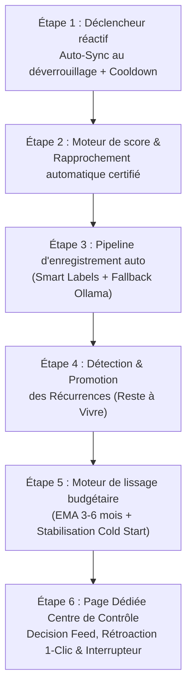

# OmniBank-Local — Architecture & Feuille de Route : Mode Auto-Pilote

> **Vision Ultime** : Fonctionnement en autonomie totale (100% offline et local-first). L'utilisateur configure ses comptes, déverrouille son coffre-fort chiffré, et l'application s'occupe du reste : synchronisation bancaire, labellisation/catégorisation multi-stage, rapprochement comptable instantané et calibration stabilisée des enveloppes budgétaires. L'utilisateur passe du rôle de *gestionnaire de saisie* à celui de *décideur éclairé*, consultant ses statistiques et échangeant avec son assistant IA local.

---

## Sommaire

1. [Vision & Spécifications de l'Interrupteur "Auto-Pilote"](#1-vision--spécifications-de-linterrupteur-auto-pilote)
2. [Cartographie des Briques & État d'Avancement Réel](#2-cartographie-des-briques--état-davancement-réel)
   - [Brique 1 : Déverrouillage Coffre & Auto-Sync Immédiat](#brique-1--déverrouillage-coffre--auto-sync-immédiat)
   - [Brique 2 : Pipeline de Catégorisation Multi-Stage & Enregistrement Auto](#brique-2--pipeline-de-catégorisation-multi-stage--enregistrement-auto)
   - [Brique 3 : Moteur de Rapprochement Automatique à Haute Certitude](#brique-3--moteur-de-rapprochement-automatique-à-haute-certitude)
   - [Brique 4 : Détection & Promotion des Récurrences (Anticipation Reste à Vivre)](#brique-4--détection--promotion-des-récurrences-anticipation-reste-à-vivre)
   - [Brique 5 : Gestionnaire Dynamique d'Enveloppes (Lissage 3–6 Mois & Cold Start)](#brique-5--gestionnaire-dynamique-denveloppes-lissage-36-mois--cold-start)
   - [Brique 6 : Sas d'Attente ("Pending Sync") & Matrice d'Arbitrage](#brique-6--sas-dattente-pending-sync--matrice-darbitrage)
   - [Brique 7 : Page Dédiée « Centre de Contrôle Auto-Pilote » (Vue Décisions, Réversibilité & Réorientation)](#brique-7--page-dédiée-centre-de-contrôle-auto-pilote-vue-décisions-réversibilité--réorientation)
3. [Pièges à Éviter & Points d'Attention Critiques](#3-pièges-à-éviter--points-dattention-critiques)
4. [Risques de Régression & Stratégies d'Étanchéité](#4-risques-de-régression--stratégies-détanchéité)
5. [Rappel des Règles Projets & Contraintes d'Ingénierie](#5-rappel-des-règles-projets--contraintes-dingénierie)
6. [Feuille de Route Incrémentale (Ordre de Réalisation)](#6-feuille-de-route-incrémentale-ordre-de-réalisation)
7. [Matrice de Validation & Cahier de Recette (Critères de Succès Pré-établis)](#7-matrice-de-validation--cahier-de-recette-critères-de-succès-pré-établis)

---

## 1. Vision & Spécifications de l'Interrupteur "Auto-Pilote"

Le mode **Auto-Pilote** n'est pas une boîte noire opaque ni une refonte complète du code, mais l'aboutissement d'une chaîne de briques modulaires déjà amorcées. Il dispose de son propre **Centre de Contrôle Dédié** (accessible via le menu de navigation `🤖 Auto-Pilote` ou par clic sur le badge d'état du header) et s'active via un interrupteur clair :

```
[ Mode Auto-Pilote : ACTIF ]
├── Sources d'Alimentation Détectées :
│    ├── Mode Hors Ligne (Fichier) : Ingestion automatique dès le glisser-déposer (CSV, XLSX, Relevé IA)
│    └── Mode En Ligne (Woob)      : Relevé automatique au déverrouillage du coffre chiffré en RAM
├── Pipeline d'ingestion : SmartLabelService (Règles -> Historique -> Inférence IA)
├── Ingestion comptable :
│    ├── Score certitude >= 85%  ──>  Rapprochement direct ou Enregistrement DB direct
│    └── Score certitude < 85%   ──>  Sas d'attente (Cockpit) pour arbitrage humain 1-clic
├── Budgets dynamiques : Recalibrage mensuel lissé (filtre EMA 3-6 mois, amortissement cold start)
├── Restitution silencieuse : Badge discret dans l'en-tête, zéro blocage, consultation 100% facultative
└── Souveraineté & Contrôle : Page dédiée pour auditer les décisions, dépointer, réorienter ou annuler
```

### Cycles d'Intronisation Cold-Start (Parcours Hybride Fichiers / Ligne)

L'Auto-Pilote est **universel** : il s'applique avec la même intelligence comptable que l'utilisateur choisisse d'importer ses relevés à la main (100% hors-ligne) ou de connecter sa banque :

#### Parcours 1 : Mode Fichier Local (CSV / Excel / Relevé IA) — 100% Hors Ligne & Souverain
```
[ Wizard de Démarrage (7 Étapes) ]
 ├── Étape 1/7 à 4/7 : Thème, Sécurité (PIN), Compte bancaire principal, Cycle de paie
 ├── Étape 5/7 : Choix de la tuile "📥 Importer un relevé (CSV / Excel)"
 ├── Étape 6/7 : Détection IA Locale (Ollama) & Activation du switch Auto-Pilote
 └── Étape 7/7 : Confirmation & Lancement
          │
          ▼
[ Utilisation Quotidienne : Dépose de Fichiers (Dropzone CSV / Excel / IA) ]
 ├── L'utilisateur glisse-dépose son relevé mensuel ou hebdomadaire
 ├── 🤖 L'Auto-Pilote prend le relais instantanément sur le lot :
 │    ├── Normalise les libellés commerciaux (SmartLabelService)
 │    ├── Rapproche automatiquement les correspondances parfaites (≥ 85%)
 │    ├── Enregistre les dépenses courantes directes en base sans friction
 │    └── Ne dépose dans le Sas d'attente (Cockpit) QUE les doutes ou opérations ambiguës
 └── Bilan comptable et solde actualisés au centime d'euro en un éclair !
```

#### Parcours 2 : Mode Synchronisation en Ligne (Woob) — Optionnel avec Coffre-fort
```
[ Wizard de Démarrage ]
 └── Étape 5/7 : Choix de la tuile "⚡ Synchroniser en ligne"
          │
          ▼
[ Page "Comptes & Livrets" (Post-Wizard) ]
 ├── L'utilisateur clique sur "Ajouter une connexion bancaire"
 ├── Choix de la banque (Woob) + Saisie des identifiants
 ├── Création du mot de passe maître du Coffre-fort (PBKDF2 / Fernet)
 ├── Validation du challenge 2FA bancaire (SMS/Application mobile)
 └── Association (mapping) des comptes distants aux comptes locaux OmniBank
          │
          ▼
[ Le "Sacrement" d'Activation Auto-Pilote (Si non activé dans le Wizard) ]
 └── Modale d'intronisation dès confirmation de la 1ère connexion bancaire :
     « 🎉 Votre banque est reliée avec succès !
        Souhaitez-vous activer le Mode Auto-Pilote dès maintenant ?
        Vos futures opérations seront relevées, catégorisées et
        rapprochées automatiquement à chaque déverrouillage de votre coffre. »
        [ Interrupteur : OUI / NON ]
```

### Machine à États & Visibilité de l'Interrupteur Auto-Pilote

L'interrupteur respecte une machine à états stricte pour garantir clarté et contrôle absolu à l'utilisateur, **indépendamment de son mode d'alimentation (fichiers CSV/Excel ou banque connectée)** :

1. **État Grisé / Inactif (`DISABLED`)** :
   - *Condition* : Aucun compte bancaire créé dans l'application (base totalement vierge sans compte courant, livret ou compte d'épargne).
   - *Comportement UI* : Switch grisé non cliquable avec infobulle explicite : *"Créez ou importez au moins un compte bancaire pour débloquer le Mode Auto-Pilote"*.
2. **État Disponible / Découverte (`DISCOVERY_MILESTONE`)** :
   - *Condition* : Déclenché lors du premier import réussi d'un relevé (CSV/Excel) OU lors de la première connexion bancaire réussie (si l'interrupteur n'était pas déjà activé dans le Wizard).
   - *Comportement UI* : Modale d'intronisation proposant d'activer l'interrupteur :
     *« 🎉 Vos opérations sont importées avec succès ! Souhaitez-vous activer le Mode Auto-Pilote ? Vos futurs relevés (fichiers CSV/Excel ou synchronisation bancaire) seront automatiquement classés, rapprochés et réconciliés. »*
3. **État Engagé mais en Rodage (`ENABLED_LEARNING` — 🟡 Badge d'Apprentissage)** :
   - *Condition* : Auto-Pilote activé, mais en phase de Cold-Start (moins de 60 jours d'historique, ou socle de catégories encore incomplet).
   - *Comportement UI* : Switch vert allumé + badge d'accompagnement jaune : `[ Auto-Pilote : 🟡 En apprentissage ]`. Infobulle : *"Auto-Pilote actif (relevés importés ou synchronisés). En attente d'une première catégorie pour parfaire l'auto-classification. Les budgets s'initialiseront au premier cycle de paie."*
4. **État Vitesse de Croisière (`ENABLED_CRUISING` — 🟢 Badge Actif)** :
   - *Condition* : Comptes stabilisés, socle de catégories actif, récurrences identifiées.
   - *Comportement UI* : `[ Auto-Pilote : 🟢 Actif ]`. Les écritures et rapprochements à haute certitude ($\ge 85\%$) sont validés sans action manuelle dès l'injection du relevé. Le Sas d'attente ne retient que les exceptions réelles.
5. **État Veille Manuelle (`ENABLED = false`)** :
   - *Comportement* : L'application fonctionne en mode classique (100% des opérations bancaires, qu'elles proviennent d'un import de fichier ou d'un relevé en ligne, sont déposées dans le Sas d'attente / Cockpit pour validation manuelle ligne par ligne).

### Rôle de l'IA Locale (Ollama) : Strictement Optionnelle

Conformément à la règle fondatrice du projet (*« L'app est 100% fonctionnelle sans Ollama »*), le mode Auto-Pilote s'adapte sans rupture :
* **Sans IA (Mode Déterministe Pur)** : Le système repose sur la normalisation Regex, les règles exactes `BankLabelMapping`, le fuzzy-matching sur l'historique et la détection mathématique des récurrences. Les marchands inconnus sont assignés *"À catégoriser"*, et l'apprentissage s'enrichit dès le 1er clic de l'utilisateur.
* **Avec IA (Mode Augmenté)** : Le LLM local intervient en secours pour inférer les catégories des nouveaux marchands inconnus et proposer des suggestions textuelles de gestion budgétaire.

---

## 2. Cartographie des Briques & État d'Avancement Réel

### Brique 1 : Déverrouillage Coffre & Auto-Sync Immédiat
*Permettre au logiciel de lancer la synchronisation dès que la clé de déchiffrement est disponible en mémoire.*

* **Fichiers concernés** :
  - [`app/services/credential_vault.py`](file:///d:/Code%20Projects/OmniBank-Local/app/services/credential_vault.py) (`CredentialVault`, `VaultSessionManager`)
  - [`app/services/bank_sync_scheduler.py`](file:///d:/Code%20Projects/OmniBank-Local/app/services/bank_sync_scheduler.py) (`bank_sync_scheduler_loop`, `trigger_manual_auto_sync`)
  - [`app/routers/bank_sync.py`](file:///d:/Code%20Projects/OmniBank-Local/app/routers/bank_sync.py) (`/vault/unlock`)
* **État d'avancement actuel : 80%**
  - ✅ Chiffrement Fernet + dérivation PBKDF2-HMAC-SHA256 (480 000 itérations).
  - ✅ Gestion de session en mémoire vive avec TTL (jours) scopée par profil (`VaultSessionManager`).
  - ✅ Boucle planifiée d'arrière-plan (`bank_sync_scheduler_loop`) vérifiant toutes les 60s si le mot de passe maître est présent en RAM.
* **Ce qu'il reste à faire** :
  1. **Hook réactif `on_vault_unlocked`** : Déclencher la synchronisation *immédiatement* lors de l'appel réussi à `/vault/unlock` au lieu d'attendre le prochain cycle de la boucle asyncio (60s).
  2. **Régulateur de Fréquence Persistant (Cooldown Policy)** : Mémoriser le timestamp du dernier relevé dans la table `GlobalConfig` de la base SQLite. Si l'utilisateur quitte et relance l'application 5 fois en 30 minutes, le système refuse de re-solliciter les serveurs bancaires tant que le cooldown (ex: 3 heures) n'est pas expiré.
  3. **Mode Catch-Up (Rattrapage Multi-Jours)** : Si l'application est restée fermée plusieurs jours ou semaines (vacances), l'Auto-Pilote ingère le lot d'opérations accumulées de façon ordonnée et atomique (tri chronologique rigoureux, mise à jour séquentielle du solde et pointage en un seul commit).
  4. **Bouclier de Fermeture Sécurisée & Fermeture Automatique (Tauri Graceful Shutdown)** :
     - Si l'utilisateur clique sur la croix [X] de la fenêtre alors qu'une synchronisation est en cours d'écriture :
       * Tauri intercepte l'événement `CloseRequested` et affiche un bandeau élégant : *« 🤖 Auto-Pilote en cours de finalisation... Sauvegarde des écritures. L'application se fermera automatiquement dans un instant. »*
       * Dès que le commit atomique est validé (souvent 2 à 4 secondes) : **Fermeture automatique instantanée** de l'application !
       * Bouton de secours : *[Forcer la fermeture]* (rollback propre de la transaction SQLite en cours, zéro corruption de données).
  5. **Option Desktop System Tray (Minimisation en Barre des Tâches)** : Option dans la configuration pour réduire OmniBank dans la zone de notification Windows (près de l'horloge) au clic sur [X], maintenant l'Auto-Pilote actif et discret pendant la session sans encombrer l'écran.
  6. **Gestion asynchrone non-bloquante du 2FA** : Si une banque requiert une validation mobile (SCA / AppValidation), le scheduler ne doit pas se bloquer : il émet une notification in-app claire et met la connexion en attente.

---

### Brique 2 : Pipeline de Catégorisation Multi-Stage & Enregistrement Auto
*Transformer un libellé bancaire brut illisible en une opération claire avec catégorie fiable sans intervention humaine.*

* **Fichiers concernés** :
  - [`app/services/smart_label_service.py`](file:///d:/Code%20Projects/OmniBank-Local/app/services/smart_label_service.py) (`normalize_raw_label`, `resolve_smart_labels_batch`, `_compute_match_score`)
  - [`app/routers/ai_helpers.py`](file:///d:/Code%20Projects/OmniBank-Local/app/routers/ai_helpers.py) / [`app/routers/chat.py`](file:///d:/Code%20Projects/OmniBank-Local/app/routers/chat.py)
* **État d'avancement actuel : 75%**
  - ✅ Nettoyage regex haute précision (suppression dates, codes guichets, CB, PRLV, préfixes passerelles PayPal/Stripe/SumUp).
  - ✅ Étage 1 : Base de règles déterministes (`BankLabelMapping`).
  - ✅ Étage 2 : Fuzzy matching Levenshtein + Jaccard tokens signifiants sur l'historique réel.
  - ✅ Détection d'ambiguïté : Si plusieurs catégories concurrentes n'atteignent pas un consensus de $\ge 75\%$, le moteur refuse de deviner à l'aveugle.
  - ✅ Résolution par lot vectorisée ultra-rapide ($O(N)$).
* **Ce qu'il reste à faire** :
  1. **Étage 3 (Fallback IA Ollama local)** : Pour les libellés totalement inconnus ou ambigus, appel asynchrone au LLM local (via prompt JSON strict en anglais) avec la liste des catégories existantes.
  2. **Apprentissage Automatique Renforcé (Auto-Learning)** : Quand une opération est validée ou classifiée avec certitude $\ge 90\%$, inscription automatique d'une règle dans `BankLabelMapping` pour les occurrences futures.
  3. **Garde-fou anti-prolifération de catégories** : Le système ne doit jamais créer automatiquement une catégorie sans autorisation. Si aucune catégorie existante ne correspond, assigner "À catégoriser" plutôt que de polluer l'arbre comptable.

---

### Brique 3 : Moteur de Rapprochement Automatique à Haute Certitude
*Associer automatiquement les opérations débitées/créditées avec les prévisions ou récurrences sans faux positif.*

* **Fichiers concernés** :
  - [`app/routers/csv_parser.py`](file:///d:/Code%20Projects/OmniBank-Local/app/routers/csv_parser.py) (`check_reconciliation`)
  - [`app/services/bank_sync_service.py`](file:///d:/Code%20Projects/OmniBank-Local/app/services/bank_sync_service.py)
* **État d'avancement actuel : 70%**
  - ✅ Score composite de matching (0 à 100 points) :
    - Empreinte bancaire unique (`csv_id`) : 100 pts.
    - Montant exact ($\pm 0.01$ €) : 40 pts.
    - Proximité temporelle asymétrique : 0 à 35 pts (privilégie les débits 1 à 3 jours après la date prévue).
    - Similarité textuelle : 0 à 25 pts.
  - ✅ Gestion des virements internes compte à compte (transferts miroirs).
  - ✅ Distinction nette entre opérations confirmées et opérations à venir (`is_coming`).
* **Ce qu'il reste à faire** :
  1. **Politique d'Auto-Validation (Auto-Commit Threshold)** :
     - **Zone Verte ($\ge 85$ pts ou `csv_id` identique)** : Rapprochement automatique immédiat en base de données.
     - **Zone Orange ($60 \le \text{Score} < 85$ pts)** : Maintien dans le Sas d'attente (Cockpit) avec statut *"Rapprochement suggéré"* pour validation manuelle.
     - **Zone Rouge ($< 60$ pts)** : Traitée comme nouvelle opération distincte (aucun rapprochement forcé).
  2. **Anti-Collision sur Montants Homonymes** : Si deux transactions prévues ont le même montant exact dans la même fenêtre temporelle (ex: 2 abonnements ou 2 retraits de 20 €), interdire l'auto-rapprochement sauf si le libellé textuel lève formellement l'ambiguïté.

---

### Brique 4 : Détection & Promotion des Récurrences (Anticipation Reste à Vivre)
*Détecter automatiquement les opérations répétées pour affiner le Reste à Vivre sans polluer la base de données.*

* **Fichiers concernés** :
  - [`app/services/finance_engine.py`](file:///d:/Code%20Projects/OmniBank-Local/app/services/finance_engine.py) (`predict_next_paycheck`, `calculate_rest_to_live`, détection des charges fixes)
  - [`app/routers/recurrences.py`](file:///d:/Code%20Projects/OmniBank-Local/app/routers/recurrences.py) (`create_template`, `_upgrade_category_if_needed`)
  - [`app/models.py`](file:///d:/Code%20Projects/OmniBank-Local/app/models.py) (`RecurrenceTemplate`, `Transaction`)
* **État d'avancement actuel : 60%**
  - ✅ Modèle de récurrence robuste Template → Instances avec isolation des modifications.
  - ✅ Détection dynamique de la paie et anticipation de la date de virement.
  - ✅ Conversion automatique de catégorie vers `expense_fixed` lors de la création d'un template.
* **Ce qu'il reste à faire** :
  1. **Algorithme de Détection Périodique (Pattern Matching)** :
     - Détection des débits récurrents : Même marchand nettoyé + Montant identique ($\pm 0,00$ €) + Intervalle de 28 à 31 jours ($\pm 2$ jours de battement calendaire).
  2. **Approche à Deux Niveaux (Sécurité Comptable & Anti-Régression KG-03)** :
     - **Niveau 1 — Anticipation Reste à Vivre Immédiate (In-Memory)** : Dès 2 occurrences consécutives détectées, l'échéance du mois suivant est intégrée comme charge fixe prévisionnelle dans le calcul du Reste à Vivre, sans écrire de transaction prématurée en base.
     - **Niveau 2 — Suggestion d'Officialisation (1-Clic)** : Badge discret dans le Dashboard invitant à convertir l'opération en `RecurrenceTemplate` officiel.
  3. **Règle du Mode Full-Auto (Autonomie 100%)** :
     - Si le mode Full-Auto est actif, la promotion automatique en template n'intervient qu'à partir du **3ème mois consécutif ($N \ge 3$)** pour éliminer les faux positifs (achats fractionnés en 2x ou 3x sans frais).
     - L'utilisateur conserve toujours la possibilité de clôturer manuellement le template en 1 clic si le paiement s'arrête (ex: achat en 4 fois).

---

### Brique 5 : Gestionnaire Dynamique d'Enveloppes (Lissage 3–6 Mois & Cold Start)
*Créer, adapter et maintenir les enveloppes de budget sans à-coups ni hyper-réactivité.*

* **Fichiers concernés** :
  - [`app/services/budget_ai_service.py`](file:///d:/Code%20Projects/OmniBank-Local/app/services/budget_ai_service.py) (`compute_monthly_averages_for_ai`, `ai_suggest_budgets_service`)
  - [`app/services/budget_service.py`](file:///d:/Code%20Projects/OmniBank-Local/app/services/budget_service.py)
* **État d'avancement actuel : 65%**
  - ✅ Écrêtage statistique des anomalies (Winsorizing / outlier sensitivity 1 à 5).
  - ✅ Calcul des moyennes historiques sur fenêtres glissantes configurables (3 à 12 mois).
  - ✅ Détection native des dépenses fixes vs variables et synchronisation avec les `RecurrenceTemplate`.
* **Ce qu'il reste à faire** :
  1. **Cadence Périodique (Anti-Thrashing)** :
     - **Règle absolue** : Les enveloppes ne doivent **JAMAIS** être modifiées lors d'une synchronisation quotidienne.
     - Le recalibrage s'exécute uniquement à date fixe : **fin de mois** ou **changement de cycle de paie**.
  2. **Filtre de Lissage Exponentiel (EMA 3–6 mois)** :
     - Formule d'ajustement amorti :
       $$\text{Budget}_{t} = (1 - \alpha) \cdot \text{Budget}_{t-1} + \alpha \cdot \overline{\text{Dépenses}}_{3-6m}$$
       avec $\alpha = 0.20$ (amortissement doux préservant la stabilité).
  3. **Plafond de Dérive Mensuelle (Drift Guard)** :
     - Aucun budget automatique ne doit varier de plus de $\pm 10\%$ d'un mois sur l'autre de façon autonome.
  4. **Traitement du "Cold Start" (Démarrage à Froid)** :
     - Si l'historique compte moins de 3 mois de données :
       - Priorité absolue aux montants des récurrences connues (`RecurrenceTemplate`).
       - Pour le variable : application d'un coefficient de prudence ($1.15 \times \text{moyenne observation}$) pour éviter les dépassements d'enveloppe précoces.
       - Interdiction de créer des micro-enveloppes anecdotiques (seuil plancher de dépense mensuelle minimum, ex: 30 €).

---

### Brique 6 : Sas d'Attente ("Pending Sync") & Matrice d'Arbitrage
*Le sas d'attente devient le filtre d'exception de l'Auto-Pilote.*

* **Fichiers concernés** :
  - [`app/services/bank_sync_scheduler.py`](file:///d:/Code%20Projects/OmniBank-Local/app/services/bank_sync_scheduler.py) (`save_pending_sync_data`, `_PENDING_SYNC_DATA`)
  - [`app/routers/bank_sync.py`](file:///d:/Code%20Projects/OmniBank-Local/app/routers/bank_sync.py)
* **État d'avancement actuel : 85%**
  - ✅ Sas d'attente persistant (RAM + `GlobalConfig`).
  - ✅ Déduplication automatique entre imports de fichiers CSV et connexions bancaires en ligne.
  - ✅ Cockpit visuel ergonomique permettant d'ignorer, modifier ou valider les opérations.
* **Ce qu'il reste à faire** :
  1. **Routage Dynamique selon le Mode** :
     - **Mode Auto-Pilote DÉSACTIVÉ** : 100% des opérations vont dans le Sas (comportement manuel actuel, pour les imports CSV/Excel comme pour les relevés en ligne).
     - **Mode Auto-Pilote ACTIVÉ** : Les opérations à haute certitude court-circuitent le Sas et sont écrites directement en DB (qu'elles proviennent d'un fichier glissé-déposé ou d'une synchronisation en ligne) ; seules les anomalies et doutes sont dirigés vers le Sas pour arbitrage.
  2. **Notification d'Arbitrage Épurée** : L'utilisateur n'est notifié que s'il y a des opérations nécessitant un arbitrage humain dans le Sas.

---

### Brique 7 : Page Dédiée « Centre de Contrôle Auto-Pilote » (Vue Décisions, Réversibilité & Réorientation)
*Garantir la souveraineté absolue et le contrôle de l'utilisateur grâce à une page dédiée transparente, réversible et interactive (consultation 100% facultative).*

* **Fichiers concernés** :
  - Nouveau fichier frontend : `static/js/views/autopilot_view.js` (`AutopilotView`)
  - Nouveau routeur backend : `app/routers/autopilot.py` (`/api/autopilot/decisions`, `/api/autopilot/override`, `/api/autopilot/rollback-session`, `/api/autopilot/rules`)
  - [`app/services/history_service.py`](file:///d:/Code%20Projects/OmniBank-Local/app/services/history_service.py) (`record_action`, `snapshot_entity`)
  - [`app/models.py`](file:///d:/Code%20Projects/OmniBank-Local/app/models.py) (`AutopilotDecisionLog`, `BankLabelMapping`)
  - [`static/index.html`](file:///d:/Code%20Projects/OmniBank-Local/static/index.html) & [`static/js/app.js`](file:///d:/Code%20Projects/OmniBank-Local/static/js/app.js) (Bouton nav `🤖 Auto-Pilote` et badge interactif dans le header)
* **État d'avancement actuel : 50%**
  - ✅ Historique complet avant/après (`snapshot_entity`) pour toutes les mutations de transactions.
  - ✅ Système de notifications persistantes avec filtres actif/archivé.
  - ✅ Base de règles d'apprentissage `BankLabelMapping` existante.

#### 1. Philosophie : Autonomie Silencieuse par Défaut, Contrôle Souverain à la Demande
- **Consultation 100% Facultative** : L'Auto-Pilote travaille silencieusement en tâche de fond. Il n'interrompt jamais l'utilisateur avec des modales bloquantes ou des demandes de validation intempestives. Si l'utilisateur choisit de ne jamais visiter cette page, ses comptes restent impeccablement tenus et équilibrés.
- **Zéro "Boîte Noire"** : Chaque décision prise de manière autonome (rapprochement, écriture, catégorisation, récurrence, enveloppe) est tracée avec son motif explicatif et conservée dans un journal structuré.
- **Souveraineté & Réversibilité Absolue** : L'utilisateur n'est jamais prisonnier des décisions du robot. En cas de désaccord, il peut d'un clic défaire une action, rectifier une étiquette ou réorienter le comportement futur du système.

#### 2. Accès Ergonomique & Indicateur Silencieux
- **Bouton Navigation Principal** : Ajout de l'onglet `🤖 Auto-Pilote` (`data-view="autopilot"`) dans la barre de navigation.
- **Accès Rapide Contextuel** : Un clic direct sur le badge de statut dans le header (`[ Auto-Pilote : 🟢 Actif (3 décisions) ]`) ouvre instantanément la page.
- **Compteur Discret** : Une pastille numérique discrète signale le nombre d'actions prises depuis la dernière visite (`🤖 Auto-Pilote (3)`), sans sonnerie ni notification intrusive, et s'estompe naturellement dès la consultation.

#### 3. Architecture Détaillée des 4 Panneaux de la Page (`AutopilotView`)

```
┌─────────────────────────────────────────────────────────────────────────────┐
│ 🤖 CENTRE DE CONTRÔLE AUTO-PILOTE                     [ Switch : 🟢 ACTIF ] │
├─────────────────────────────────────────────────────────────────────────────┤
│ Mode : (•) Vitesse de Croisière (Full-Auto)   ( ) Prudent (Semi-Auto)       │
│ Santé : Dernier relevé : Aujourd'hui 08:34 | Coffre : Valide | IA : Ollama  │
│ KPIs  : 42 opérations gérées | Précision : 100% | 0 anomalie | 120 clics éco│
├─────────────────────────────────────────────────────────────────────────────┤
│ 📜 FLUX DES DÉCISIONS AUTOMATIQUES (Decision Feed)                          │
│ Filtres : [ Tous ] [ 🟢 Rapprochements ] [ 🏷️ Catégories ] [ 🔄 Récurrences ]│
│                                                                             │
│ ▼ Cycle de Relevé du 06/09/2026 à 08:34 (BoursoBank)   [ ⏪ Annuler ce cycle ]│
│ ┌─────────────────────────────────────────────────────────────────────────┐ │
│ │ 🟢 RAPPROCHEMENT COMPTABLE                                (Score: 94%) │ │
│ │ Débit de 65,00 € "PRLV EDF" rapproché avec prévision #412               │ │
│ │ Motif : Montant exact + échéance calendaire concordante (+1 jour)       │ │
│ │ [ ↩️ Dépointer / Dissocier ]  [ 🔍 Voir l'écriture ]                     │ │
│ └─────────────────────────────────────────────────────────────────────────┘ │
│ ┌─────────────────────────────────────────────────────────────────────────┐ │
│ │ 🏷️ NOUVELLE ÉCRITURE & CATÉGORISATION                     (Confiance: 92%)│ │
│ │ Débit de 38,50 € "CB CARREFOUR MARKET 7501"                             │ │
│ │ Nettoyé en : "Carrefour" ──> Affecté à : [ Alimentation ▾ ]             │ │
│ │ Motif : Règle déterministe #12                                          │ │
│ │ [ ✏️ Changer Catégorie ]  [ 🚫 Exclure ce marchand ]                     │ │
│ └─────────────────────────────────────────────────────────────────────────┘ │
│ ┌─────────────────────────────────────────────────────────────────────────┐ │
│ │ 🔄 RÉCURRENCE VALIDÉE                                    (3ème mois)   │ │
│ │ Débit récurrent de 10,99 € "SPOTIFY PARIS" officialisé en charge fixe   │ │
│ │ [ 🛑 Clôturer la récurrence ]  [ ⚙️ Configurer le modèle ]               │ │
│ └─────────────────────────────────────────────────────────────────────────┘ │
├─────────────────────────────────────────────────────────────────────────────┤
│ 🛠️ ATELIER DES DIRECTIVES & RÈGLES APPRISES (Rules Workshop)                 │
│ Onglets : [ 📋 Règles Marchands (18) ] [ 🚫 Marchands Exclus (2) ] [ 🔒 Budgets (4) ]│
└─────────────────────────────────────────────────────────────────────────────┘
```

#### 4. Les Leviers de Contrôle : Revenir dessus, Modifier & Réorienter

1. **Revenir dessus (Défaire / Annuler sans risque)** :
   - **[Dépointer / Dissocier]** : Rompt instantanément le rapprochement d'une opération si l'association était erronée (ex: deux prélèvements au montant homonyme). L'opération bancaire et la prévision redeviennent indépendantes sans aucune perte de données.
   - **[Rollback Global de Cycle (1-Clic)]** : Situé sur l'en-tête de chaque groupe de synchronisation, ce bouton permet d'annuler en bloc l'ensemble des écritures et rapprochements créés lors d'une session précise. Les opérations reviennent dans le Sas d'attente pour examen manuel.

2. **Modifier la Décision (Rectification immédiate)** :
   - **[Changer de Catégorie]** : Menu déroulant direct dans la tuile de décision pour corriger instantanément une affectation erronée.
   - **[Ajuster le Libellé Nettoyé]** : Rectifier le nom commercial simplifié attribué par le robot.
   - **[Ajuster l'Enveloppe Budgétaire]** : Modifier le montant issu du lissage sans attendre le cycle suivant.

3. **Réorienter pour le Futur (Directives & Éducation de l'Auto-Pilote)** :
   - **Apprentissage Dirigé Instantané** : Dès que l'utilisateur modifie la catégorie d'une transaction, l'interface affiche une invite élégante :
     *« Mémoriser cette orientation ? Voulez-vous que tous les futurs débits de ce marchand soient automatiquement classés dans cette catégorie ? »*
     $\rightarrow$ En un clic, la règle est gravée dans `BankLabelMapping`.
   - **Blacklist / Exclusion de Marchands** : Bouton *« Ne plus jamais auto-catégoriser ce marchand »*. Les opérations futures de ce commerçant seront systématiquement laissées dans le Sas d'attente pour validation humaine.
   - **Verrouillage d'Enveloppe Budgétaire (Cadenas)** : Un bouton cadenas sur chaque enveloppe permet d'exclure les catégories sensibles (ex: Épargne, Loisirs) du recalcul automatique par l'Auto-Pilote.
   - **Réglage des Seuils de Tolérance** : Possibilité d'ajuster le curseur d'exigence (ex: exiger 90% ou 95% au lieu de 85% pour l'auto-rapprochement).

#### 5. L'Atelier des Directives (Rules Workshop)
- Un panneau dédié en bas de page regroupe l'ensemble des connaissances acquises par l'Auto-Pilote :
  - **Tableau des correspondances libellés** (`BankLabelMapping` : motif brut $\rightarrow$ nom propre $\rightarrow$ catégorie par défaut). Possibilité d'ajouter, modifier ou supprimer des règles.
  - **Liste des marchands exclus** (commerçants requérant un arbitrage systématique).
  - **Enveloppes budgétaires protégées** (catégories figées).

---

## 3. Pièges à Éviter & Points d'Attention Critiques

| Domaine | Piège identifié | Risque encouru | Solution architecturale requise |
| :--- | :--- | :--- | :--- |
| **Bancaire** | Sollicitation excessive (Polling trop fréquent) | Blocage d'IP, bannissement temporaire ou demande intempestive de 2FA. | **Cooldown strict** : Intervalle minimal de 2h à 6h entre deux relevés, même en cas de déverrouillages répétitifs du coffre. |
| **Bancaire** | Blocage sur challenge 2FA en tâche de fond | Thread gelé, application ralentie ou crash silencieux. | Exécution asynchrone isolée, timeout strict (120s max), émission d'une alerte in-app non intrusive si une action mobile est requise. |
| **Comptable** | Rapprochement sur doublon de montant | Rapprochement de la mauvaise opération (ex: 2 prélèvements identiques de 15,00 €). | Exiger la concordance textuelle et/ou l'unicité temporelle. Si ambiguïté, transférer au Sas d'attente. |
| **Comptable** | Écritures fantômes / double débit | Incohérence des soldes, écart avec le relevé de compte officiel. | Règle d'or : une écriture passée ne peut être validée qu'une seule fois. Vérification stricte via `csv_id`. |
| **Budgets** | Hyper-réactivité / Effet "Yoyo" | Les budgets changent chaque semaine, créant anxiété et illisibilité. | **Isolation stricte** : Aucun ajustement d'enveloppe pendant les syncs quotidiennes. Lissage EMA sur 3 à 6 mois au 1er du mois. |
| **Cold Start** | Extrapolation sur données partielles | Création d'enveloppes aberrantes après seulement 10 jours d'utilisation. | Pendant les 90 premiers jours, borner les estimations par les modèles de récurrence (`RecurrenceTemplate`) et imposer un plafond de variation. |
| **UX** | Syndrome de la "Boîte Noire" | L'utilisateur ne sait plus ce qui a été fait, perte de confiance. | Journal d'activité clair : *"Auto-Pilote : 3 opérations rapprochées, 1 ajoutée. Tout est équilibré."* + Rollback 1-clic. |
| **Cycle de Vie (Tauri)** | Fermeture brutale [X] pendant la synchronisation | Données partielles ou coupure abrupte du process Python. | **Bouclier de Fermeture Sécurisée** : Interception de `CloseRequested`, court écran d'attente (2 à 4s) avec **fermeture automatique** dès le commit terminé. Transactions SQLite atomiques (`with db.begin():`) garantissant zéro corruption de base. |

---

## 4. Risques de Régression & Stratégies d'Étanchéité

Pour que l'ajout du mode Auto-Pilote ne casse aucune fonctionnalité existante, les verrous suivants doivent être respectés :

1. **Préservation du Workflow Manuel (Cockpit & Saisie)** :
   - L'ensemble du code de validation manuelle via le cockpit et la modale d'opérations doit rester intact. Le mode Auto-Pilote n'est qu'un court-circuit conditionnel :
     ```python
     if is_auto_pilot_enabled and match_confidence >= AUTO_COMMIT_THRESHOLD:
         commit_directly(db, tx_data)
     else:
         send_to_pending_sas(db, tx_data)
     ```
2. **Concurrence SQLite & Verrouillage DB (`database is locked`)** :
   - Les tâches de fond de synchronisation et d'ajustement budgétaire ouvrent leur propre session SQLAlchemy (`SessionProf`) et exécutent leurs commits en blocs courts.
   - Les PRAGMAs configurés (`busy_timeout = 30000`, WAL mode) doivent être préservés impérativement.
3. **Respect des Mémos Anti-Régression Existants** :
   - **KG-02 & KG-03 (Récurrences)** : Ne jamais régénérer ni clôturer de récurrences sans validation explicite de l'utilisateur ou sans présence de transactions réelles sur l'année.
   - **Validation Benchmark CSV vs JPG** : La précision décimale et le calcul du solde cumulé doivent correspondre exactement aux données de référence.

---

## 5. Rappel des Règles Projets & Contraintes d'Ingénierie

Tout développement lié au mode Auto-Pilote doit se conformer strictement à [CLAUDE.md](file:///d:/Code%20Projects/OmniBank-Local/CLAUDE.md) et [Construction Plan.yaml](file:///d:/Code%20Projects/OmniBank-Local/Construction%20Plan.yaml) :

* **Règle 1 : Réfléchir avant de coder** : Expliciter les compromis (tradeoffs), ne rien supposer.
* **Règle 2 : Simplicité d'abord** : Pas de frameworks ou d'abstractions spéculatives inutiles.
* **Règle 3 : Modifications chirurgicales** : Ne toucher qu'aux lignes requises, ne pas refactorer le code adjacent qui fonctionne.
* **Règle 4 : Validation par objectifs** : Chaque étape est validée par des tests unitaires automatisés (`pytest`).
* **Règle 5 : Internationalisation (i18n)** :
  - Clés toujours synchronisées entre `fr.json` et `en.json`.
  - Écriture des JSON **exclusivement via Python avec `encoding='utf-8-sig'`** (Règle G-07, interdiction formelle de PowerShell pour éviter la corruption en Windows-1252).
* **Règle 6 : Changelog & Releases** : `CHANGELOG.md` en anglais, concis et orienté utilisateur.
* **Règle G-04 : Logs de Debug** : Logs rédigés impérativement en **Français**.
* **Règle G-08 : Modales UI** : Utiliser `showInlineConfirm` de `common.js`, jamais de `window.confirm`.
* **Règle G-12 : Prompts Système LLM** : Rédigés en anglais dans le backend pour la stabilité du Function Calling / JSON parsing, langue de restitution injectée dynamiquement.
* **Souveraineté des Données** : Zéro appel externe, zéro télémétrie. LLM 100% local via Ollama.

---

## 6. Feuille de Route Incrémentale (Ordre de Réalisation)

La transition vers l'Auto-Pilote s'effectuera en **6 étapes autonomes**, chacune apportant une valeur immédiate sans attendre l'étape suivante :



### Détail des Étapes de Livraison :

1. **Étape 1 : Réactivité Déverrouillage Coffre & Gestion du Cycle de Vie**
   - Branchement de l'événement `on_vault_unlocked` vers `trigger_manual_auto_sync`.
   - Ajout d'une clé `last_auto_sync_attempt` dans `GlobalConfig` (SQLite) pour instaurer un cooldown intelligent persistant entre ouvertures/fermetures de l'app.
   - Mode "Catch-Up" : ingestion atomique et triée chronologiquement des opérations lors d'une réouverture après absence prolongée.
   - *Bénéfice immédiat* : Dès l'ouverture du coffre, les données sont rafraîchies sans clic supplémentaire et sans risque de spammer les banques.

2. **Étape 2 : Auto-Rapprochement Haute Certitude**
   - Introduction du seuil d'éligibilité ($\ge 85$ pts) dans `check_reconciliation`.
   - Option *"Rapprocher automatiquement les correspondances parfaites"* dans la page Comptes.
   - *Bénéfice immédiat* : Réduction de 80% des clics de validation dans le cockpit.

3. **Étape 3 : Enregistrement Autonome des Nouvelles Écritures**
   - Extension du `SmartLabelService` avec appel local Ollama en secours ($O(1)$ par nouveau marchand).
   - Ingestion directe des dépenses courantes non ambiguës avec libellé et catégorie propres.
   - *Bénéfice immédiat* : Plus besoin de saisir manuellement les tickets ou courses habituelles.

4. **Étape 4 : Détection & Promotion des Récurrences**
   - Moteur de reconnaissance de périodicité (même montant, même marchand, intervalle ~30 jours).
   - Intégration immédiate au Reste à Vivre (Niveau 1) + Badge d'officialisation 1-clic (Niveau 2).
   - En mode Full-Auto : officialisation automatique après 3 mois consécutifs ($N \ge 3$).
   - *Bénéfice immédiat* : Le Reste à Vivre anticipe les charges fixes dès le 1er du mois sans attendre les prélèvements.

5. **Étape 5 : Lissage & Stabilisation des Enveloppes Budgétaires**
   - Implémentation du filtre EMA 3–6 mois dans `budget_ai_service.py`.
   - Ajout de l'heuristique de démarrage à froid (*Cold Start Dampening*).
   - Déclencheur périodique mensuel silencieux pour recalibrer les budgets sans à-coups.
   - *Bénéfice immédiat* : Des budgets stables, réalistes et non pollués par les dépenses ponctuelles.

6. **Étape 6 : Page Dédiée « Centre de Contrôle Auto-Pilote » & Bouclier de Fermeture**
   - Développement de la vue dédiée `static/js/views/autopilot_view.js` (`AutopilotView`) avec les 4 panneaux : Cockpit & KPIs, Decision Feed chronologique avec filtres, Leviers de rétroaction 1-clic (Dépointer, Rectifier catégorie, Rollback de cycle, Verrouillage budget), et Atelier des règles (`BankLabelMapping`).
   - Création du routeur backend `app/routers/autopilot.py` (`/api/autopilot/decisions`, `/api/autopilot/override`, `/api/autopilot/rollback-session`, `/api/autopilot/rules`).
   - Modèle SQLAlchemy `AutopilotDecisionLog` traçant chaque décision automatique avec horodatage, score de confiance et motif explicatif.
   - Ajout de l'entrée de menu `🤖 Auto-Pilote` (`data-view="autopilot"`) dans `static/index.html` et routage dans `static/js/app.js`.
   - Pastille d'état interactive dans le header avec compteur discret d'actions récentes non consultées.
   - **Bouclier de Fermeture Sécurisée & Fermeture Automatique (Tauri)** : Interception de `CloseRequested` dans `src-tauri/src/main.rs` si une synchro est active, avec écran d'attente bref et fermeture automatique dès validation du commit.
   - **Option System Tray** : Possibilité de minimiser OmniBank dans la barre des tâches près de l'horloge au lieu de quitter.
   - Synchronisation bilingue des clés i18n (`fr.json` et `en.json` via script Python `utf-8-sig`).
   - *Bénéfice immédiat* : L'utilisateur gagne une visibilité limpide, un contrôle absolu et une sérénité totale à la fermeture de l'application.

---

## 7. Matrice de Validation & Cahier de Recette (Critères de Succès Pré-établis)

Chaque brique implantée doit faire l'objet d'une validation rigoureuse avant déploiement. Le tableau ci-dessous établit **à l'avance** le résultat exact attendu (au centime et à la milliseconde près) et le compare aux conditions réelles pour statuer objectivement sur le succès (**PASS**) ou l'échec (**FAIL**).

### Pack de Test 1 : Réactivité Déverrouillage, Cooldown & Cycle de Vie (Étape 1)

| Réf | Scénario & Conditions Initiales | Action Déclenchée | Résultat Attendu Pré-établi | Critère de Succès (PASS) | Critère d'Échec (FAIL) |
| :--- | :--- | :--- | :--- | :--- | :--- |
| **T1.1** | Coffre verrouillé, banque configurée, dernier relevé > 3h. | Appel `/api/bank-sync/vault/unlock` avec mot de passe valide. | Synchronisation démarrée en tâche de fond dans un délai $< 200$ ms (sans attendre la boucle de 60s). | `last_auto_sync_attempt` mis à jour en DB, log backend `[AutoPilot] Sync réactive déclenchée`. | Attente $> 1$s, ou absence de déclenchement avant la boucle périodique. |
| **T1.2** | Application déverrouillée et synchronisée il y a 2 minutes (`cooldown = 3h`). | L'utilisateur verrouille puis re-déverrouille son coffre immédiatement. | Aucune requête HTTP vers la banque. Notification/infobulle : *"Prochain relevé dans 2h58"*. | 0 appel réseau vers Woob, zéro challenge 2FA déclenché. | Appel réseau envoyé à la banque malgré le délai $< 3$h (risque de ban). |
| **T1.3** | Application fermée pendant 15 jours (35 opérations en attente côté banque). | Déverrouillage après 15 jours d'absence (Mode Catch-Up). | Ingestion ordonnée chronologiquement de la plus ancienne à la plus récente. | Solde final calculé identique au centime près au solde bancaire officiel en 1 seul commit. | Désynchronisation de solde, inversion chronologique ou doublons. |
| **T1.4** | Synchronisation en cours d'écriture (commit de 20 opérations). | L'utilisateur clique sur la croix [X] de la fenêtre Tauri. | Fenêtre intercepte `CloseRequested`, affiche le voile d'attente, termine le commit puis se ferme automatiquement en $< 4$s. | Base SQLite saine (0 écriture partielle), fermeture auto réussie. | Fenêtre tuée brutalement via `taskkill /F` en plein commit ou freeze infini. |

---

### Pack de Test 2 : Auto-Rapprochement Haute Certitude vs Zone d'Arbitrage (Étape 2)

| Réf | Scénario & Conditions Initiales | Action Déclenchée | Résultat Attendu Pré-établi | Critère de Succès (PASS) | Critère d'Échec (FAIL) |
| :--- | :--- | :--- | :--- | :--- | :--- |
| **T2.1** | Prévision existante : Loyer 750,00 € au 01/10. Relevé bancaire : Débit 750,00 € "PRLV LOYER" le 02/10. | Exécution du moteur de rapprochement Auto-Pilote. | Score composite $\ge 90$ pts. Rapprochement automatique instantané en base (`reconciliation_date` renseigné). | L'opération est pointée, statut "Rapproché" vert, 0 clic utilisateur requis. | Opération laissée en attente dans le Sas ou non liée à la prévision. |
| **T2.2** | Prévision existante : Retrait DAB 40,00 € au 05/10. Relevé : Débit 40,00 € "RETRAIT DAB" le 18/10 (écart de 13 jours). | Exécution du moteur de rapprochement. | Score composite calculé : 65 pts ($60 \le \text{Score} < 85$). | L'opération est maintenue dans le Sas d'attente avec statut *"Rapprochement suggéré"*. | Rapprochement forcé à tort en base malgré l'écart de 13 jours. |
| **T2.3** | Deux prévisions identiques : Abonnement A (15,00 €) et Abonnement B (15,00 €). Débit bancaire : 15,00 € "ABO A". | Exécution du moteur avec détection d'anti-collision. | Rapprochement sur la prévision A grâce à la similarité textuelle. La prévision B reste ouverte. | Prévision A pointée, Prévision B intacte. | Les deux prévisions fusionnées ou pointage aléatoire sur B. |

---

### Pack de Test 3 : Pipeline Smart Labels & Fallback IA / Déterministe (Étape 3)

| Réf | Scénario & Conditions Initiales | Action Déclenchée | Résultat Attendu Pré-établi | Critère de Succès (PASS) | Critère d'Échec (FAIL) |
| :--- | :--- | :--- | :--- | :--- | :--- |
| **T3.1** | Libellé brut : `CB CARREFOUR MARKET 7501 04/09`. Règle #1 existante dans `BankLabelMapping`. | Normalisation et affectation par `SmartLabelService`. | Libellé nettoyé : `"Carrefour"`. Catégorie : `"Alimentation"` (Score certitude: 100%). | Écriture directe en base avec libellé propre et catégorie exacte. | Libellé brut conservé avec codes guichet ou date parasite. |
| **T3.2** | Libellé brut : `CB BOULANGERIE DU PARC 92` (Marchand inconnu, IA Ollama désactivée). | Résolution déterministe pure (mode sans IA). | Libellé nettoyé : `"Boulangerie Du Parc"`. Catégorie : `None` (*"À catégoriser"*). | **Zéro nouvelle catégorie créée**. Le nombre de catégories en base reste strictement invariant. | Création automatique anarchique d'une catégorie "Boulangerie". |
| **T3.3** | Libellé brut : `CB LEROY MERLIN BRICOLAGE` (Marchand inconnu, IA Ollama connectée). | Résolution avec fallback IA local. | Prompt JSON strict en anglais envoyé à Ollama avec les catégories existantes. | Réponse JSON valide : catégorie choisie = `"Logement & Maison"` ou `"Bricolage"`. | Prompt en échec, hallucination d'une catégorie inexistante ou crash backend. |

---

### Pack de Test 4 : Détection & Promotion des Récurrences (Étape 4)

| Réf | Scénario & Conditions Initiales | Action Déclenchée | Résultat Attendu Pré-établi | Critère de Succès (PASS) | Critère d'Échec (FAIL) |
| :--- | :--- | :--- | :--- | :--- | :--- |
| **T4.1** | Débit Netflix 13,49 € constaté en M-1 et M-2 (2 mois consécutifs). Aucun template en DB. | Calcul du Reste à Vivre au 1er du mois M (avant prélèvement). | Le Reste à Vivre déduit in-memory 13,49 € d'anticipation de charge fixe. | Calcul exact : $\text{Reste à Vivre} - 13,49 \text{ €}$, mais **0 écriture de template en DB**. | Création prématurée d'un template en base dès le 2ème mois. |
| **T4.2** | Débit Netflix 13,49 € prélevé pour le 3ème mois consécutif ($N = 3$). Mode Full-Auto actif. | Ingestion du 3ème prélèvement par l'Auto-Pilote. | Promotion automatique en `RecurrenceTemplate` (fréquence mensuelle, `expense_fixed`). | Modèle créé en base, catégorie passée en charge fixe, décision loggée. | Pas de modèle créé après 3 mois, ou création de doublons mensuels. |
| **T4.3** | Paiement fractionné détecté : `PRLV ALMA M1/4 45,00 €`. | Ingestion de la 1ère échéance. | Détection de la signature fractionnée ($X/Y$). Création d'une récurrence bornée ($N = 4$ max). | Extinction automatique programmée après le 4ème prélèvement. | Transformation en abonnement permanent infini. |

---

### Pack de Test 5 : Lissage Budgétaire EMA & Cadence Mensuelle (Étape 5)

| Réf | Scénario & Conditions Initiales | Action Déclenchée | Résultat Attendu Pré-établi | Critère de Succès (PASS) | Critère d'Échec (FAIL) |
| :--- | :--- | :--- | :--- | :--- | :--- |
| **T5.1** | Enveloppe "Carburant" fixée à 120,00 €. Synchronisation quotidienne du 12 du mois (plein de 65 €). | Exécution de la synchronisation bancaire courante. | Le montant de l'enveloppe Carburant reste **strictement fixé à 120,00 €**. | Règle absolue anti-thrashing respectée : zéro retouche de budget en cours de mois. | Recalibrage ou modification du budget pendant un jour ordinaire du mois. |
| **T5.2** | Budget N-1 = 100,00 €. Dépenses moyennes 3 mois constatées = 150,00 €. Date : 1er du mois. | Déclencheur du recalibrage mensuel (EMA $\alpha = 0.20$). | Calcul pré-établi : $(0.80 \times 100) + (0.20 \times 150) = 80 + 30 = \mathbf{110,00 \text{ €}}$. | Nouveau budget exactement égal à 110,00 € (variation bornée à +10%). | Budget passant brutalement à 150 € ou valeur non lissée. |
| **T5.3** | Budget N-1 = 100,00 €. Dépense exceptionnelle ponctuelle de 600,00 € (panne auto). | Recalibrage mensuel avec filtre Winsorizing anti-anomalie. | L'anomalie de 600 € est écrêtée par Winsorizing. | Le budget auto ne dépasse pas le plafond de dérive (+10% max soit 110 €). | Explosion de l'enveloppe à 300 € suite à une dépense unique non représentative. |

---

### Pack de Test 6 : Centre de Contrôle, Rétroaction 1-Clic & Rollback (Étape 6)

| Réf | Scénario & Conditions Initiales | Action Déclenchée | Résultat Attendu Pré-établi | Critère de Succès (PASS) | Critère d'Échec (FAIL) |
| :--- | :--- | :--- | :--- | :--- | :--- |
| **T6.1** | Une opération a été auto-rapprochée avec la prévision #102. | L'utilisateur clique sur `[↩️ Dépointer]` dans le Centre de Contrôle. | `reconciliation_date` repasse à `NULL`. La prévision #102 repasse en statut ouvert. | Dépointage instantané sans altération des montants ni suppression des écritures. | Suppression par erreur de l'écriture ou incohérence de solde. |
| **T6.2** | Marchand "LIDL" classé en "Alimentation" par l'Auto-Pilote. | L'utilisateur modifie la catégorie vers "Bricolage" et coche *"Mémoriser pour le futur"*. | Mise à jour de la transaction + Inscription immédiate de la règle dans `BankLabelMapping`. | Prochain relevé avec "LIDL" automatiquement classé en "Bricolage". | Règle non mémorisée ou oubliée lors du relevé suivant. |
| **T6.3** | Un relevé de 6 opérations a été auto-validé ce matin à 08:30. | L'utilisateur clique sur `[⏪ Annuler ce cycle]` sur l'en-tête du relevé. | Les 6 écritures sont retirées de la table `Transaction` et replacées dans le Sas `_PENDING_SYNC_DATA`. | Retour à l'état exact antérieur au centime près, solde restauré. | Restes d'écritures fantômes ou perte des données du Sas. |
| **T6.4** | Une enveloppe "Loisirs" (150 €) a été cadenassée par l'utilisateur. | Recalibrage mensuel au 1er du mois (dépenses réelles constatées = 220 €). | L'Auto-Pilote détecte le cadenas et ignore l'enveloppe Loisirs. | Montant conservé à 150,00 € sans modification. Décision notée : *"Enveloppe protégée"*. | Modification automatique d'une enveloppe verrouillée. |

---

## 8. Banc d'Essai Global : Dataset de Référence Cold-Start (4 Mois Réels)

Pour valider l'ensemble des briques en conditions réelles sans dépendre d'une banque en ligne vivante, un jeu complet de données de benchmark bancaire est stocké sous [`tests/autopilot_benchmark/`](file:///d:/Code%20Projects/OmniBank-Local/tests/autopilot_benchmark/) :

- **Solde initial (31/08/2026)** : `1 500,00 €`
- **Compte** : `Compte de dépôt N° 00012345678`
- **Précision comptable** : Continuité au centime sans aucune dérive sur les 4 mois.

### Table de Continuité des Soldes du Benchmark

| Fichier | Mois | Total Crédits | Total Débits | Solde Fin de Mois | Opérations Clés Éprouvées |
| :--- | :--- | :---: | :---: | :---: | :--- |
| [`mois_01_septembre_2026.csv`](file:///d:/Code%20Projects/OmniBank-Local/tests/autopilot_benchmark/mois_01_septembre_2026.csv) | Septembre 2026 | `+2 400,00 €` | `-1 295,48 €` | **`2 604,52 €`** | Cold start, 1ère détection de charges candidates, Alma 1/3 (80 €). |
| [`mois_02_octobre_2026.csv`](file:///d:/Code%20Projects/OmniBank-Local/tests/autopilot_benchmark/mois_02_octobre_2026.csv) | Octobre 2026 | `+2 400,00 €` | `-1 638,18 €` | **`3 366,34 €`** | Détection Niveau 1 (in-memory $N=2$), Alma 2/3 (80 €), Dépense exceptionnelle garage (-380 €). |
| [`mois_03_novembre_2026.csv`](file:///d:/Code%20Projects/OmniBank-Local/tests/autopilot_benchmark/mois_03_novembre_2026.csv) | Novembre 2026 | `+2 464,50 €` | `-1 290,68 €` | **`4 540,16 €`** | **Promotion Full-Auto ($N=3$)** : 4 templates créés en DB, Alma 3/3 soldé et clôturé, Virement CPAM (+64,50 €). |
| [`mois_04_decembre_2026.csv`](file:///d:/Code%20Projects/OmniBank-Local/tests/autopilot_benchmark/mois_04_decembre_2026.csv) | Décembre 2026 | `+3 250,00 €` | `-1 534,18 €` | **`6 255,98 €`** | Rapprochement sur templates officiels, Salaire + Prime (+750 €), Étrennes (+100 €), **Zéro Alma** (extinction validée). |

Consulter le guide complet et les assertions détaillées dans [`tests/autopilot_benchmark/README.md`](file:///d:/Code%20Projects/OmniBank-Local/tests/autopilot_benchmark/README.md).

### Validation du Dataset de Benchmark (Intégrité Mathématique CSV)

Le fichier de validation du dataset de référence est exécutable dans :
👉 [`tests/test_autopilot_benchmark.py`](file:///d:/Code%20Projects/OmniBank-Local/tests/test_autopilot_benchmark.py)

Commande d'exécution :
```powershell
python -m pytest tests/test_autopilot_benchmark.py -v
```

> [!NOTE]
> **Nature exacte de cette suite de tests (Validation du Jeu de Données)** :
> Ce fichier valide actuellement **l'intégrité mathématique et la cohérence des 4 fichiers CSV de référence** (continuité des soldes au centime, extraction regex des marchands via `SmartLabelService`, détection regex de l'échelonnement Alma $1/3 \to 2/3 \to 3/3$).
> Il **ne teste pas encore le moteur applicatif Auto-Pilote** lui-même (qui est en cours de développement au fil des étapes 1 à 6). Les futurs tests d'intégration applicatifs viendront brancher les véritables services d'ingestion et de décision sur ce jeu de données de référence.

Cette suite valide automatiquement les 5 axes fonctionnels critiques du dataset :
1. `test_benchmark_balance_continuity_across_4_months` : Contrôle au centime de l'équation de solde sur les 4 mois sans dérive ($1500 \to 2604.52 \to 3366.34 \to 4540.16 \to 6255.98$).
2. `test_smart_label_normalization_on_benchmark` : Extraction et nettoyage des marchands (Carrefour, EDF, Foncia, Spotify, Freebox, CPAM).
3. `test_fractional_payment_lifecycle_alma` : Cycle de vie du paiement 3x ($1/3 \to 2/3 \to 3/3 \to$ extinction confirmée au M4 avec zéro prélèvement).
4. `test_recurrence_progressive_promotion` : Transition d'apprentissage $N=1$ (neutre), $N=2$ (in-memory candidate), $N=3$ (promotion en base de 4 `RecurrenceTemplate`), et M4 (rapprochement sans doublon).
5. `test_salary_base_and_bonus_segregation` : Reconnaissance du salaire récurrent ACME CORP (2 400 €) et isolation de la prime annuelle (+750 €) et des étrennes (+100 €).

---

### Protocole de Test E2E Navigateur (Agent Browser Playbook)

> [!IMPORTANT]
> **Statut de ce Protocole : Spécification Cible (Cahier de Recette TDD / Acceptance Criteria)**
> Ce playbook constitue le contrat d'acceptation de bout en bout (**Acceptance Criteria**) de la vision cible.
> **À ce jour**, si ce test est joué immédiatement, il échoue intentionnellement dès l'Étape 1 (l'interrupteur Auto-Pilote n'existant pas encore dans le wizard) et à l'Étape 4 (les 4 templates n'étant pas encore promus automatiquement par le backend).
> L'objectif de la feuille de route est de faire passer ce scénario de **RED** à **GREEN** au fur et à mesure de l'implémentation des Étapes 1 à 6.

Pour éprouver l'expérience utilisateur complète et les interactions UI en conditions réelles, le protocole pas à pas destiné à un **Agent Browser** est formalisé dans :
👉 [`tests/autopilot_benchmark/E2E_BROWSER_TEST_SCENARIO.md`](file:///d:/Code%20Projects/OmniBank-Local/tests/autopilot_benchmark/E2E_BROWSER_TEST_SCENARIO.md)

Ce playbook pilote l'agent navigateur à travers :
1. **Étape 0 & 1** : Création du profil maître neuf `Test E2E Auto-Pilote` et parcours complet du **Setup Wizard** (thème Bento, compte courant initialisé à `1 500,00 €`, salaire cold-start, sélection mode d'entrée Import relevé, **activation du switch Auto-Pilote**).
2. **Étape 2 (Mois 1)** : Dépôt du CSV de Septembre $\to$ contrôle du solde (`2 604,52 €`), des 12 transactions nettoyées et de l'absence de récurrence prématurée.
3. **Étape 3 (Mois 2)** : Dépôt du CSV d'Octobre $\to$ contrôle du solde (`3 366,34 €`), apparition des charges candidates in-memory dans le Reste à Vivre, et franchissement de l'échéance Alma 2/3.
4. **Étape 4 (Mois 3)** : Dépôt du CSV de Novembre $\to$ contrôle du solde (`4 540,16 €`), **officialisation visuelle des 4 templates de récurrence** dans l'onglet Récurrences, clôture d'Alma 3/3, et consultation du flux d'audit dans le Centre de Contrôle.
5. **Étape 5 (Mois 4)** : Dépôt du CSV de Décembre $\to$ contrôle du solde final (**`6 255,98 €`**), pointage 1:1 sans doublon sur les prévisions existantes, vérification de l'absence totale de débit Alma et isolation du bonus de fin d'année.
6. **Étape 6** : Rapport de conformité comparant l'état final réel de l'UI avec la matrice de prédictions.

> [!CAUTION]
> **Consigne Impérative Fail-Fast pour l'Agent Browser** :
> En cas d'anomalie, d'écart de solde (même d'un centime) ou d'échec d'une assertion à une étape $M$, **l'Agent Browser a pour consigne stricte de stopper immédiatement le test**. Il est formellement interdit de charger le mois $M+1$ sur un état corrompu. L'agent prend une capture d'écran, extrait la console/logs et émet un rapport d'incident instantané pour arbitrage.


