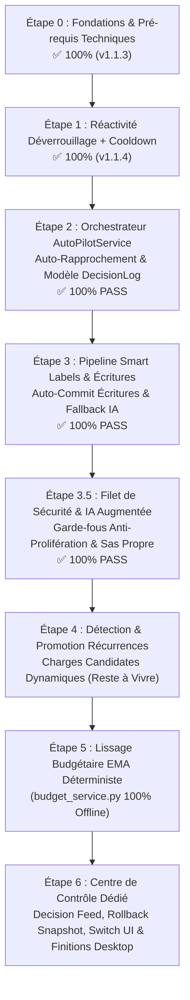

# OmniBank-Local — Architecture & Feuille de Route : Mode Auto-Pilote

> **Vision Ultime** : Fonctionnement en autonomie totale (100% offline et local-first). L'utilisateur configure ses comptes, déverrouille son coffre-fort chiffré, et l'application s'occupe du reste : synchronisation bancaire, labellisation/catégorisation multi-stage, rapprochement comptable instantané et calibration stabilisée des enveloppes budgétaires. L'utilisateur passe du rôle de *gestionnaire de saisie* à celui de *décideur éclairé*, consultant ses statistiques et échangeant avec son assistant IA local.

---

## Sommaire

1. [Vision & Spécifications de l'Interrupteur "Auto-Pilote"](#1-vision--spécifications-de-linterrupteur-auto-pilote)
2. [Cartographie des Briques & État d'Avancement Réel](#2-cartographie-des-briques--état-davancement-réel)
   - [Brique 1 : Déverrouillage Coffre, Modes de Relevé (Immédiat / Passif) & Cycle de Vie](#brique-1--déverrouillage-coffre-modes-de-relevé-immédiat--passif--cycle-de-vie)
   - [Brique 2 : Pipeline de Catégorisation Multi-Stage & Enregistrement Auto](#brique-2--pipeline-de-catégorisation-multi-stage--enregistrement-auto)
   - [Brique 3 : Moteur de Rapprochement Automatique à Haute Certitude](#brique-3--moteur-de-rapprochement-automatique-à-haute-certitude)
   - [Brique 4 : Détection & Promotion des Récurrences (Anticipation Reste à Vivre)](#brique-4--détection--promotion-des-récurrences-anticipation-reste-à-vivre)
   - [Brique 5 : Gestionnaire Dynamique d'Enveloppes (Lissage 3–6 Mois & Cold Start)](#brique-5--gestionnaire-dynamique-denveloppes-lissage-36-mois--cold-start)
   - [Brique 6 : Sas d'Attente ("Pending Sync") & Matrice d'Arbitrage](#brique-6--sas-dattente-pending-sync--matrice-darbitrage)
   - [Brique 7 : Page Dédiée « Centre de Contrôle Auto-Pilote » (Vue Décisions, Réversibilité & Réorientation)](#brique-7--page-dédiée-centre-de-contrôle-auto-pilote-vue-décisions-réversibilité--réorientation)
3. [Pièges à Éviter & Points d'Attention Critiques](#3-pièges-à-éviter--points-dattention-critiques)
4. [Risques de Régression & Stratégies d'Étanchéité](#4-risques-de-régression--stratégies-détanchéité)
5. [Rappel des Règles Projets & Contraintes d'Ingénierie](#5-rappel-des-règles-projets--contraintes-dingénierie)
6. [Feuille de Route Incrémentale (Ordre de Réalisation)](#6-feuille-de-route-incrémentale-ordre-de-réalisation)
7. [Matrice de Validation & Cahier de Recette (Critères de Succès Pré-établis)](#7-matrice-de-validation--cahier-de-recette-critères-de-succès-pré-établis)

---

## 1. Vision & Spécifications de l'Interrupteur "Auto-Pilote"

Le mode **Auto-Pilote** n'est pas une boîte noire opaque ni une refonte complète du code, mais l'aboutissement d'une chaîne de briques modulaires déjà amorcées. Il dispose de son propre **Centre de Contrôle Dédié** (accessible via le menu de navigation `🤖 Auto-Pilote` ou par clic sur le badge d'état du header) et s'active via un interrupteur clair :

```
[ Mode Auto-Pilote : ACTIF ]
├── Sources d'Alimentation Détectées :
│    ├── Mode Hors Ligne (Fichier) : Ingestion automatique dès le glisser-déposer (CSV, XLSX, Relevé IA)
│    └── Mode En Ligne (Woob)      : Relevé planifié (12h/24h/48h) ou immédiat au déverrouillage du coffre en RAM
├── Pipeline d'ingestion : SmartLabelService (Règles -> Historique -> Inférence IA)
├── Ingestion comptable :
│    ├── Score certitude >= 85%  ──>  Rapprochement direct ou Enregistrement DB direct
│    └── Score certitude < 85%   ──>  Sas d'attente (Cockpit) pour arbitrage humain 1-clic
├── Budgets dynamiques : Recalibrage mensuel lissé (filtre EMA 3-6 mois, amortissement cold start)
├── Restitution silencieuse : Badge discret dans l'en-tête, zéro blocage, consultation 100% facultative
└── Souveraineté & Contrôle : Page dédiée pour auditer les décisions, dépointer, réorienter ou annuler
```

### Cycles d'Intronisation Cold-Start (Parcours Hybride Fichiers / Ligne)

L'Auto-Pilote est **universel** : il s'applique avec la même intelligence comptable que l'utilisateur choisisse d'importer ses relevés à la main (100% hors-ligne) ou de connecter sa banque :

#### Parcours 1 : Mode Fichier Local (CSV / Excel / Relevé IA) — 100% Hors Ligne & Souverain
```
[ Wizard de Démarrage (7 Étapes) ]
 ├── Étape 1/7 à 4/7 : Thème, Sécurité (PIN), Compte bancaire principal, Cycle de paie
 ├── Étape 5/7 : Choix de la tuile "📥 Importer un relevé (CSV / Excel)"
 ├── Étape 6/7 : Détection IA Locale (Ollama) & Interrupteur Auto-Pilote (indépendant et autonome même sans IA)
 └── Étape 7/7 : Confirmation & Lancement
          │
          ▼
[ Utilisation Quotidienne : Dépose de Fichiers (Dropzone CSV / Excel / IA) ]
 ├── L'utilisateur glisse-dépose son relevé mensuel ou hebdomadaire
 ├── 🤖 L'Auto-Pilote prend le relais instantanément sur le lot :
 │    ├── Calcule un csv_id déterministe (hash SHA-256 date/montant/marchand) garantissant l'idempotence
 │    ├── Normalise les libellés commerciaux (SmartLabelService)
 │    ├── Rapproche automatiquement les correspondances parfaites (≥ 85%)
 │    ├── Enregistre les dépenses courantes directes en base sans friction
 │    └── Ne dépose dans le Sas d'attente (Cockpit) QUE les doutes ou opérations ambiguës
 └── Bilan comptable et solde actualisés au centime d'euro en un éclair !
```

#### Parcours 2 : Mode Synchronisation en Ligne (Woob) — Optionnel avec Coffre-fort
```
[ Wizard de Démarrage ]
 └── Étape 5/7 : Choix de la tuile "⚡ Synchroniser en ligne"
          │
          ▼
[ Page "Comptes & Livrets" (Post-Wizard) ]
 ├── L'utilisateur clique sur "Ajouter une connexion bancaire"
 ├── Choix de la banque (Woob) + Saisie des identifiants
 ├── Création du mot de passe maître du Coffre-fort (PBKDF2 / Fernet)
 ├── Validation du challenge 2FA bancaire (SMS/Application mobile)
 └── Association (mapping) des comptes distants aux comptes locaux OmniBank
          │
          ▼
[ Le "Sacrement" d'Activation Auto-Pilote (Si non activé dans le Wizard) ]
 └── Modale d'intronisation dès confirmation de la 1ère connexion bancaire :
     « 🎉 Votre banque est reliée avec succès !
        Souhaitez-vous activer le Mode Auto-Pilote dès maintenant ?
        Vos futures opérations seront relevées, catégorisées et
        rapprochées automatiquement (selon votre fréquence 12/24/48h ou au déverrouillage). »
        [ Interrupteur : OUI / NON ]
```

### Machine à États & Visibilité de l'Interrupteur Auto-Pilote

L'interrupteur respecte une machine à états stricte pour garantir clarté et contrôle absolu à l'utilisateur, **indépendamment de son mode d'alimentation (fichiers CSV/Excel ou banque connectée)** :

1. **État Grisé / Inactif (`DISABLED`)** :
   - *Condition* : Aucun compte bancaire créé dans l'application (base totalement vierge sans compte courant, livret ou compte d'épargne).
   - *Comportement UI* : Switch grisé non cliquable avec infobulle explicite : *"Créez ou importez au moins un compte bancaire pour débloquer le Mode Auto-Pilote"*.
2. **État Disponible / Découverte (`DISCOVERY_MILESTONE`)** :
   - *Condition* : Déclenché lors du premier import réussi d'un relevé (CSV/Excel) OU lors de la première connexion bancaire réussie (si l'interrupteur n'était pas déjà activé dans le Wizard).
   - *Comportement UI* : Modale d'intronisation proposant d'activer l'interrupteur :
     *« 🎉 Vos opérations sont importées avec succès ! Souhaitez-vous activer le Mode Auto-Pilote ? Vos futurs relevés (fichiers CSV/Excel ou synchronisation bancaire) seront automatiquement classés, rapprochés et réconciliés. »*
3. **État Engagé mais en Rodage (`ENABLED_LEARNING` — 🟡 Badge d'Apprentissage)** :
   - *Condition* : Auto-Pilote activé, mais en phase de Cold-Start (moins de 60 jours d'historique, ou socle de catégories encore incomplet).
   - *Comportement UI* : Switch vert allumé + badge d'accompagnement jaune : `[ Auto-Pilote : 🟡 En apprentissage ]`. Infobulle : *"Auto-Pilote actif (relevés importés ou synchronisés). En attente d'une première catégorie pour parfaire l'auto-classification. Les budgets s'initialiseront au premier cycle de paie."*
4. **État Vitesse de Croisière (`ENABLED_CRUISING` — 🟢 Badge Actif)** :
   - *Condition* : Comptes stabilisés, socle de catégories actif, récurrences identifiées.
   - *Comportement UI* : `[ Auto-Pilote : 🟢 Actif ]`. Les écritures et rapprochements à haute certitude ($\ge 85\%$) sont validés sans action manuelle dès l'injection du relevé. Le Sas d'attente ne retient que les exceptions réelles.
5. **État Veille Manuelle (`ENABLED = false`)** :
   - *Comportement* : L'application fonctionne en mode classique (100% des opérations bancaires, qu'elles proviennent d'un import de fichier ou d'un relevé en ligne, sont déposées dans le Sas d'attente / Cockpit pour validation manuelle ligne par ligne).

> [!IMPORTANT]
> **Garantie d'Étanchéité & Clé de Configuration (`auto_pilot_enabled`)** :
> Pour ne jamais forcer l'autonomie sur les profils souhaitant une gestion manuelle classique, la clé `auto_pilot_enabled` est introduite dès l'Étape 1 dans la table `GlobalConfig` (valeur par défaut : `"false"`). Tant que cet interrupteur n'est pas activé, 100% des opérations continuent d'atterrir dans le Sas d'attente (Cockpit) sans aucune altération de comportement par rapport à OmniBank v1.1.2.

### Rôle de l'IA Locale (Ollama) : Strictement Optionnelle

Conformément à la règle fondatrice du projet (*« L'app est 100% fonctionnelle sans Ollama »*), le mode Auto-Pilote s'adapte sans rupture :
* **Sans IA (Mode Déterministe Pur)** : Le système repose sur la normalisation Regex, les règles exactes `BankLabelMapping`, le fuzzy-matching sur l'historique et la détection mathématique des récurrences. Les marchands inconnus sont assignés *"À catégoriser"*, et l'apprentissage s'enrichit dès le 1er clic de l'utilisateur.
* **Avec IA (Mode Augmenté)** : Le LLM local intervient en secours pour inférer les catégories des nouveaux marchands inconnus et proposer des suggestions textuelles de gestion budgétaire.

---

## 2. Cartographie des Briques & État d'Avancement Réel

### Brique 1 : Déverrouillage Coffre, Modes de Relevé (Immédiat / Passif) & Cycle de Vie
*Permettre au logiciel d'exploiter la clé de déchiffrement en mémoire vive soit par synchronisation immédiate au déverrouillage, soit en mode passif silencieux confié au planificateur d'arrière-plan (12h/24h/48h).*

* **Fichiers concernés** :
  - [`app/services/credential_vault.py`](file:///d:/Code%20Projects/OmniBank-Local/app/services/credential_vault.py) (`CredentialVault`, `VaultSessionManager`)
  - [`app/services/bank_sync_scheduler.py`](file:///d:/Code%20Projects/OmniBank-Local/app/services/bank_sync_scheduler.py) (`bank_sync_scheduler_loop`, `trigger_manual_auto_sync`)
  - [`app/routers/bank_sync.py`](file:///d:/Code%20Projects/OmniBank-Local/app/routers/bank_sync.py) (`/vault/unlock`)
* **État d'avancement actuel : 100% — ✅ LIVRÉ (v1.1.4 / Étape 1)**
  - ✅ Chiffrement Fernet + dérivation PBKDF2-HMAC-SHA256 (480 000 itérations).
  - ✅ Gestion de session en mémoire vive avec TTL (jours) scopée par profil (`VaultSessionManager`).
  - ✅ Boucle planifiée d'arrière-plan (`bank_sync_scheduler_loop`) vérifiant toutes les 60s si le mot de passe maître est présent en RAM.
  - ✅ **Interrupteur Maître & Clé de Configuration (`auto_pilot_enabled`)** : Clé technique interne initialisée à `"false"` dans `GlobalConfig` (SQLite v24) garantissant le mode manuel classique par défaut.
  - ✅ **Hook réactif et paramétrable `on_vault_unlocked`** : Paramètre utilisateur `sync_on_vault_unlock` (géré en base et dans les réglages/modale) permettant la bascule entre le Mode A (Relevé immédiat au déverrouillage, `< 200 ms`) et le Mode B (Déverrouillage passif silencieux en RAM sans requête réseau bancaire à T0).
  - ✅ **Prise en charge des deux cycles de vie** : Conteneur Docker 24/7 (maintien de session selon TTL) et Desktop Tauri (session en mémoire vive active).
  - ✅ **Régulateur de Fréquence Persistant (Cooldown Policy 3h)** : Clé `GlobalConfig.last_auto_sync_attempt` protégeant les serveurs bancaires lors d'ouvertures/fermetures répétées, avec maintien du forçage manuel immédiat (`force=True`).
  - ✅ **Isolation de Session SQLAlchemy & Concurrence Thread-Safe** : Sessions dédiées `SessionProf` au sein de chaque thread worker, et verrou d'exécution anti-collision `_ACTIVE_BACKGROUND_THREADS` avec vérification `t.is_alive()` éliminant les doubles relevés et doubles notifications.
  - ✅ **Horodatage ISO UTC & Affichage Heure Locale** : Suffixe standard `Z` sur les dates de notifications (`app/routers/notifications.py`) et helper de normalisation `_parseNotifDate` (`app.js`) garantissant une restitution fidèle au fuseau local de l'utilisateur.
  - ✅ **Rafraîchissement Réactif Global en Temps Réel** : Branchement de `BankSyncView.refreshActiveViews()` dès la fin du relevé en tâche de fond ou la réception de notification bancaire (actualisation immédiate de l'Overview, Dashboard/Timeline, Opérations, Comptes et soldes sans F5).
  - ✅ **Mode Catch-Up & Tri Chronologique Strict** : Tri croissant systématique `history_raw.sort(key=lambda x: x["tx_date_obj"])` et `coming_raw` éliminant l'antéchronologie Woob.
  - ✅ **Gestion asynchrone non-bloquante du 2FA** : Notifications in-app dédiées et attente sans thread bloqué.
  - ✅ **Traçabilité du Déclencheur (`trigger_source`)** : Marquage contextuel de l'origine de la synchronisation (`vault_unlock`, `scheduled`, `manual`) dans les logs et notifications bancaires, offrant une visibilité immédiate sur la cause de chaque relevé.
  - ✅ **Déduplication Intelligente des Notifications Bancaires** : Mise à jour in-place évitant l'empilement intempestif de notifications d'erreur successives pour un même compte bancaire.
  - ✅ **Suite de tests unitaires et d'intégration validée** : 100% de succès sur le Pack de Test 1 (T1.1 à T1.6 dans `tests/test_bank_sync_step1.py`).

> [!NOTE]
> **Périmètre Desktop (Tauri Rust) vs Backend (Brique 1)** :
> La Brique 1 traite exclusivement la logique d'authentification et de planification en Python (`CredentialVault`, `BankSyncScheduler`, `GlobalConfig`). Sur Desktop, l'application fonctionne selon le comportement standard actuel : tant que la fenêtre est ouverte, la session vit ; si la fenêtre est fermée, le processus s'arrête.
> L'interception de fermeture sécurisée (`CloseRequested`) et une éventuelle option de minimisation en barre des tâches (**System Tray**, fonctionnalité inexistante à ce jour dans l'application) sont des développements natifs Rust programmés à l'**Étape 6** (Finitions Desktop).

---

### Brique 2 : Pipeline de Catégorisation Multi-Stage & Enregistrement Auto
*Transformer un libellé bancaire brut illisible en une opération claire avec catégorie fiable sans intervention humaine.*

* **Fichiers concernés** :
  - [`app/services/smart_label_service.py`](file:///d:/Code%20Projects/OmniBank-Local/app/services/smart_label_service.py) (`normalize_raw_label`, `resolve_smart_labels_batch`, `_compute_match_score`)
  - [`app/routers/ai_helpers.py`](file:///d:/Code%20Projects/OmniBank-Local/app/routers/ai_helpers.py) / [`app/routers/chat.py`](file:///d:/Code%20Projects/OmniBank-Local/app/routers/chat.py)
* **État d'avancement actuel : 100% — ✅ LIVRÉ (Étape 3)**
  - ✅ Nettoyage regex haute précision (suppression dates, codes guichets, CB, PRLV, préfixes passerelles PayPal/Stripe/SumUp).
  - ✅ Étage 1 : Base de règles déterministes (`BankLabelMapping`).
  - ✅ Étage 2 : Fuzzy matching Levenshtein + Jaccard tokens signifiants sur l'historique réel.
  - ✅ Détection d'ambiguïté : Si plusieurs catégories concurrentes n'atteignent pas un consensus de $\ge 75\%$, le moteur refuse de deviner à l'aveugle.
  - ✅ Résolution par lot vectorisée ultra-rapide ($O(N)$).
  - ✅ **Sanctuarisation Manuelle des Règles (`is_manual = True`)** : Les règles configurées ou modifiées manuellement par l'utilisateur sont formellement protégées contre tout écrasement ou réécriture lors des imports ou détections ultérieurs.
  - ✅ **Apprentissage Progressif Fiabilisé ($N \ge 2$)** : La première observation d'un marchand ($N=1$) reste à l'état provisoire (`is_provisional = True`) sans figer prématurément de catégorie automatique. L'apprentissage ne se consolide qu'à partir de 2 détections concordantes.
  - ✅ **Prise en Charge Native des Marchands Caméléons / Multi-Catégories (`_MULTI_CATEGORY_MERCHANTS`)** : Amazon, PayPal, grandes surfaces et marketplaces ne sont plus figés sur une catégorie unique erronée ; ils conservent leur libellé commercial propre tout en laissant la catégorie libre à l'arbitrage humain (`is_multi_category = True`).
  - ✅ **Détection de Dispersion Catégorielle** : Si l'historique d'un commerçant est éclaté entre plusieurs catégories sans consensus net, le moteur neutralise l'affectation automatique pour éviter tout mauvais choix.
  - ✅ **Réversibilité Totale & Intégration `ActionHistory`** : Toute modification d'une règle (passage manuel/auto, changement de catégorie, activation multi-catégorie) est tracée dans l'historique d'annulation/rétablissement global avec toast d'annulation 1-clic (`undo_action` / `redo_action`).
  - ✅ **Badges de Transparence dans le Sas d'Attente (Cockpit de Revue)** : Affichage direct de badges d'explication de provenance (`🛡️ Règle manuelle`, `🤖 Règle apprise`, `⚠️ Provisoire (1ère fois)`, `🔀 Multi-catégories`, `🕒 Historique`) avec info-bulles détaillées guidant l'utilisateur sur la manière de modifier la règle si besoin.
  - ✅ **Modale d'Édition Ergonomique avec Recherche Permissive** : Modale dédiée d'édition de règle dans l'Atelier avec recherche instantanée insensible à la casse et aux accents (`removeAccents`), prévisualisation en direct et navigation clavier.
  - ✅ **Garde-fou Anti-Prolifération, Filet de Sécurité Déterministe & Revue Manuelle IA (Étape 3.5)** : Attribution d'une catégorie fourre-tout intelligente (`"Dépenses diverses"` / `"Revenus divers"`) pour 100% des opérations inconnues afin de garantir un Sas propre, proposition automatique IA dès la synchronisation manuelle et à l'ouverture de revue avec badges explicatifs (`🤖 Suggestion IA`, `✨ Nouvelle catégorie`, `🛡️ Fourre-tout`), quota maximal de 2 nouvelles catégories par lot d'import IA, fusion lexicale (≥ 80%) et création différée en base au moment du commit.
  - ✅ **Étage 3 : Fallback IA local Ollama Groupé par Lot (`call_ollama_batch`)** : Résolution des marchands inconnus en 1 seule requête JSON groupée (`format: "json"`) avec garde-fou anti-hallucination, validation linguistique anti-déchet et proposition contrôlée de nouvelles catégories.
  - ✅ **Banc d'Essai & Simulation Smart Label** : Atelier interactif de test de la cascade décisionnelle en direct avec sauvegarde 1-clic en règle permanente et plancher de fluidité UX.
  - ✅ **Auto-Commit des Nouvelles Écritures Courantes & Marchands Caméléons** : Enregistrement autonome des dépenses courantes directes non ambiguës dans [`app/services/autopilot_service.py`](file:///d:/Code%20Projects/OmniBank-Local/app/services/autopilot_service.py) avec traçabilité complète `AutopilotDecisionLog` (`new_entry`) lorsque `auto_pilot_enabled == True`, incluant les marchands caméléons par défaut.

---

### Brique 3 : Moteur de Rapprochement Automatique à Haute Certitude
*Associer automatiquement les opérations débitées/créditées avec les prévisions ou récurrences sans faux positif.*

* **Fichiers concernés** :
  - [`app/services/reconciliation_engine.py`](file:///d:/Code%20Projects/OmniBank-Local/app/services/reconciliation_engine.py) (`check_reconciliation` — extrait et découplé en Étape 0)
  - [`app/services/autopilot_service.py`](file:///d:/Code%20Projects/OmniBank-Local/app/services/autopilot_service.py) (Nouveau service d'orchestration unifié : `AutoPilotService`)
  - [`app/models.py`](file:///d:/Code%20Projects/OmniBank-Local/app/models.py) (Modèle de traçabilité : `AutopilotDecisionLog` — créé en Étape 0)
  - [`app/routers/csv_parser.py`](file:///d:/Code%20Projects/OmniBank-Local/app/routers/csv_parser.py) (`csv_id` déterministe SHA-256)
  - [`app/services/bank_sync_service.py`](file:///d:/Code%20Projects/OmniBank-Local/app/services/bank_sync_service.py)

> [!NOTE]
> **Dette Technique Soldée — Refactoring `check_reconciliation` (Étape 0)** :
> La fonction `check_reconciliation` a été extraite avec succès depuis le routeur `csv_parser.py` vers son module dédié [`app/services/reconciliation_engine.py`](file:///d:/Code%20Projects/OmniBank-Local/app/services/reconciliation_engine.py) (Jalon 0.1), éliminant la dépendance inversée et préparant l'orchestration par `AutoPilotService`.

* **État d'avancement actuel : 100% — ✅ LIVRÉ (Étape 2)**
  - ✅ Score composite de matching (0 à 100 points) :
    - Empreinte bancaire unique (`csv_id`) : 100 pts.
    - Montant exact ($\pm 0.01$ €) : 40 pts.
    - Proximité temporelle asymétrique : 0 à 35 pts (privilégie les débits 1 à 3 jours après la date prévue).
    - Similarité textuelle : 0 à 25 pts.
  - ✅ Gestion des virements internes compte à compte (transferts miroirs).
  - ✅ Distinction nette entre opérations confirmées et opérations à venir (`is_coming`).
  - ✅ Empreinte idempotente des fichiers (`csv_id` déterministe SHA-256 + index intra-lot dans `csv_parser.py` — Jalon 0.3).
  - ✅ Modèle de traçabilité `AutopilotDecisionLog` dans `app/models.py`, schéma v24 SQLite et DTO Pydantic `AutopilotDecisionLogOut` (Jalons 0.4, 0.5, 0.6).
  - ✅ **Séparation Stricte : Évaluation Pure vs Mutation Orchestrée** : `check_reconciliation` (`reconciliation_engine.py`) reste une fonction pure d'évaluation sans mutation, tandis que `AutoPilotService.process_incoming_batch()` (`autopilot_service.py`) orchestre l'auto-commit DB, le journal de bord `AutopilotDecisionLog`, la traçabilité Undo/Redo `ActionHistory` et l'invalidation du cache de statistiques.
  - ✅ **Politique d'Auto-Validation (Auto-Commit Threshold)** :
    - **Zone Verte ($\ge 85$ pts ou `csv_id` identique sans collision)** : Rapprochement automatique instantané en base.
    - **Zone Orange ($60 \le \text{Score} < 85$ pts)** : Maintien dans le Sas d'attente (Cockpit) avec statut *"Rapprochement suggéré"*.
    - **Zone Rouge ($< 60$ pts)** : Traitée comme nouvelle opération distincte.
  - ✅ **Détection Anti-Collision sur Montants Homonymes** : Si plusieurs prévisions concordent au centime près, l'arbitrage textuel départage les candidats ; en l'absence de discriminant, `collision_detected = True` neutralise l'auto-commit et bascule l'opération dans le sas d'attente pour arbitrage humain.
  - ✅ **Suite de tests unitaires et d'intégration validée** : 100% de succès sur le Pack de Test 2 (T2.1 à T2.8 dans `tests/test_autopilot_step2.py`).

### Brique 4 : Détection & Promotion des Récurrences (Anticipation Reste à Vivre)
*Détecter automatiquement les opérations répétées pour affiner le Reste à Vivre sans polluer la base de données.*

* **Ce qu'il reste à faire** :
   1. **Algorithme de Détection Périodique (Pattern Matching)** :
      - Détection des débits récurrents : Même marchand nettoyé + Montant identique ($\pm 0,00$ €) + Intervalle de 28 à 31 jours ($\pm 2$ jours de battement calendaire). **Filtre strict sur les dépenses (`raw_amount < 0` ou `type == 'expense_var'`)** : Les remboursements de santé (ex: virement CPAM) ou recettes exceptionnelles ne doivent en aucun cas être convertis en modèles de charges fixes.
      - **Modification requise de `calculate_rest_to_live`** dans [`finance_engine.py`](file:///d:/Code%20Projects/OmniBank-Local/app/services/finance_engine.py) : la fonction actuelle (ligne 144) ne considère que les transactions non rapprochées avant la prochaine paie. Un scan historique dynamique doit être ajouté pour détecter les charges candidates ($N \ge 2$) et les soustraire du solde sans écriture en base.
      - **Optimisation de Performance via Cache** : Le calcul des charges candidates ($N \ge 2$) doit être mis en cache dans [`app/services/stats_cache.py`](file:///d:/Code%20Projects/OmniBank-Local/app/services/stats_cache.py) et invalidé uniquement lors des commits de transactions ou imports de relevés, évitant tout scan SQL lourd sur 90 jours lors de chaque rafraîchissement du Dashboard ou de l'Overview.
   2. **Approche à Deux Niveaux & Règle Anti-Doublon Comptable** :
      - **Niveau 1 — Anticipation Reste à Vivre Déterministe Dynamique ($N=2$)** : Dès 2 occurrences consécutives détectées, l'échéance du mois suivant est intégrée dynamiquement comme charge fixe prévisionnelle dans le calcul du Reste à Vivre (`calculate_rest_to_live` dans `finance_engine.py`) sans dépendre d'une variable globale volatile en RAM.
      - **Garde-fou Anti-Doublon dans `calculate_rest_to_live`** : Une charge candidate ($N=2$) n'est déduite du solde **que si aucun débit concordant (même marchand nettoyé et montant exact)** n'a déjà été débité et comptabilisé depuis le début du cycle de paie en cours (évite de déduire deux fois une facture déjà réglée).
      - **Niveau 2 — Suggestion d'Officialisation (1-Clic)** : Badge discret dans le Dashboard invitant à convertir l'opération en `RecurrenceTemplate` officiel.
   3. **Règle du Mode Full-Auto pour Charges Ordinaires (Abonnements / Loyers)** :
      - Pour les débits récurrents ordinaires (sans signature de paiement fractionné), la promotion automatique en template n'intervient qu'à partir du **3ème mois consécutif ($N \ge 3$)** avec création d'un `RecurrenceTemplate` permanent actif (`is_closed = False`).
      - L'utilisateur conserve toujours la possibilité de clôturer manuellement le template en 1 clic dans l'onglet Récurrences ou le Centre de Contrôle.
   4. **Détection des Paiements Fractionnés (Alma / Klarna / Oney) & Cycle de Clôture Déterministe** :
      - **Regex de Détection** : Identification des signatures d'échelonnement dans les libellés bruts via un motif regex dédié : `r'\b(?:ALMA|KLARNA|ONEY|FLOA|COFIDIS).*?\b(\d+)\s*[/x]\s*(\d+)\b'` capturant le numéro d'échéance courante ($M$) et le total ($N$) pour en déduire `max_occurrences = N`.
      - **Liaison Rétroactive Immédiate ($M$ Transactions Passées)** : Le modèle `RecurrenceTemplate` ne disposant pas de colonne compteur, l'Auto-Pilote rattache immédiatement les $M$ transactions réelles existantes au template créé (`tx.recurrence_id = tpl.id`). Le décompte existant `existing_count = db.query(Transaction).filter(...).count()` vaut ainsi immédiatement $M$, garantissant que `generate_recurrences` ne programmera que les $N - M$ échéances restantes avant extinction automatique.
      - **Extinction Automatique à l'Échéance Finale ($M = N$)** : Dès que l'échéance finale est atteinte (ex: Alma 3/3 au Mois 3), le template est immédiatement marqué `is_closed = True` et ne génère plus aucune opération future.
      - **Cohérence des Décomptes d'Assertions** : Les assertions du benchmark et de l'UI vérifiant les templates officialisés comptent les templates **actifs** (`is_closed == False`). Ainsi, au Mois 3, il y a rigoureusement **4 templates actifs** (Foncia, EDF, Freebox, Spotify), le template Alma étant clôturé.
      - **Garde-fou Anti-Promotion Infinie** : Un paiement identifié comme fractionné ($N \le 12$) ne doit jamais être promu en abonnement récurrent permanent.

---

### Brique 5 : Gestionnaire Dynamique d'Enveloppes (Lissage 3–6 Mois & Cold Start)
*Créer, adapter et maintenir les enveloppes de budget sans à-coups ni hyper-réactivité, de manière 100% déterministe et offline.*

* **Fichiers concernés** :
  - [`app/services/budget_service.py`](file:///d:/Code%20Projects/OmniBank-Local/app/services/budget_service.py) (Calcul mathématique du lissage EMA, Winsorizing et plafonnement — **100% offline sans dépendance Ollama**)
  - [`app/services/stats_utils.py`](file:///d:/Code%20Projects/OmniBank-Local/app/services/stats_utils.py) (Filtre d'écrêtage Winsorizing extrait et partagé — Étape 0)
  - [`app/services/budget_ai_service.py`](file:///d:/Code%20Projects/OmniBank-Local/app/services/budget_ai_service.py) (Suggestions et commentaires qualitatifs IA — facultatifs)
* **État d'avancement actuel : 50%**
  - ✅ Calcul des moyennes historiques sur fenêtres glissantes configurables (3 à 12 mois).
  - ✅ Écrêtage statistique des anomalies (Winsorizing / outlier sensitivity 1 à 5) extrait dans [`app/services/stats_utils.py`](file:///d:/Code%20Projects/OmniBank-Local/app/services/stats_utils.py) et re-exporté dans `budget_service.py` (**100% offline sans Ollama** — Jalon 0.7).
  - ✅ Colonne `Budget.is_locked` ajoutée en base de données (schéma SQLite v24) et intégrée aux DTOs Pydantic (Jalons 0.4, 0.5, 0.6).
  - ⬜ Synchronisation dynamique des dépenses fixes vs variables avec les `RecurrenceTemplate` — la classification fixe/variable existe dans le modèle, mais **aucune logique de synchronisation automatique** entre les templates et les enveloppes budgétaires n'est implémentée dans `budget_service.py`.
* **Ce qu'il reste à faire** :
  1. **Cadence Périodique & Déclencheur Temporel (Anti-Thrashing)** :
     - **Règle absolue** : Les enveloppes ne doivent **JAMAIS** être modifiées lors d'une synchronisation quotidienne.
     - **Déclencheur Temporel Backend** : Le recalibrage s'exécute uniquement à date fixe : **au 1er du mois ou lors d'un nouveau cycle de paie**.
     - **Implémentation** : La vérification est intégrée dans la boucle périodique [`bank_sync_scheduler_loop`](file:///d:/Code%20Projects/OmniBank-Local/app/services/bank_sync_scheduler.py) ainsi qu'au boot dans le `lifespan` de [`app/main.py`](file:///d:/Code%20Projects/OmniBank-Local/app/main.py). Une clé `last_budget_recalibration_period` (ex: `"2026-09"`) est persistée dans `GlobalConfig` pour garantir qu'un seul calcul est appliqué par période.
  2. **Filtre de Lissage Exponentiel Déterministe (EMA 3–6 mois)** :
     - Implémenté directement dans `budget_service.py` pour fonctionner même si Ollama est absent ou désactivé.
     - Formule d'ajustement amorti :
       $$\text{Budget}_{t} = (1 - \alpha) \cdot \text{Budget}_{t-1} + \alpha \cdot \overline{\text{Dépenses}}_{3-6m}$$
       avec $\alpha = 0.20$ (amortissement doux préservant la stabilité).
  3. **Plafond de Dérive Mensuelle (Drift Guard) & Filtre Strict d'Éligibilité des Enveloppes** :
     - **Filtre strict d'éligibilité** : Le lissage s'applique EXCLUSIVEMENT aux enveloppes mensuelles opérationnelles de dépenses courantes :
       `Budget.envelope_type == 'spending' and not Budget.is_project and not Budget.is_closed and not Budget.is_locked and Budget.period == 'monthly'`
     - **Exclusion stricte** : Les tirelires d'épargne (`envelope_type == 'savings'`) alimentées manuellement via `BudgetAllocation`, les budgets de projets ponctuels (`is_project == True`), les enveloppes annuelles ou clôturées sont formellement protégés contre toute retouche automatique.
     - Aucun budget automatique ne doit varier de plus de $\pm 10\%$ d'un mois sur l'autre de façon autonome.
     - Prise en compte du cadenas `Budget.is_locked` (initialisé en Étape 0) pour que le filtre ignore formellement toute enveloppe cadenassée par l'utilisateur.
  4. **Traitement du "Cold Start" (Démarrage à Froid)** :
     - Si l'historique compte moins de 3 mois de données :
       - Priorité absolue aux montants des récurrences connues (`RecurrenceTemplate`).
       - Pour le variable : application d'un coefficient de prudence ($1.15 \times \text{moyenne observation}$) pour éviter les dépassements d'enveloppe précoces.
       - Interdiction de créer des micro-enveloppes anecdotiques (seuil plancher de dépense mensuelle minimum, ex: 30 €).

---

### Brique 6 : Sas d'Attente ("Pending Sync") & Matrice d'Arbitrage
*Le sas d'attente devient le filtre d'exception de l'Auto-Pilote pour tous les modes d'entrée.*

* **Fichiers concernés** :
  - [`app/services/autopilot_service.py`](file:///d:/Code%20Projects/OmniBank-Local/app/services/autopilot_service.py) (Point d'entrée unique de traitement des lots entrants)
  - [`app/services/bank_sync_scheduler.py`](file:///d:/Code%20Projects/OmniBank-Local/app/services/bank_sync_scheduler.py) (`save_pending_sync_data`, `_PENDING_SYNC_DATA`)
  - [`app/routers/csv_manager.py`](file:///d:/Code%20Projects/OmniBank-Local/app/routers/csv_manager.py) (`import_to_pending`)
  - [`app/routers/bank_sync.py`](file:///d:/Code%20Projects/OmniBank-Local/app/routers/bank_sync.py)
* **État d'avancement actuel : 95%**
  - ✅ Sas d'attente persistant (RAM + `GlobalConfig`).
  - ✅ Déduplication automatique entre imports de fichiers CSV et connexions bancaires en ligne.
  - ✅ Cockpit visuel ergonomique permettant d'ignorer, modifier ou valider les opérations.
  - ✅ Support multi-onglets XLSX & multi-sections CSV avec mémorisation de mapping par compte (`GlobalConfig.file_account_mapping`) et ré-évaluation dynamique instantanée du rapprochement (Phase B / v1.1.3).
  - ✅ **Unification du Pipeline d'Ingestion & Routage Dynamique** : Les relevés Woob (`execute_auto_sync_for_connection`) et les imports de fichiers (`import_to_pending`) transitent désormais par le point d'entrée unique `AutoPilotService.process_incoming_batch()`.
  - ✅ **Routage Conditionnel Transparent** : Si l'Auto-Pilote est désactivé, 100% des opérations vont dans le Sas (comportement manuel classique 100% intact). S'il est activé, les rapprochements à haute certitude court-circuitent le Sas avec audit et notification enrichie.
* **Ce qu'il reste à faire (Étape 3)** :
  1. **Adaptation Dropzone CSV / Excel (`import_wizard.js`)** : Fermeture automatique de la modale avec toast de confirmation lorsque 100% des opérations d'un lot sont traitées de manière autonome (`pending === 0`), sans ouvrir de modale de revue vide.

---

### Brique 7 : Page Dédiée « Centre de Contrôle Auto-Pilote » (Vue Décisions, Réversibilité & Réorientation)
*Garantir la souveraineté absolue et le contrôle de l'utilisateur grâce à une page dédiée transparente, réversible et interactive (consultation 100% facultative).*

* **Fichiers concernés** :
  - Nouveau fichier frontend : `static/js/views/autopilot_view.js` (`AutopilotView`)
  - Nouveau routeur backend : `app/routers/autopilot.py` (`/api/autopilot/decisions`, `/api/autopilot/override`, `/api/autopilot/rollback-cycle`)
  - Routeur de gestion des règles réutilisé : [`app/routers/smart_labels.py`](file:///d:/Code%20Projects/OmniBank-Local/app/routers/smart_labels.py) (`/api/smart-labels/mappings` — CRUD déjà existant sur `BankLabelMapping`)
  - [`app/services/history_service.py`](file:///d:/Code%20Projects/OmniBank-Local/app/services/history_service.py) (`record_action`, `snapshot_entity`)
  - [`app/models.py`](file:///d:/Code%20Projects/OmniBank-Local/app/models.py) (`AutopilotDecisionLog`, `BankLabelMapping`)
  - [`static/index.html`](file:///d:/Code%20Projects/OmniBank-Local/static/index.html) & [`static/js/app.js`](file:///d:/Code%20Projects/OmniBank-Local/static/js/app.js) (Bouton nav `🤖 Auto-Pilote` et badge interactif dans le header)
* **État d'avancement actuel : 60%**
  - ✅ Système `record_action` + `snapshot_entity` dans `history_service.py` pour l'historique avant/après des mutations de transactions et des règles Smart Labels.
  - ✅ Système de notifications persistantes avec filtres actif/archivé, déduplication et provenance `trigger_source`.
  - ✅ Base de règles d'apprentissage `BankLabelMapping` et API complète existante dans `smart_labels.py` (évite de réinventer un CRUD d'API en Étape 6).
  - ✅ **Atelier des Directives Opérationnel (`config_smart_labels.js`)** : Tableau des correspondances libellés/catégories avec filtres, bascule 1-clic Manuel/Auto, bascule Multi-catégories, modale d'édition in-place avec recherche ultra-permissive (casse/accents) et annulation immédiate (Undo).

#### 1. Philosophie : Autonomie Silencieuse par Défaut, Contrôle Souverain à la Demande
- **Consultation 100% Facultative** : L'Auto-Pilote travaille silencieusement en tâche de fond. Il n'interrompt jamais l'utilisateur avec des modales bloquantes ou des demandes de validation intempestives. Si l'utilisateur choisit de ne jamais visiter cette page, ses comptes restent impeccablement tenus et équilibrés.
- **Zéro "Boîte Noire"** : Chaque décision prise de manière autonome (rapprochement, écriture, catégorisation, récurrence, enveloppe) est tracée avec son motif explicatif et conservée dans un journal structuré.
- **Souveraineté & Réversibilité Absolue** : L'utilisateur n'est jamais prisonnier des décisions du robot. En cas de désaccord, il peut d'un clic défaire une action, rectifier une étiquette ou réorienter le comportement futur du système.

#### 2. Accès Ergonomique & Indicateur Silencieux
- **Bouton Navigation Principal** : Ajout de l'onglet `🤖 Auto-Pilote` (`data-view="autopilot"`) dans la barre de navigation.
- **Accès Rapide Contextuel** : Un clic direct sur le badge de statut dans le header (`[ Auto-Pilote : 🟢 Actif (3 décisions) ]`) ouvre instantanément la page.
- **Compteur Discret** : Une pastille numérique discrète signale le nombre d'actions prises depuis la dernière visite (`🤖 Auto-Pilote (3)`), sans sonnerie ni notification intrusive, et s'estompe naturellement dès la consultation.

#### 3. Architecture Détaillée des 4 Panneaux de la Page (`AutopilotView`)

```
┌─────────────────────────────────────────────────────────────────────────────┐
│ 🤖 CENTRE DE CONTRÔLE AUTO-PILOTE                     [ Switch : 🟢 ACTIF ] │
├─────────────────────────────────────────────────────────────────────────────┤
│ Mode : (•) Vitesse de Croisière (Full-Auto)   ( ) Prudent (Semi-Auto)       │
│ Santé : Dernier relevé : Aujourd'hui 08:34 | Coffre : Valide | IA : Ollama  │
│ KPIs  : 42 opérations gérées | Précision : 100% | 0 anomalie | 120 clics éco│
├─────────────────────────────────────────────────────────────────────────────┤
│ 📜 FLUX DES DÉCISIONS AUTOMATIQUES (Decision Feed)                          │
│ Filtres : [ Tous ] [ 🟢 Rapprochements ] [ 🏷️ Catégories ] [ 🔄 Récurrences ]│
│                                                                             │
│ ▼ Cycle de Relevé du 06/09/2026 à 08:34 (BoursoBank)   [ ⏪ Annuler ce cycle ]│
│ ┌─────────────────────────────────────────────────────────────────────────┐ │
│ │ 🟢 RAPPROCHEMENT COMPTABLE                                (Score: 94%) │ │
│ │ Débit de 65,00 € "PRLV EDF" rapproché avec prévision #412               │ │
│ │ Motif : Montant exact + échéance calendaire concordante (+1 jour)       │ │
│ │ [ ↩️ Dépointer / Dissocier ]  [ 🔍 Voir l'écriture ]                     │ │
│ └─────────────────────────────────────────────────────────────────────────┘ │
│ ┌─────────────────────────────────────────────────────────────────────────┐ │
│ │ 🏷️ NOUVELLE ÉCRITURE & CATÉGORISATION                     (Confiance: 92%)│ │
│ │ Débit de 38,50 € "CB CARREFOUR MARKET 7501"                             │ │
│ │ Nettoyé en : "Carrefour" ──> Affecté à : [ Alimentation ▾ ]             │ │
│ │ Motif : Règle déterministe #12                                          │ │
│ │ [ ✏️ Changer Catégorie ]  [ 🚫 Exclure ce marchand ]                     │ │
│ └─────────────────────────────────────────────────────────────────────────┘ │
│ ┌─────────────────────────────────────────────────────────────────────────┐ │
│ │ 🔄 RÉCURRENCE VALIDÉE                                    (3ème mois)   │ │
│ │ Débit récurrent de 10,99 € "SPOTIFY PARIS" officialisé en charge fixe   │ │
│ │ [ 🛑 Clôturer la récurrence ]  [ ⚙️ Configurer le modèle ]               │ │
│ └─────────────────────────────────────────────────────────────────────────┘ │
├─────────────────────────────────────────────────────────────────────────────┤
│ 🛠️ ATELIER DES DIRECTIVES & RÈGLES APPRISES (Rules Workshop)                 │
│ Onglets : [ 📋 Règles Marchands (18) ] [ 🚫 Marchands Exclus (2) ] [ 🔒 Budgets (4) ]│
└─────────────────────────────────────────────────────────────────────────────┘
```

#### 4. Les Leviers de Contrôle : Revenir dessus, Modifier & Réorienter

1. **Revenir dessus (Défaire / Annuler sans risque)** :
   - **[Dépointer / Dissocier]** : Rompt instantanément le rapprochement d'une opération si l'association était erronée (ex: deux prélèvements au montant homonyme). L'opération bancaire et la prévision redeviennent indépendantes (`reconciliation_date = NULL`), et la décision est marquée `is_undone = True` sans aucune perte de données.
   - **[Rollback Global de Cycle (1-Clic)]** : Situé sur l'en-tête de chaque groupe de synchronisation, ce bouton permet d'annuler en bloc l'ensemble des décisions d'un cycle précis (`batch_id`). Le moteur applique une logique sémantique stricte selon `decision_type` :
     * **Pour `decision_type == 'new_entry'`** : L'écriture créée est purement supprimée de la table `Transaction`.
     * **Pour `decision_type == 'reconciliation'`** : L'écriture existante n'est **JAMAIS supprimée** (préservant intégralement les prévisions de l'utilisateur) ; elle est dissociée (`reconciliation_date = NULL`) et ses champs restaurés depuis son `raw_snapshot`.
     * **Pour `decision_type == 'recurrence_promotion'`** : Le template créé est clôturé ou supprimé.
     * **Statut d'Audit** : Toutes les lignes `AutopilotDecisionLog` du cycle passent à `is_undone = True` avec `undone_at = now()`.
     * **Reconstitution du Sas** : Grâce aux snapshots JSON, le lot original d'opérations est réinjecté fidèlement dans le Sas d'attente (`_PENDING_SYNC_DATA`) pour examen manuel dans le Cockpit.

2. **Modifier la Décision (Rectification immédiate)** :
   - **[Changer de Catégorie]** : Menu déroulant direct dans la tuile de décision pour corriger instantanément une affectation erronée.
   - **[Ajuster le Libellé Nettoyé]** : Rectifier le nom commercial simplifié attribué par le robot.
   - **[Ajuster l'Enveloppe Budgétaire]** : Modifier le montant issu du lissage sans attendre le cycle suivant.

3. **Réorienter pour le Futur (Directives & Éducation de l'Auto-Pilote)** :
   - **Apprentissage Dirigé Instantané** : Dès que l'utilisateur modifie la catégorie d'une transaction, l'interface affiche une invite élégante :
     *« Mémoriser cette orientation ? Voulez-vous que tous les futurs débits de ce marchand soient automatiquement classés dans cette catégorie ? »*
     $\rightarrow$ En un clic, la règle est gravée dans `BankLabelMapping`.
   - **Blacklist / Exclusion de Marchands** : Bouton *« Ne plus jamais auto-catégoriser ce marchand »*. Les opérations futures de ce commerçant seront systématiquement laissées dans le Sas d'attente pour validation humaine (via `is_ignored = True` dans `BankLabelMapping`).
   - **Verrouillage d'Enveloppe Budgétaire (Cadenas)** : Un bouton cadenas sur chaque enveloppe bascule `Budget.is_locked = True` et protège les catégories sensibles (ex: Épargne, Loisirs) du recalcul automatique par l'Auto-Pilote.
   - **Réglage des Seuils de Tolérance** : Possibilité d'ajuster le curseur d'exigence (ex: exiger 90% ou 95% au lieu de 85% pour l'auto-rapprochement).

#### 5. L'Atelier des Directives (Rules Workshop)
- Un panneau dédié en bas de page regroupe l'ensemble des connaissances acquises par l'Auto-Pilote (en s'appuyant directement sur le routeur existant [`app/routers/smart_labels.py`](file:///d:/Code%20Projects/OmniBank-Local/app/routers/smart_labels.py)) :
  - **Tableau des correspondances libellés** (`BankLabelMapping` via `/api/smart-labels/mappings` : motif brut $\rightarrow$ nom propre $\rightarrow$ catégorie par défaut). Possibilité d'ajouter, modifier ou supprimer des règles.
  - **Liste des marchands exclus** (commerçants avec `is_ignored = True` requérant un arbitrage systématique).
  - **Enveloppes budgétaires protégées** (enveloppes avec `is_locked = True` exclues du lissage auto).

---

## 3. Pièges à Éviter & Points d'Attention Critiques

| Domaine | Piège identifié | Risque encouru | Solution architecturale requise |
| :--- | :--- | :--- | :--- |
| **Bancaire** | Sollicitation excessive (Polling trop fréquent) | Blocage d'IP, bannissement temporaire ou demande intempestive de 2FA. | **Cooldown strict** : Intervalle minimal de 2h à 6h entre deux relevés, même en cas de déverrouillages répétitifs du coffre. |
| **Bancaire** | Blocage sur challenge 2FA en tâche de fond | Thread gelé, application ralentie ou crash silencieux. | Exécution asynchrone isolée, timeout strict (120s max), émission d'une alerte in-app non intrusive si une action mobile est requise. |
| **Comptable** | Rapprochement sur doublon de montant | Rapprochement de la mauvaise opération (ex: 2 prélèvements identiques de 15,00 €). | Exiger la concordance textuelle et/ou l'unicité temporelle. Si ambiguïté, transférer au Sas d'attente. |
| **Comptable** | Écritures fantômes / double débit | Incohérence des soldes, écart avec le relevé de compte officiel. | Règle d'or : une écriture passée ne peut être validée qu'une seule fois. Vérification stricte via `csv_id`. |
| **Budgets** | Hyper-réactivité / Effet "Yoyo" | Les budgets changent chaque semaine, créant anxiété et illisibilité. | **Isolation stricte** : Aucun ajustement d'enveloppe pendant les syncs quotidiennes. Lissage EMA sur 3 à 6 mois au 1er du mois. |
| **Cold Start** | Extrapolation sur données partielles | Création d'enveloppes aberrantes après seulement 10 jours d'utilisation. | Pendant les 90 premiers jours, borner les estimations par les modèles de récurrence (`RecurrenceTemplate`) et imposer un plafond de variation. |
| **UX** | Syndrome de la "Boîte Noire" | L'utilisateur ne sait plus ce qui a été fait, perte de confiance. | Journal d'activité clair : *"Auto-Pilote : 3 opérations rapprochées, 1 ajoutée. Tout est équilibré."* + Rollback 1-clic. |
| **Cycle de Vie (Tauri)** | Fermeture brutale [X] pendant la synchronisation | Données partielles ou coupure abrupte du process Python. | **Bouclier de Fermeture Sécurisée** : Interception événementielle conjointe au niveau natif Rust dans `src-tauri/src/main.rs` (`WindowEvent::CloseRequested` en plus de `RunEvent::Exit`) et côté webview (`tauri://close-requested`), consultation de l'état de synchronisation en cours via l'API locale, court écran d'attente (2 à 4s) si actif avec **fermeture automatique** dès le commit terminé. Transactions SQLite atomiques (`with db.begin():`) garantissant zéro corruption de base. |

---

## 4. Risques de Régression & Stratégies d'Étanchéité

Pour que l'ajout du mode Auto-Pilote ne casse aucune fonctionnalité existante, les verrous suivants doivent être respectés :

1. **Préservation du Workflow Manuel (Cockpit & Saisie)** :
   - L'ensemble du code de validation manuelle via le cockpit et la modale d'opérations doit rester intact. Le mode Auto-Pilote n'est qu'un court-circuit conditionnel :
     ```python
     if is_auto_pilot_enabled and match_confidence >= AUTO_COMMIT_THRESHOLD:
         commit_directly(db, tx_data)
     else:
         send_to_pending_sas(db, tx_data)
     ```
2. **Concurrence SQLite & Verrouillage DB (`database is locked`)** :
   - Les tâches de fond de synchronisation et d'ajustement budgétaire ouvrent leur propre session SQLAlchemy (`SessionProf`) et exécutent leurs commits en blocs courts.
   - Les PRAGMAs configurés (`busy_timeout = 30000`, WAL mode) doivent être préservés impérativement.
   - **Concurrence `AutoPilotService` vs Scheduler** : La méthode `process_incoming_batch()` de l'`AutoPilotService` sera appelée **depuis** le scheduler (même thread/coroutine) et non en parallèle, évitant ainsi les contentions SQLite. Si un appel CSV import déclenche le pipeline simultanément, chaque appel ouvre sa propre session `SessionProf` avec des commits atomiques courts ($< 200$ ms) pour minimiser la fenêtre de verrouillage WAL.
3. **Respect des Mémos Anti-Régression Existants** :
   - **KG-02 & KG-03 (Récurrences)** : Ne jamais régénérer ni clôturer de récurrences sans validation explicite de l'utilisateur ou sans présence de transactions réelles sur l'année.
   - **Validation Benchmark CSV vs JPG** : La précision décimale et le calcul du solde cumulé doivent correspondre exactement aux données de référence.
4. **Migration Incrémentale de Schéma DB Multi-Profils (Bases Existantes)** :
   - Le projet n'utilise pas Alembic. Les migrations sont assurées par des blocs de versionnement incrémentaux (`schema_version`) dans `app/init_data.py` et des scripts ad-hoc dans `migrations/`.
   - La dernière version de schéma actuelle dans le code étant `schema_version < 23` (`entity_snapshots` pour le chat), l'Auto-Pilote constitue officiellement le **`schema_version = '24'`**.
   - Un script dédié `migrations/migrate_autopilot.py` sera créé dès l'Étape 0 pour itérer sur **l'ensemble des profils existants** (profil racine `omni_bank.db` et tous les sous-dossiers de profils chargés via `app.profile_manager.load_profiles_data()`) afin de :
     * Créer la table `autopilot_decision_log` (si inexistante) via `CREATE TABLE IF NOT EXISTS` avec les colonnes complètes : `id`, `batch_id`, `decision_type`, `action`, `entity_type`, `entity_id`, `conn_id`, `account_id`, `raw_snapshot`, `confidence_score`, `is_undone` (BOOLEAN DEFAULT 0), `undone_at` (DATETIME NULL), `created_at`.
     * Ajouter la colonne `is_locked` sur la table `budgets` (`ALTER TABLE budgets ADD COLUMN is_locked BOOLEAN DEFAULT 0`).
     * Initialiser les clés `GlobalConfig` manquantes (`auto_pilot_enabled = "false"`, `bank_sync_on_vault_unlock = "true"`, `last_auto_sync_attempt = ""`, et passer `schema_version = "24"`).
   - L'`init_data.py` existant sera enrichi avec le bloc `if schema_version < 24:` pour initialiser ces mêmes clés et colonnes lors de la création de tout nouveau profil ou au démarrage applicatif, garantissant une compatibilité parfaite fresh install et upgrade sans profil orphelin.
5. **Scoping Multi-Profils des Clés Auto-Pilote** :
   - La clé `auto_pilot_enabled` et les préférences associées (`bank_sync_on_vault_unlock`, `last_auto_sync_attempt`) doivent être **scopées par profil**. Puisque le multi-profils utilise déjà des bases SQLite séparées (une `GlobalConfig` par profil), les clés sont naturellement isolées. Aucune convention de nommage avec préfixe profil n'est nécessaire — c'est déjà le comportement attendu.
   - Le `AutoPilotService` doit recevoir le `profile_id` courant dans chaque appel, comme les services existants (`bank_sync_scheduler`, `credential_vault`), et invalider le cache de manière ciblée via `stats_cache.invalidate(profile_id)`.

---

## 5. Rappel des Règles Projets & Contraintes d'Ingénierie

Tout développement lié au mode Auto-Pilote doit se conformer strictement à [CLAUDE.md](file:///d:/Code%20Projects/OmniBank-Local/CLAUDE.md) et [Construction Plan.yaml](file:///d:/Code%20Projects/OmniBank-Local/Construction%20Plan.yaml) :

* **Règle 1 : Réfléchir avant de coder** : Expliciter les compromis (tradeoffs), ne rien supposer.
* **Règle 2 : Simplicité d'abord** : Pas de frameworks ou d'abstractions spéculatives inutiles.
* **Règle 3 : Modifications chirurgicales** : Ne toucher qu'aux lignes requises, ne pas refactorer le code adjacent qui fonctionne.
* **Règle 4 : Validation par objectifs** : Chaque étape est validée par des tests unitaires automatisés (`pytest`).
* **Règle 5 : Internationalisation (i18n)** :
  - Clés toujours synchronisées entre `fr.json` et `en.json`.
  - Écriture des JSON **exclusivement via Python avec `encoding='utf-8-sig'`** (Règle G-07, interdiction formelle de PowerShell pour éviter la corruption en Windows-1252).
* **Règle 6 : Changelog & Releases** : `CHANGELOG.md` en anglais, concis et orienté utilisateur.
* **Règle G-04 : Logs de Debug** : Logs rédigés impérativement en **Français**.
* **Règle G-08 : Modales UI** : Utiliser `showInlineConfirm` de `common.js`, jamais de `window.confirm`.
* **Règle G-12 : Prompts Système LLM** : Rédigés en anglais dans le backend pour la stabilité du Function Calling / JSON parsing, langue de restitution injectée dynamiquement.
* **Souveraineté des Données** : Zéro appel externe, zéro télémétrie. LLM 100% local via Ollama.

---

## 6. Feuille de Route Incrémentale (Ordre de Réalisation)

La transition vers l'Auto-Pilote s'effectuera en **7 étapes autonomes**, chacune apportant une valeur immédiate sans attendre l'étape suivante :



### Détail des Étapes de Livraison :

#### Étape 0 : Fondations Techniques & Pré-requis (Zéro Fonctionnalité Visible, 100% Étanchéité) — `✅ TERMINÉE (100%)`
- [x] **Jalon 0.1 : Refactoring `check_reconciliation`** : Extraction de la fonction depuis `app/routers/csv_parser.py` vers un nouveau module dédié `app/services/reconciliation_engine.py`. Mise à jour de tous les points d'import (`bank_sync_service.py`, `bank_sync_scheduler.py`, `csv_manager.py`, `ai_helpers.py`). Objectif : éliminer la dépendance inversée routeur→service et préparer l'orchestration par `AutoPilotService`.
- [x] **Jalon 0.2 : Consolidation du client Ollama via `app/services/chat/ollama_client.py`** : Réutilisation et extension du client asynchrone existant (`call_ollama_safe` et `call_ollama_safe_async`) afin de fournir des appels LLM directs et sécurisés sans lever de `HTTPException` (FastAPI) dans les tâches d'arrière-plan, prêt pour le batch prompting d'ingestion.
- [x] **Jalon 0.3 : Empreinte Idempotente des Fichiers (`csv_id` Déterministe)** : Remplacement de l'horodatage volatile de `csv_parser.py` par un hash SHA-256 déterministe combiné à un index ordinal intra-batch (`f"{sha256}_{idx}"`) garantissant des identifiants distincts même pour plusieurs écritures identiques au sein d'un même relevé et une déduplication rigoureuse lors des ré-imports CSV.
- [x] **Jalon 0.4 : Modèle `AutopilotDecisionLog` et champ `is_locked`** : Ajout du modèle SQLAlchemy dans `app/models.py` et de la colonne `is_locked` sur `Budget`.
- [x] **Jalon 0.5 : Script de migration & Schéma SQLite v24** : Création de `migrations/migrate_autopilot.py` (itérant sur tous les profils existants) et enrichissement de `app/init_data.py` sous le bloc `if schema_version < 24:` pour initialiser la table `autopilot_decision_log`, la colonne `budgets.is_locked` et les clés `GlobalConfig` avec `schema_version = "24"`.
- [x] **Jalon 0.6 : Schémas API & DTOs Pydantic** :
  - Définition de `AutopilotDecisionLogOut` dans `app/schemas/api_schemas.py`.
  - Ajout du champ `is_locked: Optional[bool] = None` dans `BudgetCreate` et `BudgetUpdate` (`app/routers/budgets.py`).
  - Sérialisation du champ `is_locked` dans `budget_to_dict`, `get_all_budgets`, `create_new_budget` et `update_budget` (`app/services/budget_service.py`).
- [x] **Jalon 0.7 : Extraction du Winsorizing** : Refactoring du filtre d'écrêtage statistique depuis `budget_ai_service.py` vers une fonction utilitaire partagée dans `app/services/stats_utils.py` (re-exportée dans `budget_service.py`), pour que le Winsorizing soit disponible **100% offline sans Ollama**.
- [x] **Jalon 0.8 : Validation automatisée** : Exécution de la suite de tests unitaires et de non-régression (`185 passed, 0 failed` sous `pytest`).
- *Bénéfice immédiat* : Aucun changement fonctionnel visible, base de code prête pour les étapes suivantes, zéro risque de régression.

#### Étape 1 : Réactivité Déverrouillage Coffre, Option de Déverrouillage Passif, Cooldown Anti-Spam & Tri Chronologique — `✅ TERMINÉE (100%)`
- [x] **Jalon 1.1 : Branchement de l'événement `on_vault_unlocked` configurable** : paramètre `bank_sync_on_vault_unlock` (`sync_on_vault_unlock: bool`) permettant soit un rafraîchissement réactif immédiat, soit un déverrouillage passif silencieux (clé en RAM et relevé délégué au planificateur).
- [x] **Jalon 1.2 : Option UI dans les Réglages Bancaires & Modale de Déverrouillage** : Case à cocher bilingue permettant à l'utilisateur de choisir son comportement : *"Synchroniser immédiatement au déverrouillage"* (défaut) vs *"Déverrouillage passif silencieux"*.
- [x] **Jalon 1.3 : Déclenchement réactif via `trigger_manual_auto_sync` enrichi** : Réutilisation directe de la tâche de fond dans [`app/services/bank_sync_scheduler.py`](file:///d:/Code%20Projects/OmniBank-Local/app/services/bank_sync_scheduler.py), complétée du cooldown persistant (`last_auto_sync_attempt` dans `GlobalConfig`, délai minimal de 3 heures) pour éliminer le spam lors de déverrouillages rapprochés.
- [x] **Jalon 1.4 : Garantie d'Étanchéité UI (Zéro Fausse Promesse)** : Le flag `auto_pilot_enabled` reste strictement interne au backend, aucun switch prématuré n'est exposé à l'utilisateur avant l'Étape 6.
- [x] **Jalon 1.5 : Tri chronologique strict de `history_raw` et `coming_raw`** : Correction de l'antéchronologie native Woob par tri croissant via `sort(key=lambda x: x["tx_date_obj"])`.
- [x] **Jalon 1.6 : Prise en charge des deux cycles de vie** : Docker 24/7 (conservation session coffre en RAM selon TTL) et Desktop Tauri (session applicative active en mémoire vive).
- [x] **Jalon 1.7 : Cooldown persistant et mode Catch-Up** : Clé `last_auto_sync_attempt` en base SQLite et ingestion atomique ordonnée après absence prolongée.
- [x] **Jalon 1.8 : Clés i18n bilingues et Pack de test 1 validé** : Synchronisation complète FR/EN et 7/7 tests unitaires du Pack de Test 1 passés avec succès (`tests/test_bank_sync_step1.py`).
- *Bénéfice immédiat* : L'utilisateur maîtrise son mode de déverrouillage, aucun risque de spam ou de ban bancaire, et les écritures sont rigoureusement ordonnées dans le temps.

#### Étape 2 : Moteur d'Orchestration d'Ingestion, Auto-Rapprochement & Modèle DecisionLog — `✅ 100% PASS`
- [x] **Jalon 2.0 : Initialisation des clés `GlobalConfig`** : Ajout des clés `auto_pilot_enabled` ('false'), `bank_sync_on_vault_unlock` ('true') et `last_auto_sync_attempt` ('') dans `app/init_data.py` (bloc `schema_version < 24`) avec protection `INSERT OR IGNORE`.
- [x] **Jalon 2.1 : Enrichissement de `reconciliation_engine.py`** : Double échelle d'évaluation (score ≥ 60 suggéré vs ≥ 85 auto-commit direct) et détection anti-collision sur montants homonymes (`collision_detected = True`).
- [x] **Jalon 2.2 : Création du service d'orchestration unifié `app/services/autopilot_service.py`** (`process_incoming_batch`) appelé à la fois par `bank_sync_scheduler.py` (Woob) et `csv_manager.py` (fichiers). Inscription dans `AutopilotDecisionLog`, traçabilité Undo/Redo dans `ActionHistory` et invalidation de `stats_cache.invalidate(profile_id)`.
- [x] **Jalon 2.3 : Branchement conditionnel dans `bank_sync_scheduler.py`** : Routage transparent si actif, maintien 100% intact du Sas si inactif, notifications enrichies.
- [x] **Jalon 2.4 : Branchement conditionnel dans `csv_manager.py`** : Routage sous `@router.post("/import_to_pending")` (L471) avec réinjection de `_autopilot_summary`.
- [x] **Jalon 2.5 : Clés i18n bilingues (FR/EN)** : 6 clés ajoutées avec encodage strict UTF-8 BOM (`utf-8-sig`) dans `fr.json` et `en.json`.
- [x] **Jalon 2.6 : Pack de Test 2 validé** : 8 tests unitaires complets passés avec succès (`tests/test_autopilot_step2.py`).
- *Bénéfice immédiat* : Réduction de 80% des clics de validation dans le cockpit, avec traçabilité complète dès la première décision.

#### Étape 3 : Pipeline Smart Labels, Fallback Ollama Groupé & Dropzone UI — `✅ TERMINÉE (100%)`
- [x] **Jalon 3.1 : Socle Smart Labels & Normalisation Déterministe** : Nettoyage regex, règles exactes `BankLabelMapping`, fuzzy-matching Levenshtein/Jaccard, et résolution par lot ultra-rapide $O(N)$ (`app/services/smart_label_service.py`).
- [x] **Jalon 3.2 : Sanctuarisation Manuelle & Apprentissage Progressif ($N \ge 2$)** : Protection des règles configurées par l'utilisateur (`is_manual = True`), statut provisoire pour $N=1$, neutralisation sur dispersion de catégories et prise en charge native des marchands caméléons multi-catégories (`_MULTI_CATEGORY_MERCHANTS`).
- [x] **Jalon 3.3 : Réversibilité Totale & Intégration `ActionHistory`** : Historique avant/après des modifications de règles, intégration au gestionnaire Undo/Redo global et toasts d'annulation 1-clic.
- [x] **Jalon 3.4 : Badges de Transparence dans le Sas d'Attente (Cockpit)** : Affichage contextuel de la logique utilisée (`🛡️ Règle manuelle`, `🤖 Règle apprise`, `⚠️ Provisoire (1ère fois)`, `🔀 Multi-catégories`, `🕒 Historique`) avec info-bulles explicatives guidant l'arbitrage dans `bank_sync_review.js`.
- [x] **Jalon 3.5 : Atelier des Règles & Recherche Permissive** : Modale d'édition in-place avec recherche instantanée insensible à la casse et aux accents (`removeAccents`), prévisualisation dynamique et navigation clavier dans `config_smart_labels.js`.
- [x] **Jalon 3.6 : Suite de Tests Smart Labels Validée** : 100% de succès sur les 25 tests unitaires et d'intégration (`tests/test_smart_label.py`).
- [x] **Jalon 3.7 : Fallback IA Ollama Groupé par Lot (Batch Prompting) & Détective d'Habitudes Anti-Hallucination** : Méthode non-bloquante `call_ollama_batch` dans `app/services/chat/ollama_client.py` et détective de nommage d'habitudes avec garde-fous stricts rejetant les hallucinations.
- [x] **Jalon 3.8 : Auto-Commit des Écritures Courantes** : Enregistrement autonome des dépenses courantes directes non ambiguës (≥ 85%, non caméléon, non provisoire) dans `AutoPilotService.process_incoming_batch()` et traçabilité dans `AutopilotDecisionLog` (`new_entry`).
- [x] **Jalon 3.9 : Adaptation de la Dropzone CSV / Excel (`static/js/views/import_wizard.js`)** : Fermeture automatique de la modale avec toast de confirmation si 100% des opérations sont traitées (`pending === 0`), évitant d'ouvrir une modale de revue vide.
- [x] **Jalon 3.10 : Clés i18n associées** : `autopilot_batch_categorized`, `autopilot_uncategorized_fallback`, `autopilot_ai_batch_failed`, `autopilot_import_complete_toast` synchronisées en FR et EN.
- *Bénéfice immédiat* : Catégorisation fiable, transparente et souveraine, apprentissage sans pollution, auto-commit transparent des dépenses courantes non ambiguës et expérience d'importation sans friction.

#### Étape 3.5 : Filet de Sécurité Déterministe (Catégories Fourre-tout) & Catégorisation IA Augmentée avec Garde-fous Anti-Prolifération — `✅ TERMINÉE (100%)`
- [x] **Jalon 3.5.1 : Filet de Sécurité Déterministe (`resolve_fallback_category`)** :
  - Détection intelligente des synonymes existants en base : `"Dépenses diverses"`, `"Autres dépenses"`, `"Dépenses imprévues"`, `"Achats divers"` pour les débits variables (`expense_var`) ; `"Revenus divers"`, `"Autres revenus"`, `"Virements reçus"` pour les crédits (`income`).
  - Détermination du nom canonique sans insertion prématurée dans la table `categories`.
  - Garantie comptable : 100% des opérations courantes ont une destination claire, éliminant les lignes `-- Catégorie --` orphelines dans le Sas.
- [x] **Jalon 3.5.2 : Prise en Charge Fluide des Marchands Caméléons (Amazon, PayPal...)** :
  - Attribution par défaut de la catégorie fourre-tout dépenses pour les marchands caméléons natifs tout en conservant `smart_is_multi_category = True` et le badge `[🤖 Caméléon]`.
  - Préservation stricte des marchands caméléons manuellement sanctuarisés (`is_manual = True`) dans le Sas pour arbitrage humain.
  - Autorisation d'auto-commit sous Auto-Pilote avec raison explicite `decision_reason = "chameleon_default"`, débloquant la fermeture automatique du Sas.
- [x] **Jalon 3.5.3 : Catégorisation IA Augmentée & Garde-fous Anti-Déchet / Anti-Prolifération** :
  - Enrichissement de `_parse_and_validate_batch_response` dans `ollama_client.py` : priorité stricte aux catégories existantes, avec autorisation de proposer une nouvelle catégorie concise si aucune ne convient.
  - Garde-fou anti-déchet linguistique : longueur (3-35 caractères), exclusion des artefacts JSON et caractères interdits (`{}[]<>\;:"*_|:`), exclusion des préfixes conversationnels et tokens génériques interdits (`inconnu`, `null`, `dépense`), formatage automatique en Title Case.
  - Garde-fou proximité lexicale : fusion automatique vers la catégorie existante si similarité ≥ 80% (ex: `"Alimentations"` → `"Alimentation"`).
  - Garde-fou anti-prolifération (seuil par lot) : quota maximal de **2 nouvelles catégories distinctes par lot d'import** ; repli automatique déterministe sur le filet de sécurité au-delà.
- [x] **Jalon 3.5.4 : Création Différée en Base (`ensure_category_exists`) & Non-Pollution de l'Apprentissage** :
  - Aucune nouvelle catégorie n'est insérée dans SQLite lors de la simple revue ou prévisualisation ; l'insertion `Category(name=..., type=...)` n'a lieu qu'au moment du commit effectif (dans `commit_reviewed_transactions` ou `AutoPilotService`).
  - `learn_label_mapping` ignore formellement les catégories fourre-tout pour ne jamais figer un commerçant sur `"Dépenses diverses"` de façon permanente.
- [x] **Jalon 3.5.5 : Auto-Commit Élargi & Sas Vide** :
  - Ajustement d'`is_eligible_new_entry` dans `autopilot_service.py` pour auto-committer les opérations munies d'une catégorie fourre-tout ou nouvelle IA validée.
  - Résultat : Sas d'attente vide (`pending = 0`) et dropzone fermée avec toast de célébration pour les imports réguliers.
- [x] **Jalon 3.5.6 : Clés i18n & Badges UI (`bank_sync_review.js`)** :
  - Badges contextuels `🛡️ Fourre-tout` et `✨ Nouvelle catégorie` à côté du sélecteur de catégorie.
  - Injection dynamique de la nouvelle catégorie dans le menu déroulant `<select>` si absente des catégories de base.
  - Clés i18n associées synchronisées en FR et EN (`utf-8-sig`).
- *Bénéfice immédiat* : Élimination totale des blocages de saisie dans le Sas d'attente, sas propre par défaut, et mode Auto-Pilote à supervision zéro véritablement opérationnel.

#### Étape 4 : Détection Périodique, Charges Candidates Dynamiques ($N=2$) & Liaison Rétroactive
- Moteur de reconnaissance de périodicité (même montant, même marchand nettoyé, intervalle 28–31 jours).
- **Intégration dynamique déterministe au Reste à Vivre (Niveau 1)** : calcul à la volée dans `calculate_rest_to_live` (`finance_engine.py`) avec mise en cache courte par signature dans `stats_cache.py` (sans état global volatile en RAM), avec filtre anti-doublon (la charge candidate n'est déduite que si aucune écriture réelle n'a déjà été débitée dans le cycle de paie en cours).
- Badge d'officialisation 1-clic (Niveau 2).
- En mode Full-Auto : officialisation automatique en `RecurrenceTemplate` après 3 mois consécutifs ($N \ge 3$).
- **Gestion des paiements fractionnés (Alma / Klarna / Oney)** via regex `M/N` : création d'un `RecurrenceTemplate` avec `max_occurrences = N` et **liaison rétroactive immédiate** des $M$ écritures déjà débitées (`tx.recurrence_id = tpl.id`). Lorsque l'échéance finale est atteinte ($M = N$, ex: Alma 3/3), le template passe automatiquement à `is_closed = True`, garantissant qu'au Mois 3 il reste exactement 4 templates actifs en base et que la génération future s'arrête à l'extinction du contrat ($N - M$ prélèvements restants).
- **Clés i18n requises (Étape 4)** :
  - `autopilot_recurrence_candidate`, `autopilot_recurrence_promoted`, `autopilot_recurrence_fractional`
  - `autopilot_rav_anticipated_charges`, `autopilot_promote_template_badge`
- *Bénéfice immédiat* : Le Reste à Vivre anticipe les charges fixes dès le 1er du mois sans attendre les prélèvements ni polluer la base.

#### Étape 5 : Lissage & Stabilisation des Enveloppes Budgétaires (100% Déterministe Offline)
- Implémentation du filtre EMA 3–6 mois directement dans `app/services/budget_service.py` (**sans aucune dépendance à Ollama**).
- Ajout de l'heuristique de démarrage à froid (*Cold Start Dampening*) et écrêtage Winsorizing.
- Plafond de dérive mensuelle borné à ± 10%.
- Prise en compte du cadenas `Budget.is_locked` : exclusion stricte des enveloppes protégées lors du recalibrage automatique.
- **Filtre strict d'éligibilité des enveloppes** : application exclusive aux dépenses mensuelles opérationnelles (`Budget.envelope_type == 'spending' and not Budget.is_project and not Budget.is_closed and not Budget.is_locked and Budget.period == 'monthly'`), exclusion formelle des tirelires d'épargne et projets.
- **Déclencheurs Périodiques & Rattrapage au Démarrage (`lifespan`)** : vérification dans `bank_sync_scheduler_loop` ET lors de l'initialisation applicative dans `app/main.py` (`lifespan`) de la clé `last_budget_recalibration_period` (format `YYYY-MM`). Ainsi, les utilisateurs Desktop ouvrant l'application ponctuellement bénéficient du recalibrage mensuel immédiat dès le premier lancement du mois (règle anti-thrashing).
- **Clés i18n requises (Étape 5)** :
  - `autopilot_decision_budget_recalibration`, `autopilot_budget_protected`, `autopilot_budget_recalibrated_toast`
- *Bénéfice immédiat* : Des budgets stables, réalistes et non pollués par les dépenses ponctuelles, fonctionnels sur toute machine sans IA.

#### Étape 6 : Page Dédiée « Centre de Contrôle Auto-Pilote », Activation UI & Finitions Desktop
- Développement de la vue dédiée `static/js/views/autopilot_view.js` (`AutopilotView`) avec les 4 panneaux : Cockpit & KPIs, Decision Feed chronologique avec filtres, Leviers de rétroaction 1-clic (Dépointer, Rectifier catégorie, Rollback de cycle, Verrouillage budget), et Atelier des règles (`BankLabelMapping`).
- Création du routeur backend `app/routers/autopilot.py` (`/api/autopilot/decisions`, `/api/autopilot/override`, `/api/autopilot/rollback-cycle`) et son enregistrement explicite dans `app/main.py` via `app.include_router(autopilot.router)`. Réutilisation intégrale de [`app/routers/smart_labels.py`](file:///d:/Code%20Projects/OmniBank-Local/app/routers/smart_labels.py) pour la gestion des correspondances marchand (`/api/smart-labels/mappings`).
- **Mécanisme de Rollback Global de Cycle Sémantique** : exploitation du `batch_id`, `conn_id`, `account_id` et du `raw_snapshot` de `AutopilotDecisionLog` pour identifier toutes les décisions d'un même cycle :
  - Pour `new_entry` : suppression physique des écritures ajoutées de la table `Transaction`.
  - Pour `reconciliation` : dissociation sans suppression (`reconciliation_date = NULL` et restauration snapshot) des prévisions pré-existantes (**ne supprime jamais les prévisions de l'utilisateur**).
  - Pour `recurrence_promotion` : clôture ou suppression du template créé.
  - Marquage de toutes les décisions du lot à `is_undone = True` (`undone_at = now()`).
  - Reconstitution fidèle du lot structuré dans le Sas `_PENDING_SYNC_DATA`.
- **Intégration Frontend & Intronisation du Switch (`static/index.html`, `app.js` & `setup_wizard.js`)** :
  - **Exposition de l'Interrupteur Maître** : Ajout du switch officiel d'activation Auto-Pilote dans les Réglages, dans le Setup Wizard (Étape 6/7) et dans le Centre de Contrôle, désormais adossé à l'ensemble du moteur validé.
  - Ajout du bouton de navigation `🤖 Auto-Pilote` (`data-view="autopilot"`) dans la barre desktop `.main-nav` ET dans le tiroir mobile `.mobile-nav`.
  - Ajout de la pastille d'état interactive `#autopilotHeaderBadge` dans `.header-actions` (à côté de la cloche des notifications).
  - Inclusion du script `<script src="/static/js/views/autopilot_view.js"></script>` dans `static/index.html`.
  - Routage dans `static/js/app.js` (`loadView('autopilot')`).
  - Styles CSS dédiés aux 4 panneaux et au badge dans `static/css/style.css`.
- **Bouclier de Fermeture Sécurisée & Fermeture Automatique (Tauri)** : Interception événementielle conjointe au niveau natif Rust dans `src-tauri/src/main.rs` (`WindowEvent::CloseRequested`) et webview (`tauri://close-requested`), consultation de l'état de synchronisation en cours via l'API `/api/bank-sync/status`, avec écran d'attente bref et fermeture automatique (`getCurrentWindow().destroy()`) dès validation du commit.
- **Option System Tray** : Possibilité de minimiser OmniBank dans la barre des tâches près de l'horloge au lieu de quitter (couche native Tauri 2.x).
- **Clés i18n requises (Étape 6)** — Liste exhaustive pour le Centre de Contrôle & Switch :
  - Activation & États : `autopilot_switch_label`, `autopilot_switch_tooltip_disabled`, `autopilot_switch_tooltip_discovery`, `autopilot_state_learning`, `autopilot_state_cruising`, `autopilot_state_disabled`, `autopilot_wizard_intro_title`, `autopilot_wizard_intro_desc`
  - Navigation & Header : `nav_autopilot`, `autopilot_badge_active`, `autopilot_badge_learning`, `autopilot_badge_count`
  - Panneau Cockpit : `autopilot_kpi_operations_managed`, `autopilot_kpi_precision`, `autopilot_kpi_anomalies`, `autopilot_kpi_clicks_saved`
  - Decision Feed : `autopilot_feed_title`, `autopilot_feed_filter_all`, `autopilot_feed_filter_reconciliations`, `autopilot_feed_filter_categories`, `autopilot_feed_filter_recurrences`
  - Actions : `autopilot_action_unpoint`, `autopilot_action_change_category`, `autopilot_action_rollback_cycle`, `autopilot_action_memorize_rule`, `autopilot_action_blacklist_merchant`, `autopilot_action_lock_budget`
  - Atelier : `autopilot_rules_title`, `autopilot_rules_merchants_tab`, `autopilot_rules_excluded_tab`, `autopilot_rules_budgets_tab`
  - Modales : `autopilot_confirm_rollback`, `autopilot_confirm_memorize`, `autopilot_tauri_closing_wait`
- Synchronisation bilingue des clés i18n (`fr.json` et `en.json` via script Python `utf-8-sig`).
- *Bénéfice immédiat* : L'utilisateur gagne une visibilité limpide, un contrôle absolu et une réversibilité totale à tout moment.

---

## 7. Matrice de Validation & Cahier de Recette (Critères de Succès Pré-établis)

Chaque brique implantée doit faire l'objet d'une validation rigoureuse avant déploiement. Le tableau ci-dessous établit **à l'avance** le résultat exact attendu (au centime et à la milliseconde près) et le compare aux conditions réelles pour statuer objectivement sur le succès (**PASS**) ou l'échec (**FAIL**).

### Pack de Test 1 : Réactivité Déverrouillage, Cooldown & Cycle de Vie (Étape 1) — `✅ 100% PASS (v1.1.4)`

| Réf | Scénario & Conditions Initiales | Action Déclenchée | Résultat Attendu Pré-établi | Critère de Succès (PASS) | Statut |
| :--- | :--- | :--- | :--- | :--- | :---: |
| **T1.1** | Coffre verrouillé, banque configurée, dernier relevé > 3h, `sync_on_vault_unlock = true`. | Appel `/api/bank-sync/vault/unlock` avec mot de passe valide. | Synchronisation démarrée en tâche de fond dans un délai $< 200$ ms (sans attendre la boucle de 60s). | `last_auto_sync_attempt` mis à jour en DB, log backend `[AutoPilot] Sync réactive déclenchée`. | ✅ **PASS** |
| **T1.2** | Application déverrouillée et synchronisée il y a 2 minutes (`cooldown = 3h`). | L'utilisateur verrouille puis re-déverrouille son coffre immédiatement. | Aucune requête HTTP vers la banque. Notification/infobulle : *"Prochain relevé dans 2h58"*. | 0 appel réseau vers Woob, zéro challenge 2FA déclenché. | ✅ **PASS** |
| **T1.3** | Application fermée pendant 15 jours (35 opérations en attente côté banque). | Déverrouillage après 15 jours d'absence (Mode Catch-Up). | Ingestion ordonnée chronologiquement de la plus ancienne à la plus récente. | Solde final calculé identique au centime près au solde bancaire officiel en 1 seul commit. | ✅ **PASS** |
| **T1.4** | Déverrouillage passif : Coffre verrouillé, `sync_on_vault_unlock = false`, relevé auto coché (intervalle 24h, TTL = 14j sur Docker ou session Tauri). | Appel `/api/bank-sync/vault/unlock` avec mot de passe valide. | Clé chargée en mémoire vive (`is_unlocked = True`), **0 requête réseau bancaire émise à T0**. Le planificateur périodique prend le relais et planifie le relevé à l'échéance programmée (24h). | Clé en RAM, 0 appel Woob émis au déverrouillage, prochain relevé programmé avec succès. | ✅ **PASS** |
| **T1.5** | Banque déclenchant un challenge 2FA / SCA mobile pendant le relevé périodique. | Cycle de relevé automatique exécuté en arrière-plan. | Le scheduler n'interrompt ni ne bloque le backend. Il émet un événement/notification *"Validation 2FA requise"* et met la session bancaire en attente. | Pas de thread bloqué, UI réactive avec pastille d'alerte claire. | ✅ **PASS** |
| **T1.6** | Relevé bancaire automatique ou sur déverrouillage rencontrant une erreur. | Déclenchement de la synchronisation en arrière-plan. | La notification émise indique la source précise (`vault_unlock`, `scheduled`, `manual`), et les erreurs successives pour un même compte sont dédupliquées in-place. | `trigger_source` fidèlement renseigné, zéro notification en doublon. | ✅ **PASS** |

---

### Pack de Test 2 : Auto-Rapprochement Haute Certitude vs Zone d'Arbitrage (Étape 2) — `✅ 100% PASS`

| Réf | Scénario & Conditions Initiales | Action Déclenchée | Résultat Attendu Pré-établi | Critère de Succès (PASS) | Statut |
| :--- | :--- | :--- | :--- | :--- | :---: |
| **T2.1** | Prévision existante : Loyer 750,00 € au 01/10. Relevé bancaire : Débit 750,00 € "PRLV LOYER" le 02/10. | Exécution du moteur de rapprochement Auto-Pilote. | Score composite $\ge 90$ pts. Rapprochement automatique instantané en base (`reconciliation_date` renseigné). | L'opération est pointée, statut "Rapproché" vert, 0 clic utilisateur requis. | ✅ **PASS** |
| **T2.2** | Prévision existante : Retrait DAB 40,00 € au 05/10. Relevé : Débit 40,00 € "RETRAIT DAB" le 18/10 (écart de 13 jours). | Exécution du moteur de rapprochement. | Score composite calculé : 65 pts ($60 \le \text{Score} < 85$). | L'opération est maintenue dans le Sas d'attente avec statut *"Rapprochement suggéré"*. | ✅ **PASS** |
| **T2.3** | Deux prévisions identiques : Abonnement A (15,00 €) et Abonnement B (15,00 €). Débit bancaire : 15,00 € "ABO A". | Exécution du moteur avec détection d'anti-collision. | Rapprochement sur la prévision A grâce à la similarité textuelle. La prévision B reste ouverte. | Prévision A pointée, Prévision B intacte. | ✅ **PASS** |
| **T2.4** | Deux prévisions identiques : 25,00 € sans indice textuel. Débit bancaire : 25,00 € "DEBIT RETRAIT". | Exécution du moteur sans discriminant textuel. | Détection de collision homonyme : aucune prévision n'est auto-pointée, opération basculée dans le Sas d'attente. | `collision_detected = True`, décision laissée à l'arbitrage humain. | ✅ **PASS** |
| **T2.5** | Mode Auto-Pilote inactif (`auto_pilot_enabled = "false"`), correspondance parfaite (100 pts). | Ingestion d'un relevé bancaire. | Zéro auto-commit en base, 100% des opérations envoyées dans le Sas d'attente. | Workflow manuel classique rigoureusement préservé sans régression. | ✅ **PASS** |
| **T2.6** | Une opération a été auto-rapprochée en base avec traçabilité `ActionHistory`. | Déclenchement d'un Undo puis d'un Redo. | Undo : `reconciliation_date` repasse à `NULL`, solde et cache recalculés. Redo : pointage ré-appliqué. | Réversibilité comptable totale au centime près. | ✅ **PASS** |
| **T2.7** | Une décision d'auto-rapprochement est enregistrée par `AutoPilotService`. | Inspection de la table `AutopilotDecisionLog`. | Enregistrement structuré avec `batch_id`, `raw_snapshot` (JSON `before`/`after`), score $\ge 85$. | Auditabilité et traçabilité complètes de la décision robotique. | ✅ **PASS** |
| **T2.8** | Import d'un fichier de relevé via `/api/csv/import_to_pending` avec Auto-Pilote activé. | Ingestion du fichier CSV. | Le backend applique l'auto-rapprochement et renvoie le résumé `_autopilot_summary`. | `_autopilot_summary` injecté dans la réponse avec le décompte des auto-rapprochements. | ✅ **PASS** |

---

### Pack de Test 3 : Pipeline Smart Labels & Fallback IA / Déterministe (Étape 3) — `✅ 25/25 PASS (100%)`

| Réf | Scénario & Conditions Initiales | Action Déclenchée | Résultat Attendu Pré-établi | Critère de Succès (PASS) | Statut |
| :--- | :--- | :--- | :--- | :--- | :---: |
| **T3.1** | Libellé brut : `CB CARREFOUR MARKET 7501 04/09`. Règle #1 existante dans `BankLabelMapping`. | Normalisation et affectation par `SmartLabelService`. | Libellé nettoyé : `"Carrefour"`. Catégorie : `"Alimentation"` (Score certitude: 100%). | Libellé propre et catégorie exacte résolus par règle déterministe. | ✅ **PASS** |
| **T3.2** | Libellé brut : `CB BOULANGERIE DU PARC 92` (Marchand inconnu, IA Ollama désactivée). | Résolution déterministe pure (mode sans IA). | Libellé nettoyé : `"Boulangerie Du Parc"`. Catégorie : `None` (*"À catégoriser"*). | **Zéro nouvelle catégorie créée**. Le nombre de catégories en base reste strictement invariant. | ✅ **PASS** |
| **T3.3** | Règle utilisateur marquée manuelle (`is_manual = True`). Import d'une transaction avec catégorie différente. | Appel d'apprentissage automatique via `learn_from_transaction`. | La règle manuelle est préservée sans modification, la catégorie de l'utilisateur n'est pas écrasée. | Protection absolue des configurations utilisateur (`is_manual` respecté). | ✅ **PASS** |
| **T3.4** | Première détection d'un nouveau marchand ($N = 1$). | Résolution du label et enregistrement. | Statut provisoire appliqué (`is_provisional = True`), pas d'affectation automatique rigide. | Évite le verrouillage prématuré au cold start. | ✅ **PASS** |
| **T3.5** | Deuxième détection concordante ($N \ge 2$) pour le même marchand. | Deuxième passage dans l'apprentissage progressif. | Confirmation de la règle, passage à `is_provisional = False`. | Apprentissage progressif stabilisé. | ✅ **PASS** |
| **T3.6** | Marchand généraliste caméléon (ex: `AMAZON`, `PAYPAL`). | Résolution par `SmartLabelService`. | Libellé nettoyé propre, mais `is_multi_category = True` et catégorie laissée ouverte. | Pas de fausse catégorie unique sur les commerçants multi-rayons. | ✅ **PASS** |
| **T3.7** | Historique montrant une dispersion catégorielle (ex: 50% Loisirs, 50% High-Tech). | Détection de dispersion par `_detect_category_dispersion`. | Neutralisation de l'auto-affectation, alerte d'ambiguïté. | Consensus $\ge 75\%$ exigé avant toute suggestion de catégorie. | ✅ **PASS** |
| **T3.8** | Modification ou bascule d'une règle dans l'Atelier. | Annulation via `undo_action` (`ActionHistory`). | Rétablissement de l'état antérieur exact (catégorie, mode manuel/auto, multi-cat). | Réversibilité totale 1-clic intégrée à l'audit trail. | ✅ **PASS** |
| **T3.9** | Sas d'attente / Cockpit de revue (`bank_sync_review.js`). | Affichage d'une écriture catégorisée. | Badge de transparence affiché (`🛡️ Règle manuelle`, `🤖 Règle apprise`, etc.) avec info-bulle explicative. | Clarté totale pour l'utilisateur sur la provenance de la décision. | ✅ **PASS** |
| **T3.10** | Libellé brut : `CB LEROY MERLIN BRICOLAGE` (Marchand inconnu, IA Ollama connectée). | Résolution avec fallback IA local groupé (`call_ollama_batch`). | Prompt JSON strict envoyé à Ollama avec les catégories existantes. | Catégorie choisie = `"Logement & Maison"` ou `"Bricolage"` en 1 seul batch. | ✅ **PASS** |
| **T3.11** | Dépense courante non ambiguë avec règle sanctuarisée ou certifiée ($\ge 85\%$) en mode Auto-Pilote. | Ingestion du lot par `process_incoming_batch`. | Enregistrement direct en base dans `Transaction` (`reconciliation_date`, `created_by="Auto-Pilote (Écriture)"`), log dans `AutopilotDecisionLog` (`new_entry`). | Écriture enregistrée sans clic, traçabilité `ActionHistory` et rollback opérationnels. | ✅ **PASS** |
| **T3.12** | Dépense caméléon multi-catégories (ex: Amazon) ou règle provisoire ($N=1$). | Ingestion du lot par `process_incoming_batch`. | Neutralisation de l'auto-commit direct, maintien de l'opération dans `residual_txs` (`pending_count > 0`). | Maintien strict de la zone d'arbitrage humain dans le Sas d'attente. | ✅ **PASS** |
| **T3.13** | Ingestion d'un fichier via la Dropzone avec 100% des écritures auto-traitées (`pending === 0`). | Réception du bilan par `openReviewFromCSV` (`import_wizard.js`). | Fermeture immédiate de la modale d'import, émission d'un toast récapitulatif enrichi (`autopilot_import_complete_toast`), actualisation des soldes. | Zéro ouverture de Sas vide, expérience utilisateur fluide et sans friction. | ✅ **PASS** |

---

### Pack de Test 3.5 : Filet de Sécurité Déterministe & Catégorisation IA Augmentée (Étape 3.5) — `✅ 10/10 PASS (100%)`

| Réf | Scénario & Conditions Initiales | Action Déclenchée | Résultat Attendu Pré-établi | Critère de Succès (PASS) | Statut |
| :--- | :--- | :--- | :--- | :--- | :---: |
| **T3.5.1** | Dépense inconnue sans IA (`CB FLEURISTE DU COIN`). Aucune règle existante. | Résolution par `resolve_smart_labels_batch`. | Libellé propre `"Fleuriste Du Coin"`, Catégorie `"Dépenses diverses"` (ou synonyme existant). Pas d'insertion immédiate dans `Category`. | Catégorie fourre-tout assignée en mémoire, table `Category` intacte. | ✅ **PASS** |
| **T3.5.2** | Recette inconnue sans IA (`VIR INST MLLE MARINE PLAZA`). | Résolution par `resolve_smart_labels_batch`. | Libellé propre, Catégorie `"Revenus divers"` (type `income`). | Catégorie recette assignée, pas d'insertion DB prématurée. | ✅ **PASS** |
| **T3.5.3** | Marchand caméléon sans règle manuelle (`AMAZON PAYMENTS`). Mode sans IA. | Résolution par `resolve_smart_labels_batch`. | Description `"Amazon"`, Catégorie `"Dépenses diverses"`, `is_multi_category = True`. | Catégorie fourre-tout renseignée, drapeau caméléon préservé. | ✅ **PASS** |
| **T3.5.4** | Nouvelle catégorie IA valide proposée (`"Jardinage"` pour `CB TRUFFAUT`). | Ingestion avec `call_ollama_batch`. | Catégorie acceptée (longueur valide, pas d'artefact, pas de syntaxe). `category_is_new = True`. | Catégorie validée en mémoire, différée jusqu'au commit. | ✅ **PASS** |
| **T3.5.5** | Déchet ou hallucination IA (`"Voici la catégorie : {Boutique}"`). | Filtrage par `validate_ai_suggested_category`. | Déchet rejeté par le garde-fou anti-déchet → Repli déterministe sur `"Dépenses diverses"`. | Hallucination neutralisée, filet de sécurité activé. | ✅ **PASS** |
| **T3.5.6** | Garde-fou anti-prolifération : Lot avec 5 propositions de nouvelles catégories. | Analyse du lot par `_parse_and_validate_batch_response`. | Maximum 2 nouvelles catégories acceptées dans le lot. Les 3 suivantes basculent sur le filet de sécurité. | Seuil de saturation respecté (max 2), pas d'explosion de l'arbre. | ✅ **PASS** |
| **T3.5.7** | Proximité lexicale : IA propose `"Alimentations"` alors qu'`"Alimentation"` existe. | Test de similarité Levenshtein/Jaccard. | Détection de proximité ≥ 80% → Fusion automatique sur la catégorie existante `"Alimentation"`. | Pas de doublon singulier/pluriel créé. | ✅ **PASS** |
| **T3.5.8** | Auto-commit Auto-Pilote sur lot mixte (Amazon + virement + commerçant) avec Auto-Pilote actif. | Ingestion du lot par `AutoPilotService.process_incoming_batch()`. | 100% des opérations insérées en base, Sas d'attente vide (`pending = 0`), notification et fermeture dropzone. | Zéro opération résiduelle dans le Sas d'attente. | ✅ **PASS** |
| **T3.5.9** | Validation manuelle Sas (`commit_reviewed_transactions`). | Commit de transactions avec catégories fourre-tout et nouvelle IA. | Appel de `ensure_category_exists` → Les catégories manquantes sont insérées dans `Category` avec le bon type. | Intégrité relationnelle parfaite, catégories persistées en base. | ✅ **PASS** |
| **T3.5.10** | Protection de l'apprentissage sur les catégories fourre-tout. | Ingestion d'une écriture affectée à `"Dépenses diverses"`. | `learn_label_mapping` n'enregistre aucune règle automatique associant le marchand à `"Dépenses diverses"`. | Marchand non pollué, règle non dénaturée pour les futurs imports. | ✅ **PASS** |

---

### Pack de Test 4 : Détection & Promotion des Récurrences (Étape 4)

| Réf | Scénario & Conditions Initiales | Action Déclenchée | Résultat Attendu Pré-établi | Critère de Succès (PASS) | Critère d'Échec (FAIL) |
| :--- | :--- | :--- | :--- | :--- | :--- |
| **T4.1** | Débit Netflix 13,49 € constaté en M-1 et M-2 (2 mois consécutifs). Aucun template en DB. | Calcul du Reste à Vivre au 1er du mois M (avant prélèvement). | Le Reste à Vivre déduit in-memory 13,49 € d'anticipation de charge fixe. | Calcul exact : $\text{Reste à Vivre} - 13,49 \text{ €}$, mais **0 écriture de template en DB**. | Création prématurée d'un template en base dès le 2ème mois. |
| **T4.2** | Débit Netflix 13,49 € prélevé pour le 3ème mois consécutif ($N = 3$). Mode Full-Auto actif. | Ingestion du 3ème prélèvement par l'Auto-Pilote. | Promotion automatique en `RecurrenceTemplate` (fréquence mensuelle, `expense_fixed`). | Modèle créé en base, catégorie passée en charge fixe, décision loggée. | Pas de modèle créé après 3 mois, ou création de doublons mensuels. |
| **T4.3** | Paiement fractionné détecté : `PRLV ALMA 1/3 80,00 €` (ou `M1/4`). | Ingestion des échéances successives ($1/3 \to 2/3 \to 3/3$). | Détection de la signature fractionnée ($M/N$), création d'un template borné ($N = 3$ max) avec liaison rétroactive. À $M=N$ (Mois 3), clôture automatique (`is_closed = True`). | Extinction automatique confirmée au Mois 4 (0 débit, 0 génération), 4 templates actifs au M3. | Transformation en abonnement permanent infini ou template restant actif après extinction. |

---

### Pack de Test 5 : Lissage Budgétaire EMA & Cadence Mensuelle (Étape 5)

| Réf | Scénario & Conditions Initiales | Action Déclenchée | Résultat Attendu Pré-établi | Critère de Succès (PASS) | Critère d'Échec (FAIL) |
| :--- | :--- | :--- | :--- | :--- | :--- |
| **T5.1** | Enveloppe "Carburant" fixée à 120,00 €. Synchronisation quotidienne du 12 du mois (plein de 65 €). | Exécution de la synchronisation bancaire courante. | Le montant de l'enveloppe Carburant reste **strictement fixé à 120,00 €**. | Règle absolue anti-thrashing respectée : zéro retouche de budget en cours de mois. | Recalibrage ou modification du budget pendant un jour ordinaire du mois. |
| **T5.2** | Budget N-1 = 100,00 €. Dépenses moyennes 3 mois constatées = 150,00 €. Date : 1er du mois. | Déclencheur du recalibrage mensuel (EMA $\alpha = 0.20$). | Calcul pré-établi : $(0.80 \times 100) + (0.20 \times 150) = 80 + 30 = \mathbf{110,00 \text{ €}}$. | Nouveau budget exactement égal à 110,00 € (variation bornée à +10%). | Budget passant brutalement à 150 € ou valeur non lissée. |
| **T5.3** | Budget N-1 = 100,00 €. Dépense exceptionnelle ponctuelle de 600,00 € (panne auto). | Recalibrage mensuel avec filtre Winsorizing anti-anomalie. | L'anomalie de 600 € est écrêtée par Winsorizing. | Le budget auto ne dépasse pas le plafond de dérive (+10% max soit 110 €). | Explosion de l'enveloppe à 300 € suite à une dépense unique non représentative. |

---

### Pack de Test 6 : Centre de Contrôle, Rétroaction 1-Clic & Rollback (Étape 6)

| Réf | Scénario & Conditions Initiales | Action Déclenchée | Résultat Attendu Pré-établi | Critère de Succès (PASS) | Critère d'Échec (FAIL) |
| :--- | :--- | :--- | :--- | :--- | :--- |
| **T6.1** | Une opération a été auto-rapprochée avec la prévision #102. | L'utilisateur clique sur `[↩️ Dépointer]` dans le Centre de Contrôle. | `reconciliation_date` repasse à `NULL`. La prévision #102 repasse en statut ouvert. | Dépointage instantané sans altération des montants ni suppression des écritures. | Suppression par erreur de l'écriture ou incohérence de solde. |
| **T6.2** | Marchand "LIDL" classé en "Alimentation" par l'Auto-Pilote. | L'utilisateur modifie la catégorie vers "Bricolage" et coche *"Mémoriser pour le futur"*. | Mise à jour de la transaction + Inscription immédiate de la règle dans `BankLabelMapping`. | Prochain relevé avec "LIDL" automatiquement classé en "Bricolage". | Règle non mémorisée ou oubliée lors du relevé suivant. |
| **T6.3** | Un relevé de 6 opérations a été auto-validé ce matin à 08:30 (4 nouvelles écritures, 2 rapprochements de prévisions). | L'utilisateur clique sur `[⏪ Annuler ce cycle]` sur l'en-tête du relevé. | Les 4 écritures créées (`new_entry`) sont supprimées de `Transaction`, les 2 prévisions rapprochées (`reconciliation`) sont dissociées (`reconciliation_date = NULL` et snapshot restauré sans suppression), et le lot complet de 6 opérations est replacé dans le Sas `_PENDING_SYNC_DATA`. Toutes les décisions passent à `is_undone = True`. | Retour à l'état exact antérieur au centime près, prévisions de l'utilisateur intactes, données restaurées dans le Sas. | Suppression par erreur des prévisions rapprochées, restes d'écritures fantômes ou perte des données du Sas. |
| **T6.4** | Une enveloppe "Loisirs" (150 €) a été cadenassée par l'utilisateur. | Recalibrage mensuel au 1er du mois (dépenses réelles constatées = 220 €). | L'Auto-Pilote détecte le cadenas et ignore l'enveloppe Loisirs. | Montant conservé à 150,00 € sans modification. Décision notée : *"Enveloppe protégée"*. | Modification automatique d'une enveloppe verrouillée. |
| **T6.5** | Synchronisation en cours d'écriture (commit de 20 opérations). | L'utilisateur clique sur la croix [X] de la fenêtre Tauri Desktop. | Rust (`src-tauri/src/main.rs`) et l'UI interceptent `WindowEvent::CloseRequested`, affichent le voile d'attente, terminent le commit atomique puis ferment la fenêtre ($< 4$s). | Base SQLite saine (0 écriture partielle), fermeture auto réussie sans crash ni corruption. | Fenêtre tuée brutalement via `taskkill /F` en plein commit ou freeze infini. |

---

## 8. Banc d'Essai Global : Dataset de Référence Cold-Start (4 Mois Réels)

Pour valider l'ensemble des briques en conditions réelles sans dépendre d'une banque en ligne vivante, un jeu complet de données de benchmark bancaire est stocké sous [`tests/autopilot_benchmark/`](file:///d:/Code%20Projects/OmniBank-Local/tests/autopilot_benchmark/) :

- **Solde initial (31/08/2026)** : `1 500,00 €`
- **Compte** : `Compte de dépôt N° 00012345678`
- **Précision comptable** : Continuité au centime sans aucune dérive sur les 4 mois.

### Table de Continuité des Soldes du Benchmark

| Fichier | Mois | Total Crédits | Total Débits | Solde Fin de Mois | Opérations Clés Éprouvées |
| :--- | :--- | :---: | :---: | :---: | :--- |
| [`mois_01_septembre_2026.csv`](file:///d:/Code%20Projects/OmniBank-Local/tests/autopilot_benchmark/mois_01_septembre_2026.csv) | Septembre 2026 | `+2 400,00 €` | `-1 295,48 €` | **`2 604,52 €`** | Cold start, 1ère détection de charges candidates, Alma 1/3 (80 €). |
| [`mois_02_octobre_2026.csv`](file:///d:/Code%20Projects/OmniBank-Local/tests/autopilot_benchmark/mois_02_octobre_2026.csv) | Octobre 2026 | `+2 400,00 €` | `-1 638,18 €` | **`3 366,34 €`** | Détection Niveau 1 (in-memory $N=2$), Alma 2/3 (80 €), Dépense exceptionnelle garage (-380 €). |
| [`mois_03_novembre_2026.csv`](file:///d:/Code%20Projects/OmniBank-Local/tests/autopilot_benchmark/mois_03_novembre_2026.csv) | Novembre 2026 | `+2 464,50 €` | `-1 290,68 €` | **`4 540,16 €`** | **Promotion Full-Auto ($N=3$)** : 4 templates créés en DB, Alma 3/3 soldé et clôturé, Virement CPAM (+64,50 €). |
| [`mois_04_decembre_2026.csv`](file:///d:/Code%20Projects/OmniBank-Local/tests/autopilot_benchmark/mois_04_decembre_2026.csv) | Décembre 2026 | `+3 250,00 €` | `-1 534,18 €` | **`6 255,98 €`** | Rapprochement sur templates officiels, Salaire + Prime (+750 €), Étrennes (+100 €), **Zéro Alma** (extinction validée). |

Consulter le guide complet et les assertions détaillées dans [`tests/autopilot_benchmark/README.md`](file:///d:/Code%20Projects/OmniBank-Local/tests/autopilot_benchmark/README.md).

### Validation du Dataset de Benchmark (Intégrité Mathématique CSV)

Le fichier de validation du dataset de référence est exécutable dans :
👉 [`tests/test_autopilot_benchmark.py`](file:///d:/Code%20Projects/OmniBank-Local/tests/test_autopilot_benchmark.py)

Commande d'exécution :
```powershell
python -m pytest tests/test_autopilot_benchmark.py -v
```

> [!NOTE]
> **Nature exacte de cette suite de tests (Validation du Jeu de Données)** :
> Ce fichier valide actuellement **l'intégrité mathématique et la cohérence des 4 fichiers CSV de référence** (continuité des soldes au centime, extraction regex des marchands via `SmartLabelService`, détection regex de l'échelonnement Alma $1/3 \to 2/3 \to 3/3$).
> Il **ne teste pas encore le moteur applicatif Auto-Pilote** lui-même (qui est en cours de développement au fil des étapes 1 à 6). Les futurs tests d'intégration applicatifs viendront brancher les véritables services d'ingestion et de décision sur ce jeu de données de référence.

Cette suite valide automatiquement les 5 axes fonctionnels critiques du dataset :
1. `test_benchmark_balance_continuity_across_4_months` : Contrôle au centime de l'équation de solde sur les 4 mois sans dérive ($1500 \to 2604.52 \to 3366.34 \to 4540.16 \to 6255.98$).
2. `test_smart_label_normalization_on_benchmark` : Extraction et nettoyage des marchands (Carrefour, EDF, Foncia, Spotify, Freebox, CPAM).
3. `test_fractional_payment_lifecycle_alma` : Cycle de vie du paiement 3x ($1/3 \to 2/3 \to 3/3 \to$ extinction confirmée au M4 avec zéro prélèvement).
4. `test_recurrence_progressive_promotion` : Transition d'apprentissage $N=1$ (neutre), $N=2$ (in-memory candidate), $N=3$ (promotion en base de 4 `RecurrenceTemplate`), et M4 (rapprochement sans doublon).
5. `test_salary_base_and_bonus_segregation` : Reconnaissance du salaire récurrent ACME CORP (2 400 €) et isolation de la prime annuelle (+750 €) et des étrennes (+100 €).

---

### Protocole de Test E2E Navigateur (Agent Browser Playbook)

> [!IMPORTANT]
> **Statut de ce Protocole : Spécification Cible (Cahier de Recette TDD / Acceptance Criteria)**
> Ce playbook constitue le contrat d'acceptation de bout en bout (**Acceptance Criteria**) de la vision cible.
> **À ce jour**, si ce test est joué immédiatement, il échoue intentionnellement dès l'Étape 1 (l'interrupteur Auto-Pilote n'existant pas encore dans le wizard) et à l'Étape 4 (les 4 templates n'étant pas encore promus automatiquement par le backend).
> L'objectif de la feuille de route est de faire passer ce scénario de **RED** à **GREEN** au fur et à mesure de l'implémentation des Étapes 1 à 6.

Pour éprouver l'expérience utilisateur complète et les interactions UI en conditions réelles, le protocole pas à pas destiné à un **Agent Browser** est formalisé dans :
👉 [`tests/autopilot_benchmark/E2E_BROWSER_TEST_SCENARIO.md`](file:///d:/Code%20Projects/OmniBank-Local/tests/autopilot_benchmark/E2E_BROWSER_TEST_SCENARIO.md)

Ce playbook pilote l'agent navigateur à travers :
1. **Étape 0 & 1** : Création du profil maître neuf `Test E2E Auto-Pilote` et parcours complet du **Setup Wizard** (thème Bento, compte courant initialisé à `1 500,00 €`, salaire cold-start, sélection mode d'entrée Import relevé, **activation du switch Auto-Pilote**).
2. **Étape 2 (Mois 1)** : Dépôt du CSV de Septembre $\to$ contrôle du solde (`2 604,52 €`), des 12 transactions nettoyées et de l'absence de récurrence prématurée.
3. **Étape 3 (Mois 2)** : Dépôt du CSV d'Octobre $\to$ contrôle du solde (`3 366,34 €`), apparition des charges candidates in-memory dans le Reste à Vivre, et franchissement de l'échéance Alma 2/3.
4. **Étape 4 (Mois 3)** : Dépôt du CSV de Novembre $\to$ contrôle du solde (`4 540,16 €`), **officialisation visuelle des 4 templates de récurrence** dans l'onglet Récurrences, clôture d'Alma 3/3, et consultation du flux d'audit dans le Centre de Contrôle.
5. **Étape 5 (Mois 4)** : Dépôt du CSV de Décembre $\to$ contrôle du solde final (**`6 255,98 €`**), pointage 1:1 sans doublon sur les prévisions existantes, vérification de l'absence totale de débit Alma et isolation du bonus de fin d'année.
6. **Étape 6** : Rapport de conformité comparant l'état final réel de l'UI avec la matrice de prédictions.

> [!CAUTION]
> **Consigne Impérative Fail-Fast pour l'Agent Browser** :
> En cas d'anomalie, d'écart de solde (même d'un centime) ou d'échec d'une assertion à une étape $M$, **l'Agent Browser a pour consigne stricte de stopper immédiatement le test**. Il est formellement interdit de charger le mois $M+1$ sur un état corrompu. L'agent prend une capture d'écran, extrait la console/logs et émet un rapport d'incident instantané pour arbitrage.
