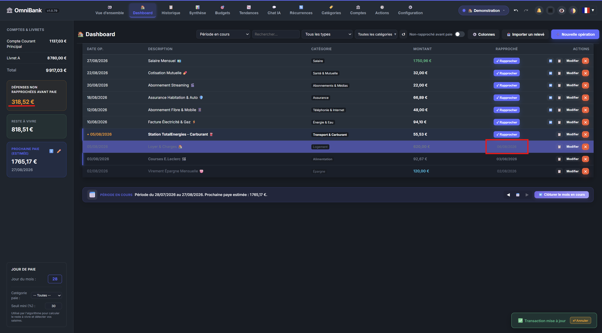

# 🚀 Quick Start Guide - OmniBank Local

This guide takes you step by step from launching OmniBank Local for the first time to exporting a safety backup of your database, importing bank statements, and tracking your budgets.

---

## 📸 Overview of the User Journey

---

## 1. First Launch & Initial Setup Wizard

On the very first launch of the application, the welcome wizard opens automatically:

1. **Language Selection**: Choose French (FR) or English (EN).
2. **First Bank Account Creation**:
   - Enter your account name (e.g., *Main Checking Account*).
   - Select the account type (*Checking*, *Savings*, *Credit Card*, etc.).
   - Set the initial balance of your account on the starting date.
3. **Default Categories**: OmniBank automatically seeds a complete tree of predefined financial categories (Groceries, Housing, Transport, Entertainment, Salary, etc.).
4. **Optional AI Configuration (Ollama)**:
   - If Ollama is installed on your computer (`http://localhost:11434`), OmniBank detects it automatically and lists available models (e.g., `gemma4:e4b` recommended, `mistral`, `llama3`, `qwen`).

---

## 2. Data Ingestion: Importing a CSV / XLSX Statement

To populate your accounts without tedious manual entry:

1. Go to the **Dashboard** or **History** page, then click the **"📥 Import Statement"** button.
2. **File Selection**: Drag and drop the `.csv`, `.xlsx`, or `.txt` file downloaded from your bank's web portal.
3. **Column Mapping**:
   - The import wizard automatically detects the delimiter (comma, semicolon, or tab) and encoding (UTF-8, ISO-8859-1).
   - If needed, associate your file's columns with OmniBank fields (*Date*, *Description*, *Amount*, *Payee*).
4. **Preview, Categorization & Reconciliation Difference**:
   - OmniBank compares imported rows with existing transactions to highlight duplicates.
   - Trigger the local AI (**`gemma4:e4b`**) via **"🤖 Analyze with AI"** to assign fitting categories (prioritizing existing categories).
   - Enter your official bank statement ending balance: the **Reconciliation Difference drops to 0.00 €** in green when selected rows match perfectly.

---

## 3. Daily Management & Bank Reconciliation

1. **Quick Operation Entry**: Click the **"+ New Operation"** button to record an expense, income, or transfer.
2. **Bank Reconciliation**:
   - When reviewing your bank statement, toggle the reconciliation status in the **Reconciliation** column to mark transactions as reconciled.
   - Your account balance splits into **Reconciled (Real) Balance** and **Pending (Expected) Balance**.

---

## 4. Budget Envelopes & AI Advice

1. **Setting a Budget**: Go to the **Budgets** section and assign a monthly envelope cap for a category (e.g., *Groceries: $400*).
2. **Visual Progress**: A color-coded progress bar indicates spending in real time (Green = Under control, Orange = Warning, Red = Overbudget).
3. **AI Suggestions**: Click **"AI Suggestions"** to have the local Ollama model analyze your spending history and propose realistic budget adjustments.

---

## 5. Backup, Restore & SQLite Database Export

Your financial records are 100% local and stored in the SQLite database file `omnibank.db`.

### Manual Backup Export:
1. Go to **Settings / Configuration** (gear icon ⚙️).
2. Navigate to the **Data Management** section.
3. Click **"Download Full Backup (ZIP)"** or **"Export Data (CSV)"**.
4. Save the `.zip` archive containing the SQLite database and configuration to a safe folder of your choice (USB drive, external disk, local vault).

### Restoration:
When switching computers, reinstall OmniBank Local, go to **Settings > Data Management**, select **"Restore Backup (ZIP)"**, choose your archive file, and confirm. All your accounts, categories, transactions, and settings will be restored instantly.

---

## 6. Going Autonomous with Auto-Pilot (100% Local)

Auto-Pilot streamlines your daily financial tracking by taking over statement reconciliation and categorization without ever sending your records to the cloud:

1. **Activation**: Open **🤖 Auto-Pilot** and pick your desired mode (**Monitoring Mode** to test recommendations or **Active Mode** for full autonomous reconciliation).
2. **Discreet Oversight (Cockpit)**: The Dashboard Cockpit widget informs you of system status, active rules, and pending review counts in real time.
3. **1-Click Review Queue**: If an ambiguous or large transaction is detected, inspect it in the **Review Queue** to validate or reassign categories with a single click.
4. **Absolute Reversibility**: Any decision executed by Auto-Pilot can be rolled back individually via the **Rollback** button in the Decision Feed.

---

## 7. Forecasting the Future with the Financial Simulator

Want to stress-test a major life decision without affecting your actual records?

1. Navigate to the **🔮 Simulator** tab.
2. Create an alternative scenario (e.g., *Home Purchase*, *Career Sabbatical*, *20-Year Loan*).
3. Insert **one-off events** (lump-sum expenses) or **recurring shifts** (salary bumps, new charges).
4. Tweak **inflation** and **seasonality** sliders to visualize your projected cash-flow trajectory over 1 to 30 years with break-even points and lowest cash troughs.

---

## 8. Total Mistake Tolerance (Undo / Redo & Audit Log)

- **Revert any mistake**: Press **`Ctrl + Z`** (or click the ↩️ arrow in the top header) at any time to instantly undo an accidental deletion, bad transaction edit, or budget update.
- **Audit Log (🕓 Actions)**: Audit every single system mutation with user attributions, timestamps, and side-by-side JSON diffs.
