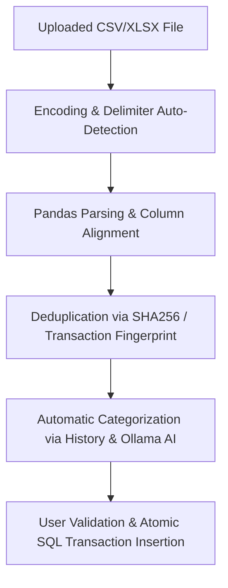

# ⚙️ Technical Pipelines & Internal Mechanisms Analysis

This document provides a deep-dive technical analysis of OmniBank Local's source code, internal mechanisms, and data processing pipelines—from first-launch initialization to database backup and restoration.

---

## 🔁 Pipeline 1: First Launch & SQL Database Seeding

### 1. Initialization State Detection
When the FastAPI server starts (`app/main.py`), the initialization function checks whether the SQLite database exists and contains active bank accounts:
- SQLite File: `omnibank.db` (managed by SQLAlchemy via `app/database.py`).
- If no accounts are found in the `accounts` table, the API returns `setup_required = True`.
- The Vanilla JS frontend (`static/js/app.js`) intercepts this status and displays the full-screen **Setup Wizard** (`static/js/views/setup_wizard.js`).

### 2. Default Data Seeding (`app/init_data.py`)
Upon completing the Setup Wizard:
1. **Initial Account Creation**: The API invokes `POST /api/setup/initialize` to create the first account.
2. **Category Seeding**: The function `seed_initial_categories(db)` in `app/init_data.py` inserts the default tree of income and expense categories (Groceries, Housing, Transport, Entertainment, Healthcare, Salary, etc.) with custom icons and colors.
3. **Base Configuration**: The `config` table is initialized with default language (`fr` or `en`), theme (`dark` or `light`), and Ollama AI settings.

---

## 📥 Pipeline 2: CSV / XLSX Parsing, Categorization & Deduplication

The statement import pipeline (`app/routers/csv_parser.py`, `app/services/csv_service.py`, and `static/js/views/import_wizard.js`) executes across 4 phases:

### Phase A: Automatic Format Detection
- **Encoding**: Sample analysis to distinguish `UTF-8`, `UTF-8-SIG`, and `ISO-8859-1` / `Windows-1252`.
- **Delimiter**: Statistical frequency count of delimiters (`;`, `,`, `\t`) across initial rows.
- **Number Format**: Automatic handling of European decimal commas (`1234,56`) and Anglo-Saxon decimal points (`1234.56`), as well as multi-column Debit / Credit merging with debit sign negation.

### Phase B: Transaction Deduplication
To prevent double-counting during overlapping statement imports:
- For each row, the algorithm generates a unique fingerprint based on: `Account_ID + Date + Amount + Cleaned Description`.
- The API checks if a transaction with identical characteristics already exists in the SQLite database. If found, it is flagged as a **"Probable Duplicate"** in the wizard and unchecked by default.

### Phase C: Automatic Categorization
- `csv_service.py` matches description keywords against past user entries (`importDescList`).
- If enabled, the local Ollama model (**`gemma4:e4b`**) analyzes unassigned descriptions to assign fitting categories from existing category trees.

---

## 💳 Pipeline 3: Financial Engine & Bank Reconciliation

The financial engine (`app/services/finance_engine.py`) ensures real-time calculation of balances and projections.

### 1. Reconciled vs Pending Balances
Every `Transaction` model holds a `reconciliation_date` (nullable Date field):
- **Reconciled (Real) Balance**: $$\text{Initial Balance} + \sum \text{Reconciled Transactions (reconciliation\_date} \neq \text{null)}$$
- **Pending (Expected) Balance**: $$\text{Reconciled Balance} + \sum \text{Pending Transactions (reconciliation\_date} = \text{null)}$$

### 2. Reconciliation Procedure
From the History or Dashboard views (`static/js/views/all_operations.js`):
1. Upon receiving an official bank statement, the user toggles the transaction status in the **Reconciliation** column (or edits its reconciliation date).
2. The frontend sends an optimized `PATCH /api/transactions/{id}` request recording or clearing `reconciliation_date`.
3. The dashboard and history table dynamically recalculate the reconciled balance and adjust the difference with pending balances.

---

## 💾 Pipeline 4: Backups, Restoration & Database Export

OmniBank Local guarantees complete data sovereignty.

### 1. Automatic Backup (`app/routers/auto_backup.py`)
- Following major operations or on a scheduled basis, a lightweight snapshot of `omnibank.db` is stored in `data/backups/`.
- The system maintains a rolling count of $N$ recent automated backups (configurable 3, 5, 10, or 20) to protect against accidental corruption.

### 2. Manual ZIP Archive Export (`app/routers/backup.py`)
When clicking **"Download Full Backup (ZIP)"** in Settings:
1. The FastAPI backend temporarily locks SQLite writes using WAL (Write-Ahead Logging) mode.
2. It generates a compressed ZIP archive containing:
   - `omnibank.db`: Full SQLite database (all tables, transactions, categories, budgets, templates).
   - `config.json`: UI and language preferences.
   - `metadata.json`: Export timestamp, application version, and integrity checksum.
3. The ZIP file is delivered directly to the client (Browser or Tauri wrapper).

### 3. Restoration Pipeline
- The user uploads a `.zip` or `.db` file via `POST /api/backup/restore`.
- The backend validates the database schema and integrity.
- If valid, the active database is replaced atomically and SQLAlchemy sessions are re-initialized without requiring a server restart.
