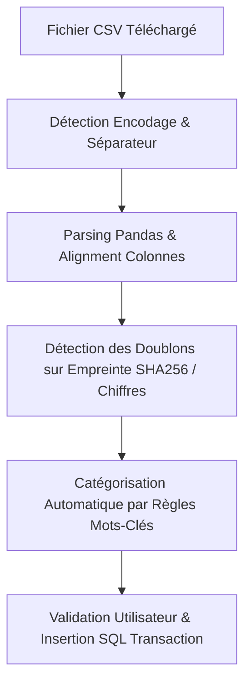

# ⚙️ Analyse Approfondie des Pipelines & Mécanismes Techniques

Ce document analyse en profondeur le code source, le fonctionnement interne et les pipelines de traitement d'OmniBank Local, depuis l'initialisation du premier lancement jusqu'à l'export/restauration de la base de données.

---

## 🔁 Pipeline 1 : Premier Lancement & Seed de la Base SQL

### 1. Détection de l'état d'initialisation
Au démarrage du serveur FastAPI (`app/main.py`), la fonction d'initialisation vérifie si la base de données SQLite existe et si des comptes bancaires sont configurés :
- Fichier SQLite : `omnibank.db` (géré par SQLAlchemy via `app/database.py`).
- Si aucun compte n'est détecté dans la table `accounts`, l'API renvoie le statut `setup_required = True`.
- Le frontend Vanilla JS (`static/js/app.js`) intercepte ce statut et affiche l'écran plein de l'**Assistant d'Initialisation** (`static/js/views/setup_wizard.js`).

### 2. Le Seed des données par défaut (`app/init_data.py`)
Lors de la validation du Setup Wizard :
1. **Création du Compte Initial** : L'API exécute `POST /api/setup/initialize` pour créer le premier compte.
2. **Injection des Catégories** : La fonction `seed_initial_categories(db)` dans `app/init_data.py` insère l'arborescence par défaut des catégories de revenus et de dépenses (Alimentation, Logement, Transports, Loisirs, Santé, Salaire, etc.) avec leurs icônes et couleurs adaptées.
3. **Configuration de base** : La table `config` est initialisée avec la langue par défaut (`fr`), le thème (`dark` ou `light`) et les paramètres Ollama.

---

## 📥 Pipeline 2 : Parsing, Catégorisation & Déduplication CSV

Le pipeline d'importation CSV (`app/routers/csv_parser.py`, `app/services/csv_service.py` et `static/js/views/import_wizard.js`) se déroule en 4 phases :

### Phase A : Détection Automatique de Format
- **Encodage** : Analyse d'échantillon pour distinguer `UTF-8`, `UTF-8-SIG`, `ISO-8859-1` / `Windows-1252`.
- **Délimiteur** : Comptage statistique des apparitions de (`;`, `,`, `\t`) sur les 10 premières lignes.
- **Format des Nombres** : Gestion automatique de la virgule décimale européenne (`1234,56`) et du point anglo-saxon (`1234.56`).

### Phase B : Détection des Doublons (Dédoublonnage)
Afin d'éviter toute double comptabilisation lors d'imports successifs contenant des périodes chevauchantes :
- Pour chaque ligne CSV, l'algorithme génère un identifiant unique (empreinte) basé sur : `Compte_ID + Date + Montant + Libellé nettoyé`.
- L'API recherche si une transaction avec ces caractéristiques exactes existe déjà dans la base SQLite. Si oui, elle est marquée comme **"Doublon probable"** dans l'assistant et désélectionnée par défaut.

### Phase C : Catégorisation Automatique
- Le service `csv_service.py` compare les mots-clés du libellé de l'opération avec les règles d'affectation mémorisées (ex: `"CARREFOUR"` ➔ *Alimentation*, `"TOTAL"` ➔ *Carburant*).

---

## 💳 Pipeline 3 : Moteur Financier & Rapprochement Bancaire

Le moteur financier (`app/services/finance_engine.py`) assure le calcul instantané et sans erreur des soldes et des projections.

### 1. Distinction Solde Pointé vs Solde Réel
Toute transaction `Transaction` possède une date de rapprochement `reconciliation_date` (null si non rapprochée) :
- **Solde Pointé (Réel)** : $$\text{Solde Initial} + \sum \text{Transactions Rapprochées (reconciliation\_date} \neq \text{null)}$$
- **Solde En Cours (Prévu)** : $$\text{Solde Pointé} + \sum \text{Transactions Non Rapprochées (reconciliation\_date} = \text{null)}$$

### 2. Procédure de Rapprochement (Pointage)
Depuis la vue Historique ou Tableau de Bord (`static/js/views/all_operations.js`) :
1. L'utilisateur bascule le statut de l'opération dans la colonne Rapprochement (ou édite sa date de rapprochement) à la réception de son relevé bancaire officiel.
2. Le frontend émet une requête optimisée `PATCH /api/transactions/{id}` enregistrant ou supprimant la `reconciliation_date`.
3. Le tableau de bord et l'historique recalculent dynamiquement le solde pointé et ajustent la différence avec le solde en cours.

---

## 💾 Pipeline 4 : Sauvegardes, Restauration & Exportation DB

OmniBank Local garantit que l'utilisateur est le seul propriétaire de ses données.

### 1. Sauvegarde Automatique (`app/routers/auto_backup.py`)
- À chaque modification majeure ou de manière planifiée, un instantané léger de la base `omnibank.db` est créé dans le sous-dossier `data/backups/`.
- Le système conserve un roulement configurable des $N$ dernières sauvegardes automatiques pour prévenir toute corruption accidentelle.

### 2. Exportation Manuelle au format ZIP (`app/routers/backup.py`)
Lorsque l'utilisateur clique sur **"Exporter la sauvegarde"** depuis les paramètres :
1. Le backend FastAPI verrouille temporairement les écritures SQLite en mode WAL (Write-Ahead Logging).
2. Il génère une archive ZIP contenant :
   - `omnibank.db` : La base de données SQLite complète (toutes tables, opérations, catégories, budgets).
   - `config.json` : Les préférences d'interface et de langue.
   - `metadata.json` : La date de l'export, la version de l'application et le checksum de vérification.
3. Le fichier ZIP est transmis en téléchargement direct au client (Browser ou Tauri wrapper).

### 3. Pipeline de Restauration
- L'utilisateur envoie son fichier `.zip` ou `.db` via `POST /api/backup/restore`.
- Le backend valide le schéma de la base de données.
- Si le fichier est valide, la base de données active est remplacée de manière atomique et les connexions SQLAlchemy sont réinitialisées sans nécessiter le redémarrage du serveur.
