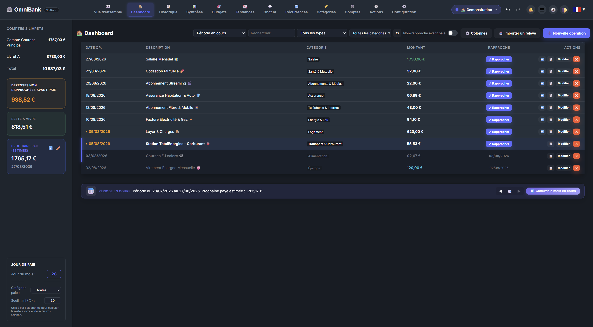

# 📊 Documentation Page : Tableau de Bord (Dashboard)

Le **Tableau de Bord** est l'écran d'accueil central d'OmniBank Local. Il offre un aperçu immédiat de la santé financière globale, des soldes des comptes, des dernières opérations et des raccourcis d'action rapide.

---

## 📸 Illustrations

*Vue générale du Tableau de bord avec soldes, graphiques et opérations récentes.*

*Modale de saisie rapide d'une nouvelle opération.*

---

## 🛠️ Composants & Fonctionnalités

### 1. Cartes de Synthese des Soldes
En haut de page, les cartes de solde affichent :
- **Solde Total Pointé (Réel)** : La somme des soldes validés sur vos relevés bancaires.
- **Solde Total En Cours (Prévu)** : Le solde incluant les opérations saisies mais pas encore pointées.
- **Variation du Mois** : Le total des entrées moins les sorties sur le mois en cours.

### 2. Graphique d'Évolution du Solde
Le graphique interactif (propulsé par **Chart.js**) trace la courbe du solde au fil des jours du mois sélectionné. Il permet de repérer visuellement les pics de dépenses ou les rentrées d'argent.

### 3. Liste des Dernières Opérations
Un aperçu des $N$ plus récentes transactions. Chaque ligne permet de :
- Consulter la date, le libellé, le tiers (payeur/bénéficiaire) et le montant.
- Voir la catégorie associée avec sa couleur.
- Basculer rapidement le statut de pointage/rapprochement dans la colonne dédiée.
- **Statut de Rapprochement** : Indiquer la date de rapprochement ou marquer l'opération comme pointée.

### 4. Saisie Rapide (+ Nouvelle Opération)
Le bouton **"+ Nouvelle Opération"** ouvre la modale de création :
- **Compte** : Sélection du compte concerné.
- **Type** : Dépense (Débit) ou Revenu (Crédit).
- **Montant** : Valeur exacte.
- **Date** : Date de la transaction.
- **Libellé & Tiers** : Description et nom du commerçant/organisme.
- **Catégorie** : Choix de la catégorie et sous-catégorie.
- **Statut de Pointage** : Coché ou non.

### 5. Widget Cockpit Auto-Pilote
Le Tableau de Bord intègre le panneau escamotable **Cockpit Auto-Pilote** :
- **Statut en Direct** : Badge lumineux vert (*Actif*) ou gris (*Veille*).
- **Compteur de Règles & File en Attente** : Visualisez d'un coup d'œil le nombre d'opérations nécessitant une revue.
- **Bouton "⚡ Exécuter l'Auto-Pilote"** : Lance manuellement le cycle de rapprochement et de catégorisation sur l'ensemble de vos comptes.
- **Accès Rapide au Centre de Contrôle** : Raccourci direct vers la vue complète d'arbitrage.

### 6. Contrôles Globaux d'En-Tête
- **Annuler / Rétablir (Undo / Redo)** : Flèches ↩️ / ↪️ (ou raccourcis clavier `Ctrl+Z` / `Ctrl+Y`) pour annuler ou rétablir n'importe quelle action comptable.
- **Centre de Notifications (🔔)** : Cloche interactive regroupant les alertes de budget, les bilans financiers IA et les rappels d'échéances avec gestion des archives et recherche.
- **Sélecteur de Profil Maître** : Basculez instantanément entre vos profils (ex: *Finances Personnelles*, *Activité Professionnelle*, *Association*).
- **Mode Discrétion (👁️)** : Masque instantanément l'affichage des soldes et montants par des pastilles chiffrées (`••• €`) en cas d'utilisation dans un lieu public.
- **Mode Compact & Thèmes** : Optimise la densité des tableaux et permet d'alterner entre les thèmes Sombre et Clair.

---

## 💡 Astuces & Bonnes Pratiques

> [!TIP]
> Utilisez la touche d'accès rapide sur le Tableau de Bord pour vérifier chaque matin si des opérations prévues ou récurrentes doivent être enregistrées, et gardez un œil sur le badge Cockpit de l'Auto-Pilote.
