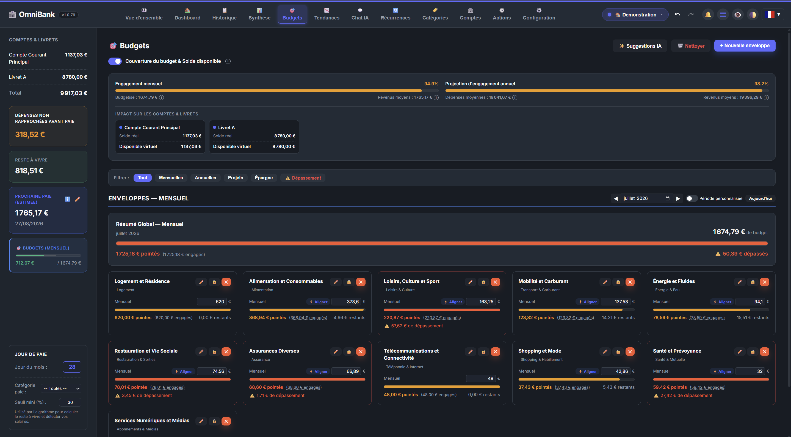

# 🎯 Documentation Page : Budgets, Enveloppes & Auto-Pilote

La page **Budgets** permet de piloter ses finances personnelles selon la méthode des **Enveloppes Budgétaires**. Elle associe un suivi visuel en temps réel à un moteur d'**Auto-Pilote budgétaire** local-first capable d'identifier les catégories orphelines, d'enrichir les enveloppes existantes et de suggérer des recalibrages mensuels lissés, de façon 100% autonome ou assistée par IA locale.

---

## 📸 Illustrations

*Vue d'ensemble des enveloppes budgétaires.*

*Détail de la consommation d'une enveloppe et liste des dépenses associées.*

*Modale de modification et de verrouillage d'une enveloppe budgétaire.*

*Module de propositions budgétaires et modale de révision interactive.*

---

## 🛠️ Principes & Fonctionnalités Visuelles

### 1. La Méthode des Enveloppes Budgétaires
Une enveloppe budgétaire est un **plafond intentionnel de dépense** alloué pour un mois à une ou plusieurs catégories (ex: *Alimentation & Courses*, *Mobilité & Transports*, *Loisirs & Sorties*).
- **Jauge tricolore de progression dynamique :**
  - 🟢 **Vert (0% à 80%) :** Rythme de dépense maîtrisé.
  - 🟠 **Orange (81% à 99%) :** Seuil d'attention atteint, approche du plafond.
  - 🔴 **Rouge (≥ 100%) :** Dépassement de budget constaté.
- **Reste à dépenser :** Calcul en temps réel du solde restant et du pourcentage consommé.

### 2. Tiroir Latéral de Consultation des Dépenses
En cliquant sur une carte d'enveloppe, un panneau latéral contextuel s'ouvre sans quitter la page. Il liste exhaustivement toutes les transactions réelles du mois imputées aux catégories de cette enveloppe, permettant d'identifier immédiatement les postes de surcoût.

### 3. Verrouillage Sanctuarisé (`🔒`)
Chaque enveloppe peut être verrouillée via son formulaire d'édition. Une enveloppe verrouillée :
- Est visuellement identifiée par une icône de cadenas `🔒`.
- Est **strictement sanctuarisée** : le moteur d'Auto-Pilote a l'interdiction formelle de proposer le moindre ajustement de son plafond (idéal pour les charges fixes intangibles comme le loyer ou les assurances).

### 4. Réactivité Zéro F5 (100% Temps Réel)
L'interface des budgets est entièrement réactive : tout ajout d'enveloppe, validation de suggestion, clôture ou modification met à jour l'affichage instantanément via des événements DOM internes (`CustomEvent`), sans nécessiter le moindre rafraîchissement manuel de la page (F5).

---

## 🤖 Le Module Auto-Pilote & Automatismes des Budgets

Accessible depuis la barre d'outils supérieure via le bouton **`⚙️ Automatismes`** ou directement depuis le bandeau de notification des suggestions, ce module pilote l'intelligence budgétaire de l'application.

### 1. Choix du Moteur de Suggestion
L'utilisateur peut choisir son moteur d'analyse :
* **⚙️ Moteur Déterministe (Par défaut, Recommandé) :**
  - Fonctionne **100% hors-ligne**, sans aucun prérequis matériel ni connexion réseau.
  - Instantané (< 50 millisecondes) grâce à des algorithmes mathématiques de clustering thématique et de lissage statistique Winsorisé.
* **🤖 Moteur Assisté par IA Locale (Ollama) :**
  - S'appuie sur une instance Ollama exécutée localement sur votre machine (modèle `gemma4:e4b`, `mistral`, `llama3`, etc.).
  - Analyse sémantiquement les intitulés de catégories pour former des regroupements intuitifs.
  - **Repli automatique zéro-erreur :** Si Ollama n'est pas démarré ou ne répond pas, le système bascule de manière totalement transparente sur le moteur déterministe sans jamais bloquer l'application ni générer d'erreur.

---

## 🧠 Les Deux Volets d'Analyse Algorithmique

L'Auto-Pilote des budgets analyse vos finances selon deux volets complémentaires et hermétiquement protégés par des garde-fous stricts :

### Volet A : Découverte de Nouvelles Enveloppes & Enrichissement Intelligent

Le Volet A inspecte les catégories de dépenses non couvertes par un budget existant (*catégories orphelines*).

1. **Enrichissement des enveloppes existantes :**
   - Plutôt que d'encombrer votre tableau de bord avec une multitude de micro-enveloppes individuelles (ex: créer une enveloppe dédiée pour « Boulangerie » alors qu'il existe déjà « Alimentation & Courses »), le moteur détecte l'affinité thématique.
   - Il propose alors de **rattacher la catégorie à l'enveloppe existante** et de rehausser le plafond du montant mensuel moyen observé.
2. **Création d'enveloppes groupées :**
   - Pour les catégories orphelines n'ayant pas d'équivalent existant, le moteur regroupe les catégories affines au sein d'enveloppes cohérentes (ex: *Mobilité* regroupant *Essence*, *Péage*, *Parking*).
3. **🛡️ Le Garde-Fou Anti-Dépenses Ponctuelles ($\ge 2$ mois observés) :**
   > [!IMPORTANT]
   > **Règle d'or de la protection du Reste à Vivre :**
   > Pour qu'une catégorie soit éligible à la création d'une enveloppe ou à un enrichissement, elle doit obligatoirement présenter des dépenses sur **au moins 2 mois distincts**.
   > 
   > **Pourquoi ce garde-fou est indispensable ?**
   > Si l'algorithme créait un budget mensuel pour un achat ponctuel isolé (par exemple un achat exceptionnel d'électroménager de 1 500 € ou un cadeau d'anniversaire à 50 € survenu un seul mois), cela créerait une charge récurrente mensuelle fantôme qui **amputerait artificiellement votre Reste à Vivre chaque mois**. Le système exige donc la preuve d'une habitude récurrente avant de proposer un budget.
4. **Seuil plancher configurable :**
   - Par défaut fixé à **30,00 €**, il évite la création de budgets superflus pour des dépenses dérisoires ou anecdotiques.
5. **Refus persistant (`DISMISSED`) :**
   - Lorsqu'une suggestion est refusée par l'utilisateur (`[Ignorer]`), la décision est gravée dans le journal d'audit. La catégorie ne sera plus jamais reproposée lors des analyses suivantes, garantissant une expérience sans harcèlement.

---

### Volet B : Recalibrage Mensuel Amorti des Enveloppes (Lissage EMA)

Le Volet B surveille les enveloppes de dépenses actives pour adapter les plafonds à l'évolution réelle de votre mode de vie.

1. **Cadence Périodique Anti-Thrashing :**
   - L'analyse de recalibrage s'exécute automatiquement au **1er de chaque mois** ou lors du renouvellement du cycle de paie.
   - Elle peut également être exécutée à tout moment à la demande via le bouton **`⚡ Lancer l'analyse`**.
2. **Formule de Lissage Exponentiel (EMA) :**
   - Pour éviter les à-coups brutaux, le nouveau montant suggéré est lissé sur une fenêtre glissante de 3 à 6 mois avec un coefficient d'amortissement $\alpha = 0.20$ :
     $$\text{Suggestion}_{t} = (1 - \alpha) \cdot \text{Budget}_{\text{actuel}} + \alpha \cdot \overline{\text{Dépenses}}_{\text{historiques}}$$
   - Les dépenses sont préalablement traitées par **Winsorizing** pour neutraliser les pics anormaux (ex: une note de restaurant inhabituelle lors d'un déplacement).
3. **Double Plafond de Dérive (Drift Guard) :**
   - **Plafond mensuel :** Une variation ne peut jamais excéder $\pm 10\%$ d'un mois sur l'autre.
   - **Plafond annuel :** La dérive cumulée ne peut jamais dépasser $\pm 25\%$ par rapport au budget de référence annuel (`base_annual_amount`).
4. **Seuil de Significativité de $\pm 2\%$ :**
   - Si l'écart entre le budget actuel et la projection lissée est inférieur à 2%, aucune suggestion n'est émise. Cela élimine le bruit pour des variations de quelques centimes.
5. **Exclusions Absolues :**
   - Les enveloppes de type **Épargne** (`savings`), les enveloppes de **Projet** (`is_project`), les enveloppes annuelles et les enveloppes **Verrouillées** (`is_locked`) sont totalement exclues de tout recalibrage automatique.

---

## 💬 Comprendre les Messages et Notifications

Lorsque vous cliquez sur le bouton **`⚡ Lancer l'analyse`** dans la modale d'automatismes :

### 1. Message d'information : *"ℹ️ Aucun ajustement ni nouvelle enveloppe nécessaire pour le moment."*
Ce message indique que votre configuration financière est **saine, stable et optimale**. Il s'affiche lorsque :
- **Vos enveloppes existantes sont bien calibrées :** Vos dépenses réelles correspondent déjà à vos plafonds (écart $< 2\%$).
- **Les dépenses hors enveloppes sont ponctuelles :** Toutes les catégories non budgétées n'ont été observées que sur **un seul mois**. Grâce au filtre de sécurité des 2 mois, le système refuse de créer un budget pérenne inutile pour une dépense isolée.

### 2. Message de succès : *"{count} recommandation(s) budgétaire(s) identifiée(s)"*
Ce message confirme que des actions pertinentes ont été détectées :
- Une dérive durable de vos dépenses réelles nécessite un ajustement de plafond.
- Une nouvelle habitude de consommation s'est confirmée sur au moins 2 mois et mérite une enveloppe dédiée ou un enrichissement.

---

## 📋 Sas de Revue Interactive des Suggestions

Lorsque des suggestions sont disponibles, un bandeau discret apparaît sur la page Budgets. En cliquant sur **`Examiner les suggestions`**, une modale interactive s'ouvre :

### 1. Éléments Comparatifs Visuels
- **Badge d'origine :** `⚙️ Déterministe`, `🤖 IA Locale` ou `🔗 Enrichissement`.
- **Comparaison chiffrée :** Montant actuel $\to$ Montant suggéré avec calcul du delta en pourcentage ($\Delta\%$).
- **Justification explicative en français :** Détail clair de la raison économique de la recommandation.
- **Ventilation par catégorie :** Liste des sous-catégories concernées avec leurs moyennes historiques observées.

### 2. Actions Disponibles
- **`[Appliquer]` (1-clic) :** Met à jour l'enveloppe ou crée la nouvelle structure instantanément. L'action est enregistrée dans l'historique et bénéficie du support Annuler/Rétablir (Undo/Redo).
- **`[Ignorer]` :** Rejette la proposition et la classe en `DISMISSED` de manière persistante.
- **`[Tout appliquer]` :** Valide l'ensemble des recommandations du lot en une seule opération.

### 3. Ergonomie Mobile Responsive
Sur smartphone ou tablette, la modale de révision s'adapte automatiquement :
- Affichage sous forme de cartes tactiles empilées avec défilement fluide.
- Bouton de fermeture `✕` ancré en haut à droite.
- Boutons d'action pleine largeur facilement actionnables au pouce.

---

## 🔒 Souveraineté, Audit et Traçabilité

- **Zéro Cloud & Données Locales :** Toutes les analyses statistiques, clustering et inférences Ollama sont exécutées à 100% sur votre machine. Aucune coordonnée bancaire, montant ou transaction ne quitte votre terminal.
- **Journal d'Audit (`AutopilotDecisionLog`) :** Chaque suggestion émise, appliquée ou rejetée est horodatée et archivée en base SQLite locale avec son instantané complet (`snapshot`), garantissant une transparence totale des décisions de l'Auto-Pilote.
